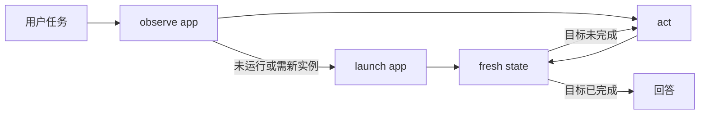

# MimiAgent 轻量 Computer Use

状态：已实现，macOS 第一阶段

MimiAgent 使用 Cua Driver 访问本机应用，但不把 Driver 协议交给模型。模型只看到两个
app-centric 工具：

- `computer_observe`：读取应用列表或一个应用的当前界面。
- `computer_act`：执行一个动作；普通 UI 动作完成后直接返回新的界面状态。

模型不需要理解 Session、PID、window id、Observation id、前后台投递、Driver 健康、
录制、回放或执行结果分层。Host 负责这些机械工作。

## 设计原则

1. app 是模型唯一的桌面目标单位。
2. AX 语义元素优先，AX 暂不可用时由 Host 短暂等待，再按模型能力回退到窗口截图。
3. 一次调用只提交一个动作，动作后状态由同一次调用返回。
4. `computer_observe` 是只读操作，不会为了方便而偷偷启动应用。
5. Host 后台投递优先；本机 Full Owner 的目标已置前，或 Driver 明确返回后台未执行时，Host 才使用一次前台投递。
6. 不通过 Shell、AppleScript、Shortcuts 或第二套 capability gateway 绕过正式工具。
7. 安全和防重放留在 Host，不能变成模型每一步都要判断的工作流。

这套设计参考了 Codex Computer Use 的 app-centric state/action 形态、AX-first 和截图兜底，
但没有照搬其 Node REPL、MCP/Sky 传输、状态 diff 和完整确认规则。Codex 的公开说明见
[Computer Use](https://learn.chatgpt.com/docs/computer-use.md)。Mimi 进一步收敛成两个工具，
并让每个 UI 动作自动带回 fresh state，适合常驻个人 Agent 的小运行时。

## 模型契约

### `computer_observe`

列出应用：

```json
{}
```

读取应用当前界面：

```json
{
  "app": "com.apple.TextEdit"
}
```

显式请求截图：

```json
{
  "app": "TextEdit",
  "screenshot": true
}
```

如果当前模型未声明图像输入能力，Host 不会让整个观察失败，而是自动忽略截图并返回
可用的 AX 语义状态，同时用 `screenshotStatus.reason=vision_unavailable` 标明降级。
`region` 等必须消费图像的底层观察仍会拒绝执行。

`app` 可以是应用名或 bundle id。Host 选择最匹配的真实窗口，并过滤菜单栏窗口、
无标题离屏伪窗口和过小窗口。应用已安装但未运行时返回精确启动目标：

```json
{
  "ok": false,
  "reason": "app_not_running",
  "apps": [
    {
      "bundleId": "com.example.app",
      "name": "Example",
      "running": false
    }
  ]
}
```

名称无法解析到任何应用时返回 `reason=app_not_found`、`next=computer_observe` 和空
`apps`。模型此时应省略 `app` 重新列出应用，不能猜 bundle ID 或提交空启动参数。

观察结果只保留模型真正需要的内容：

```json
{
  "app": {
    "id": "com.apple.TextEdit",
    "name": "TextEdit",
    "window": "notes.txt"
  },
  "dimensions": { "width": 900, "height": 700 },
  "elements": [
    {
      "index": 12,
      "role": "AXTextArea",
      "value": "hello",
      "writable": true,
      "focused": true
    }
  ],
  "actionable": true,
  "truncated": false
}
```

文本 observation 硬限制为 16 KiB。重复 raw AX 树、内部句柄、PID、window id 和
frontmost 诊断不会进入模型上下文。截图通过 SDK image output 传输，不放进 JSON 文本。

### `computer_act`

工具只有一个 `action` 对象：

```json
{
  "action": {
    "type": "click",
    "elementIndex": 12
  }
}
```

模型可用动作保持在常用集合内：

| 动作 | 主要参数 | 用途 |
|---|---|---|
| `launch_app` | `bundleId`, `urls?`, `newInstance?` | 用 observe 返回的精确 bundle ID 启动应用或打开文件/URL |
| `click` | `elementIndex` 或 `x/y`, `button?`, `axAction?` | 点击元素或窗口局部坐标 |
| `double_click` | `elementIndex` 或 `x/y` | 双击 |
| `type_text` | `elementIndex` 或 `x/y`, `text` | 向目标输入文本 |
| `set_value` | `elementIndex`, `value` | 直接设置可写 AX 值 |
| `keypress` | `keys` | 单键或组合键 |
| `scroll` | `deltaX`, `deltaY`, `x/y?` | 滚动 |
| `drag` | `path` | 拖拽 |
| `wait` | `milliseconds` | 等待应用自行更新 |

`launch_app` 不依赖窗口 observation，但 `bundleId` 必须来自 `computer_observe` 返回的
`app.id` 或 `apps[].bundleId`。Host 在启动前记录已有窗口，启动后按新窗口身份或打开
文件名绑定本轮目标，并直接返回该窗口的 fresh state：

```json
{
  "ok": true,
  "state": {
    "app": {
      "id": "com.apple.TextEdit",
      "name": "TextEdit",
      "window": "notes.txt"
    },
    "elements": []
  }
}
```

只有启动成功但在有界 settle 内还没有可绑定窗口时，才返回
`{ "ok": true, "next": "computer_observe" }`。

普通 UI 动作由 Host 自动绑定本 Run 最近一次有效窗口观察，并直接返回动作后的状态：

```json
{
  "ok": true,
  "state": {
    "app": {
      "id": "com.apple.calculator",
      "name": "Calculator",
      "window": "Calculator"
    },
    "elements": [
      { "index": 0, "role": "AXStaticText", "value": "56" }
    ],
    "actionable": true
  }
}
```

模型应直接使用 `state` 继续；只有结果包含 `next: "computer_observe"` 或 state 不足时
才重新观察。Driver 回执和恢复判断全部由 Host 消化，不进入模型任务。

## 一次正常任务



这不是一个显式 workflow。Host 只保存当前 Run 的最近窗口观察和预算；Run 结束即释放
Driver Session。Goal、Plan 和 Checkpoint 仍是唯一的长任务状态。

## Host 内部边界

以下逻辑存在于 Host，但不进入模型 schema：

- 将 app 名称解析成精确 `bundleId + pid + windowId`。
- 为一个 Run 创建和关闭 Cua Session。
- 检查应用 allowlist、控制面应用禁用、动作和截图预算。
- 在动作提交前检查窗口没有漂移，并串行化本机 GUI 写动作。
- launch 前记录已有窗口，优先绑定本轮新窗口或 URL 对应的文档窗口。
- 保留 ExecutionLedger 的 at-most-once fence。
- 动作传输中断时停止，不自动重放同一副作用。
- 只有 Driver 明确返回 `background_unsupported`（动作未执行）且 Run 已有 foreground 权限时，同一逻辑动作才允许一次前台投递。
- 对新启动应用的 AX 窗口做最多 5 次、每次 100 ms 的有界 settle。
- AX 仍不可用且模型支持图像时，只做一次窗口截图观察。

这些规则保护执行边界，但不会要求模型选择状态层级或管理恢复流程。没有 foreground 权限时，
`background_unsupported` 仍只返回一个清楚的失败原因；不会声称已完成。

## 为什么不做动作数组

任意动作数组看起来能减少模型回合，但一旦中途失败，就必须回答“前几个动作是否已发生、
从哪里恢复、能否重试”，重新引入复杂状态机和重复副作用风险。Mimi 保持一次一个动作；
对于文本、快捷键和 AX set-value，单个动作本身已经可以表达高频复合输入。

后续只有在真实基准证明模型往返是主要瓶颈，并且 Driver 能提供原子序列或逐步确定回执时，
才考虑 Host-owned 的有限宏动作，不向模型开放任意 batch。

## 权限与暴露范围

- Plan 模式只有 `computer_observe`，没有 `computer_act`。
- General/Ultra 的本机 Full Owner Run 可以获得 Computer 工具。
- Safe、Workstation、SubAgent、Team worker 和独立后台 Task 不获得本机桌面写能力。
- Daemon owner source 仍需 source policy 显式授权，并可用 `computerApps` 限制 bundle id。
- Terminal、Codex、IDE 等控制面应用不能作为 Computer 目标。
- 外部事件正文只是不可信数据，不能扩大应用或动作权限。

`computer_act` 仍是 side-effect Tool，并使用现有 ExecutionLedger。这里的防重放只在 Host
处理 transport 边界；模型在成功路径上只看到 `ok + state`，失败路径只看到可操作原因。

## 配置

| 变量 | 默认值 | 说明 |
|---|---|---|
| `MIMI_COMPUTER_BACKEND` | 自动发现 | `cua` 显式启用，`off` 关闭 |
| `MIMI_CUA_DRIVER_COMMAND` | 自动发现 | Cua Driver 可执行文件绝对路径 |
| `MIMI_COMPUTER_DEFAULT_ACCESS` | `foreground` | 本机 Full Owner 的最大访问档位；实际投递仍后台优先 |
| `MIMI_COMPUTER_ACTION_TIMEOUT_MS` | `15000` | 单次 Driver 调用上限 |
| `MIMI_COMPUTER_MAX_ACTIONS_PER_RUN` | `50` | 单 Run 动作预算 |
| `MIMI_COMPUTER_MAX_SCREENSHOTS_PER_RUN` | `12` | 单 Run 截图预算 |
| `MIMI_MODEL_SUPPORTS_IMAGE_INPUT` | 模型 Profile | 是否允许截图 fallback |

Full Owner 会从 `~/.local/bin` 和 `PATH` 自动发现 `cua-driver`。显式配置的 Driver 路径必须
是绝对路径、普通文件且可执行。当前适配器测试覆盖 `0.8.x`（patch >= 3）、`0.9.0`、
`0.12.3`、`0.14.1` 和 `0.16.0`。

## 健康与诊断

健康状态分开回答两个问题：

- `transportReady`：Driver daemon/RPC 是否可连接。
- `operationalReadiness`：是否真实观察过可操作窗口。

只有 transport 和真实窗口探针都通过时，Daemon 才报告 `computer.ready=true`。探针只读，
不会启动应用、移动鼠标或切换前台。

## 测试

默认单元测试不访问真实桌面：

```bash
node --import tsx --test tests/computer.test.ts
npm run check
```

真实 Driver/Manager E2E：

```bash
MIMI_E2E_ITERATIONS=10 npm run test:computer:macos
```

真实 Mimi 模型 E2E：

```bash
npm run build
MIMI_E2E_ITERATIONS=10 npm run test:computer:agent:macos
```

Manager E2E 使用 Calculator 与临时 TextEdit 文件，验证 AX 读写、按键、截图兜底、会话
清理、前台变化和真实鼠标变化。Agent E2E 读取完整 Session，拒绝 Shell/Skill/网关回退，
并要求模型实际调用 `computer_observe` / `computer_act` 完成同样任务。两个脚本都输出单行
机器可读 JSON，失败时非零退出。

## 已知边界

- Secure Input、Touch ID、系统隐私弹窗和应用自身保护不能绕过。
- 某些应用不提供完整 AX；有图像输入能力时可读取窗口截图，但坐标动作仍受窗口边界约束。
- 后台定向输入不是所有应用都支持；Host 不把失败伪装成成功。
- 首阶段只支持 macOS，不自动创建或管理 VM。
