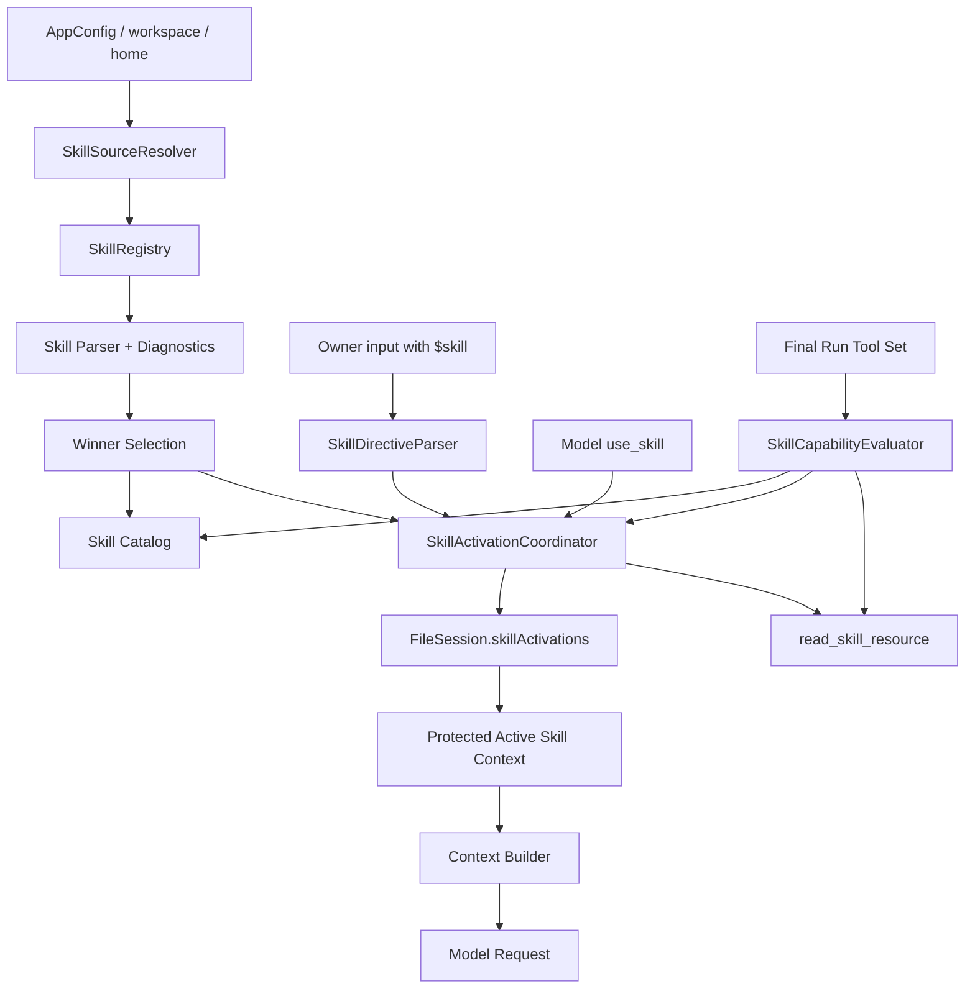

# MimiAgent Agent Skills 完整兼容改造计划

日期：2026-07-27

状态：待实施

适用基线：当前 `0.12.0` 工作树及其后续演进

外部依据：

- [Agent Skills Specification](https://agentskills.io/specification)
- [How to add skills support to your agent](https://agentskills.io/client-implementation/adding-skills-support)

关联仓库文档：

- `AGENTS.md`
- `docs/ARCHITECTURE.md`
- `docs/plans/20260724-MimiAgent上下文记忆与运行架构改造计划.md`

## 一、结论与实施范围

MimiAgent 已具备 `SKILL.md` 解析、目录披露、`use_skill` 激活、资源按需读取和
`required-tools` 初步过滤，但仍是单目录、单次工具结果驱动的最小客户端。后续改造
必须补齐以下六项能力，并保持现有 Session、Run、权限和上下文不变量：

1. 通用发现路径：同时支持项目级、用户级、Mimi 原生目录和 `.agents/skills/`。
2. 多作用域冲突优先级：同名 Skill 使用确定性规则选出唯一生效版本并报告遮蔽关系。
3. 用户显式 `$skill` 激活：由统一 Runtime 入口解析，而不是只做 CLI 特例。
4. 激活去重：同一 Session 内重复激活不重复注入，也不产生重复持久状态。
5. 防上下文压缩丢失：激活说明独立于 transcript 保存，并作为受保护指令重新注入。
6. 能力安全过滤：以当前 Run 最终工具集和权限策略为准，所有披露与激活路径 fail closed。

本计划只定义后续实现，不包含本轮代码修改。实施时按阶段提交，不能把六项改造压成
一个不可审查的大变更。

## 二、现状基线与问题

| 领域 | 当前实现 | 主要缺口 |
|---|---|---|
| 发现 | `SkillLoader` 扫描一个 `skillsRoot` 的直接子目录 | 不扫描项目/用户 `.agents/skills/`，没有来源信息 |
| 冲突 | 单根目录下要求目录名等于 `name` | 没有跨目录优先级、shadow warning 和来源诊断 |
| 激活 | 模型调用 `use_skill`，返回完整 `SKILL.md` | 用户不能由宿主显式激活；参数不是有效名称枚举 |
| 去重 | 每次调用都返回完整内容 | 没有 Session 激活集合，同一 Skill 可反复注入 |
| 压缩 | Skill 内容作为普通工具结果进入 transcript | 旧工具结果会被 microcompact，旧轮会被 archive/truncation 移除 |
| 能力 | `required-tools` 根据 `availableToolNames` 过滤 catalog 和 `activate` | `list_skills`、资源读取和已激活 Skill 未统一重验；`allowed-tools` 不生效 |

当前 `src/extensions/skills.ts` 同时承担发现、解析、注册、激活、资源读取和工具创建。
多作用域和 Session 激活状态加入后，继续把所有职责放在一个类中会形成新的组合根，
因此应先稳定数据契约，再拆分实现。

## 三、目标、非目标和不变量

### 3.1 完成目标

改造完成后必须满足：

1. 无显式环境覆盖时，MimiAgent 能自动发现项目级和用户级标准 Skill。
2. 每个已发现 Skill 都带稳定来源、优先级、规范化路径、内容摘要和诊断。
3. 任意同名冲突只有一个 winner；结果不依赖文件系统枚举顺序。
4. owner 输入以 `$skill-name` 开头时，Runtime 在模型执行前完成查找、权限校验和激活。
5. 模型调用 `use_skill` 与用户 `$skill` 进入同一个激活协调器。
6. Session 重启、自动压缩和 `/compact` 后，已激活 Skill 仍以完整内容生效。
7. 同一 Session 重复激活同一来源、同一内容摘要的 Skill，不重复写入和注入。
8. 最终工具集缺少 `required-tools` 时，catalog、显式激活、模型激活、资源读取和持久激活
   恢复全部 fail closed。
9. `allowed-tools` 永远不能扩大 MimiAgent 的模式、来源策略、安全档位或 owner 授权。
10. `/skills` 能解释 winner、来源、不可用原因和被遮蔽版本，而不只返回名称。
11. 旧 Session 和旧 `MIMI_SKILLS_DIR` 配置无需人工迁移即可继续工作。

### 3.2 非目标

- 不引入 Skill 市场、远程下载、自动安装或更新服务。
- 不执行不可信仓库中的安装脚本。
- 不让 Skill 成为新的 Agent、Goal、Plan、Task 或工作流子系统。
- 不把 Skill 正文写入伪造的 `user` / `assistant` transcript 消息。
- 不允许 `allowed-tools` 绕过 Plan 只读、RunPolicy、Tool Policy、Execution Ledger 或副作用授权。
- 不保证执行任意语言脚本；脚本仍依赖当前 Run 实际存在的 Shell、运行时和权限。
- 不在本改造中重新设计全部 Context Manifest 或 Session 存储。
- 不修改生成目录 `dist/`。

### 3.3 必须保持的架构不变量

- `runtime` 负责组合和执行，`core` 保存 Session 持久语义，`extensions` 提供 Skill 能力。
- 主 Agent 继续拥有 Session 和最终回答；Skill 不拥有独立会话。
- General、Plan、Ultra 的能力由最终工具选择强制执行，不能依赖 Skill 提示词。
- external/public 事件正文是数据，不能通过 `$skill` 获得 owner 级能力。
- Tool Call/Result 协议单元不能因 Skill 保护逻辑被拆开。
- 未确定副作用不能因重新激活或恢复 Skill 自动重放。
- 所有 Session 激活状态必须通过现有 `AtomicJsonStore` 原子更新。

## 四、目标架构



建议职责边界：

```text
src/extensions/skills/
├── types.ts                  # Skill 来源、记录、诊断、可用性
├── parser.ts                 # SKILL.md frontmatter 与正文解析
├── source-resolver.ts        # 默认/显式发现根目录
├── registry.ts               # 扫描、冲突决议、原子快照
├── capability.ts             # required-tools / allowed-tools 解释
├── activation.ts             # 激活协调、去重、资源读取
└── tools.ts                  # use_skill/list/read/reload 工具适配

src/core/
├── session.ts                # SkillActivation 持久字段和原子方法
└── skill-directive.ts        # 与具体 Loader 无关的 $skill 语法解析
```

第一阶段可保留 `src/extensions/skills.ts` 作为兼容导出，逐步把实现迁入子目录；不要同时
修改所有 import 路径和公共导出。

## 五、稳定数据契约

### 5.1 Skill 来源

```ts
export type SkillScope = 'project' | 'user' | 'explicit';
export type SkillLocationKind = 'mimi-native' | 'agents-shared' | 'configured';

export interface SkillSource {
  id: string;
  scope: SkillScope;
  kind: SkillLocationKind;
  root: string;
  precedence: number;
}
```

`id` 必须由 scope、kind 和规范化绝对路径稳定生成，不能依赖扫描顺序。所有 root 在扫描前
使用 `path.resolve`，实际读取时再使用 `realpath` 做 containment 校验。

### 5.2 已发现 Skill

```ts
export interface SkillRecord {
  name: string;
  description: string;
  metadata: SkillMetadata;
  content: string;
  contentDigest: string;
  root: string;
  file: string;
  source: SkillSource;
}

export interface SkillRegistryEntry {
  winner: SkillRecord;
  shadowed: SkillRecord[];
  diagnostics: SkillDiagnostic[];
}
```

`contentDigest` 使用规范化换行后的 SHA-256。它用于去重、变更检测和激活状态校验，
不能作为授权凭据。

### 5.3 可用性

```ts
export interface SkillAvailability {
  available: boolean;
  missingRequiredTools: string[];
  recognizedAllowedTools: string[];
  unsupportedAllowedToolExpressions: string[];
  reason?: string;
}
```

可用性必须由 `SkillCapabilityEvaluator` 根据当前 Run 的最终工具名称计算，不能缓存为
进程级永久结论。Registry 只保存静态 Skill，不保存“当前可用”。

### 5.4 Session 激活状态

```ts
export interface SkillActivation {
  name: string;
  sourceId: string;
  file: string;
  contentDigest: string;
  activatedBy: 'owner-directive' | 'model';
  activatedAt: string;
  updatedAt: string;
}
```

`SessionFile` 增加可选 `skillActivations`，旧数据缺失时按空数组处理。激活状态只保存
身份和摘要，不复制 Skill 正文；每次 Run 从当前 Registry winner 重新取得正文并验证
sourceId、digest 和能力。

## 六、Workstream A：通用发现路径

### 6.1 默认发现根

未设置 `MIMI_SKILLS_DIR` / `AGENT_SKILLS_DIR` 时，按以下来源构建 Registry：

| 优先级 | 来源 | 路径 |
|---:|---|---|
| 400 | project / mimi-native | `<workspace>/skills/` |
| 300 | project / agents-shared | `<workspace>/.agents/skills/` |
| 200 | user / mimi-native | `~/.mimi-agent/skills/` |
| 100 | user / agents-shared | `~/.agents/skills/` |

优先级数值越大越优先。该规则同时满足“项目覆盖用户”和“保留 MimiAgent 现有原生目录”
两项要求。

### 6.2 显式配置兼容

`MIMI_SKILLS_DIR` 和旧别名 `AGENT_SKILLS_DIR` 保持当前“单根目录显式覆盖”语义：

- 一旦设置，只扫描该 configured root。
- 不在同一版本中悄悄合并默认项目/用户目录，避免已配置用户突然加载额外仓库指令。
- `MIMI_SKILLS_DIR` 继续优先于 `AGENT_SKILLS_DIR`。
- `/status` 和 `/skills` 应明确显示当前为 configured override。

如未来需要用户配置多个附加根目录，应另行设计 `MIMI_SKILLS_DIRS`，不在本计划内把
单路径变量改成隐式路径列表。

### 6.3 扫描规则

- 每个 source 只扫描直接子目录中的精确文件名 `SKILL.md`。
- source 不存在时静默跳过；不可读、损坏或越界时记录诊断。
- 每个 source 的目录先按名称排序，再解析，确保结果不依赖 `readdir` 顺序。
- 保留当前单 Skill 512KB、单资源 256KB、最多 200 个和总文本 10MB 的边界，但限制应
  对整个 Registry 生效，并在诊断中指出被截断的 source。
- 目录符号链接可以被发现，但 `realpath` 后必须仍处于声明 source root 内；越界 Skill
  不加载。
- reload 先构建不可变候选快照，全部扫描完成后一次性替换 Registry；不能边扫描边清空
  当前可用目录。

## 七、Workstream B：多作用域冲突优先级

冲突按 frontmatter `name` 判断，不按目录名猜测。严格规范仍要求目录名与 `name` 一致；
无效 Skill 进入 diagnostics，不参与 winner 竞争。

决议算法：

1. 收集所有有效 `SkillRecord`。
2. 按 `name` 分组。
3. 每组按 `source.precedence DESC`、`source.id ASC`、`file ASC` 排序。
4. 第一项成为 winner，其余写入 `shadowed`。
5. 同一 precedence 出现多个候选时仍按稳定路径选 winner，并产生 collision warning。
6. catalog 和激活只使用 winner；`/skills --all` 或详细输出可以展示 shadowed。

reload 后若 winner 改变：

- 未激活 Skill：下一 Run 直接使用新 winner。
- 已激活 Skill：sourceId 不同则标记 activation stale，不自动注入新来源；要求 owner 或模型
  重新激活，防止同名仓库 Skill 静默替换已信任的用户 Skill。
- 同一 canonical file 内容变化：只有显式 `/skills reload` 成功后才更新 Registry；
  已激活项仍因 digest 不同进入 stale，重新激活后更新摘要。不要静默把修改后的新指令
  注入正在持续的 Session。

## 八、Workstream C：用户显式 `$skill` 激活

### 8.1 语法

首版只支持输入开头一个或多个显式 token：

```text
$code-review 检查当前改动
$research $pdf 分析这份报告
```

语法规则：

- 忽略输入最前面的空白。
- token 必须完整匹配 `\$[a-z0-9]+(?:-[a-z0-9]+)*`。
- 只解析连续的开头 token；正文中的 `$name` 不触发宿主行为。
- 同一输入重复名称只保留一次，保持首次出现顺序。
- 发现语法合法但 Registry 不存在的名称时，返回明确错误和最多 5 个相近名称，不调用模型。
- transcript 和 checkpoint 保存 owner 原始输入；模型输入也可以保留原 token，避免产生
  “Session 记录与实际请求不同”的第二套历史。

### 8.2 权威入口

不能只修改 `CommandHandler`，因为 Daemon、Connector、后台 Host 和 CLI 最终都应使用同一
语义。推荐流程：

1. `MimiAgent.stream()` 建立 RunScope 时调用纯函数 `parseSkillDirectives(input)`，只记录请求。
2. 完成 `ToolSetBuilder.final()` 后取得最终 `availableToolNames`。
3. 在 Context 组装前调用 `SkillActivationCoordinator.activateExplicit(...)`。
4. 激活成功后原子更新当前 `FileSession`，随后装配 protected active Skill context。

只有 `cause.trust === 'owner'` 或无外部 cause 的本地 owner 输入可以触发 `$skill`。外部、
public、derived event 中的 `$skill` 一律作为普通不可信文本，不允许激活。

### 8.3 与模型激活统一

`use_skill` 工具也必须调用同一个 `SkillActivationCoordinator`，不能继续直接从 Loader
返回字符串。返回结构至少包含：

```ts
{
  name,
  source,
  root,
  file,
  instructions,
  alreadyActive,
  contentDigest,
}
```

`use_skill` 的参数 schema 应约束到当前可披露 winner 名称；如果 SDK 不支持运行时 enum，
execute 内仍必须做确定性查找和结构化错误，不能接受模糊名称。

## 九、Workstream D：激活去重和 Session 生命周期

`FileSession` 增加以下原子方法：

```ts
getSkillActivations(): Promise<SkillActivation[]>;
upsertSkillActivation(activation: SkillActivation): Promise<{
  activation: SkillActivation;
  changed: boolean;
}>;
removeSkillActivation(name: string): Promise<boolean>;
clearSkillActivations(): Promise<void>;
```

去重键为 `name + sourceId + contentDigest`：

- 完全相同：返回 `alreadyActive: true`，不更新时间、不重复写 Session。
- 名称相同但来源或摘要变化：只有一次明确重新激活可以替换旧记录。
- 并发重复激活：依赖 `AtomicJsonStore` 锁和单次 mutate，只产生一个最终记录。
- `/clear` / `clearSession()` 同时清空激活状态。
- `/new` 创建的新 Session 没有继承激活项。
- `/switch` 恢复目标 Session 自己的激活项。
- `/compact`、自动 archive、历史修复和 `repairToolPairs()` 不修改激活项。

增加显式停用入口：

```text
/skills deactivate <name>
/skills deactivate --all
```

停用只删除激活状态，不删除 Skill 文件，也不改变 Registry。该命令是激活生命周期的必要
对称操作，应与实现去重放在同一阶段完成。

## 十、Workstream E：防上下文压缩丢失

### 10.1 不保护旧工具结果，保护独立状态

不要修改 `trimHistory()` 去永久保留所有 `use_skill` Function Call/Result。这样会：

- 把 Skill 生命周期绑死在 transcript 位置。
- 增加 Tool Call/Result 配对和 archive 复杂度。
- 让重复激活继续浪费上下文。
- 在 `/compact` 后仍难以判断哪份内容应当生效。

正确做法是把 `skillActivations` 作为 Session 状态加载，并在每次模型请求前从 Registry
重新解析成独立受保护指令区。

### 10.2 新增上下文区

`ContextParts` / `ContextSectionId` 增加：

```ts
activeSkills: ActiveSkillContext[];
// section id: active-skills
```

输出使用清晰结构：

```text
当前 Session 已激活的 Agent Skills。以下内容是持久行为说明：

<skill_content name="code-review" source="project:mimi-native">
Skill directory: /absolute/path/skills/code-review
Relative paths resolve from this directory.

[完整 SKILL.md]
</skill_content>
```

要求：

- `active-skills` 与 catalog 分离，优先级高于普通历史、archive、Memory Cards 和 catalog。
- `buildInstructionsResult()` 不得通过 `fitTokens()` 静默截断某个 Skill 的一部分。
- 预算不足时整项拒绝激活或将已激活项标记 suspended，并返回明确诊断；不能注入半份指令。
- Context Manifest 记录 active skill 数量、估算 token 和是否 suspended。
- catalog 仍只包含 name、description、location，不因为已激活而重复加载全文。
- 已激活 Skill 可以从 catalog 标注为 active，但不能再次注入正文。

### 10.3 预算策略

不新增一个与模型上下文无关的固定字符上限。使用当前模型的 request budget：

1. 基础指令、协议余量和当前输入先保留。
2. 对 active Skills 按 `activatedAt` 稳定排序并计算完整 token 估算。
3. 激活新 Skill 前验证“现有 active Skills + 新 Skill”能完整进入受保护指令预算。
4. 无法完整容纳时拒绝本次激活，并说明需要停用哪些 Skill；不自动淘汰旧项。
5. 模型或配置切换导致预算变小时，在模型调用前失败并给出可操作诊断，而不是静默降级。

## 十一、Workstream F：能力安全过滤

### 11.1 唯一权威输入

Skill 可用性只能依据 `ToolSetBuilder.final()` 之后的最终工具名称。以下内容都不能单独
证明能力存在：

- Security Profile 理论权限。
- 某个 Extension 已安装。
- Registry 中存在 Skill。
- Skill 声明了 `required-tools` 或 `allowed-tools`。
- 上一 Run 曾经拥有某个工具。

### 11.2 `required-tools`

保留 MimiAgent 扩展字段，并统一应用到：

- 初始 catalog。
- `list_skills` 的 available/status 字段。
- owner `$skill` 激活。
- 模型 `use_skill` 激活。
- 已激活 Skill 的每 Run 恢复。
- `read_skill_resource`。

已激活 Skill 在新 Run 缺少依赖时：

- 不注入完整说明。
- 不删除激活记录，状态显示为 suspended，以便权限恢复后重新校验。
- 向模型只提供一条短诊断，不提供可能诱导调用缺失工具的完整工作流。
- owner 显式激活时直接返回缺少工具列表，不进入模型执行。

### 11.3 `allowed-tools`

`allowed-tools` 是 Agent Skills 的实验字段，不能直接映射成 MimiAgent 授权。实现边界：

1. Parser 保存原始空格分隔表达式。
2. 与 Mimi 工具名称精确匹配的 token 可记录为 `recognizedAllowedTools`。
3. `Bash(git:*)` 等其他客户端表达式记录为 unsupported diagnostic，不猜测映射。
4. recognized 项必须与最终工具集、mode、RunPolicy 和 Security Profile 取交集。
5. 该字段最多减少已有授权下的重复确认，永远不能注册新工具、跳过副作用账本或扩大来源权限。
6. 在 MimiAgent 尚无对应“预批准确认”层时，只展示诊断，不声称已经执行预授权语义。

### 11.4 资源读取

`read_skill_resource` 必须同时满足：

- Skill 是当前 Registry winner。
- Skill 已在当前 Session 激活。
- 当前 Run 重新计算后仍 available。
- 请求路径在 canonical Skill root 内。
- 文件是受大小限制的常规文本文件。

这样可以避免模型绕过激活/能力过滤直接读取一个被隐藏或 suspended Skill 的资源。

## 十二、诊断与用户界面

`/skills` 建议输出：

```text
code-review  active · available · project/mimi-native
pdf          inactive · unavailable: missing run_shell · user/agents-shared
research     shadowed 1 · available · project/agents-shared
```

支持：

```text
/skills
/skills reload
/skills --all
/skills deactivate <name>
/skills deactivate --all
```

`list_skills` 返回结构化字段，不再只返回 winner 的基础信息：

```ts
{
  name,
  description,
  source,
  file,
  available,
  active,
  suspended,
  missingRequiredTools,
  shadowedCount,
  diagnostics,
}
```

reload 回执必须包含：

- 扫描过的 source。
- winner 数量。
- invalid 数量。
- collision 数量。
- active / stale / suspended 数量。

诊断不得包含 Skill 正文、环境变量值、凭据或用户私有文件内容。

## 十三、分阶段实施顺序

### 阶段 0：锁定契约和回归基线

修改范围：

- 新增 `tests/skills-registry.test.ts` 或等价聚焦测试。
- 保留现有 `tests/core.test.ts` Skill 用例作为行为基线。
- 为当前单目录加载、catalog、激活、资源 containment 和 `required-tools` 建立明确回归。

验收：

- 当前 Skill 聚焦测试在改造前全部通过。
- 测试不读取真实 `~/.mimi-agent`、`~/.agents` 或仓库外用户状态。

### 阶段 1：多来源 Registry 和冲突决议

修改范围：

- `src/config.ts`
- `src/runtime/components.ts`
- `src/extensions/skills.ts` 及新 `src/extensions/skills/*`
- `tests/config.test.ts`
- Skill Registry 聚焦测试

实现：

- 引入 `SkillSourceResolver` 和不可变 Registry snapshot。
- 默认四根目录；显式旧变量保持单根覆盖。
- 实现稳定 precedence、shadowed 和 diagnostics。
- reload 使用 build-then-swap。

验收：

- 项目 winner 确定性覆盖用户同名 Skill。
- 同一 source 枚举顺序变化不改变 winner。
- 显式 `MIMI_SKILLS_DIR` 不额外加载默认目录。
- source 不存在不报致命错误；越界符号链接被拒绝。

### 阶段 2：统一能力评估

修改范围：

- Skill capability 模块
- `src/runtime/pipeline/tool-set-builder.ts` 的调用边界
- `src/runtime/mimi-agent.ts`
- `src/runtime/tool-policy.ts`
- Skill 和 Run Policy 测试

实现：

- 用最终 `availableToolNames` 生成每 Run availability view。
- catalog、list、activate 和 resource 统一使用 view。
- 补充 `allowed-tools` 解析诊断，不扩大权限。

验收：

- Plan、read-only、external policy 和 Computer disabled 场景均无 dangling Skill。
- `required-tools` 在工具被 mode/policy 移除后立即 suspended。
- `allowed-tools` 不能使任何原本不可见工具出现。

### 阶段 3：Session 激活状态、去重和 `$skill`

修改范围：

- `src/core/session.ts`
- 新增 `src/core/skill-directive.ts`
- Skill activation coordinator
- `src/runtime/mimi-agent.ts`
- `src/commands.ts`
- Session、命令、Runtime 集成测试

实现：

- Session schema 增加可选激活数组和原子方法。
- `use_skill` 接入 coordinator。
- Runtime 解析 owner 输入开头的 `$skill`。
- 增加 deactivate 命令。

验收：

- 同一 Session 模型激活、owner 激活和重复激活只有一条状态。
- `/switch` 恢复各自激活集合，`/new` 不继承，`/clear` 清空。
- external/public `$skill` 不产生激活。
- 未知、不可用和 stale Skill 均在模型调用前返回确定性错误。

### 阶段 4：受保护上下文和压缩恢复

修改范围：

- `src/core/context.ts`
- `src/runtime/pipeline/state-loader.ts`
- `src/runtime/pipeline/context-assembler.ts`
- `src/runtime/mimi-agent.ts`
- `tests/context-continuity.test.ts`
- Context/Session 集成测试

实现：

- 加载 Session activations 并解析完整 active Skill context。
- 新增 `active-skills` section 和 manifest 统计。
- 实现整项预算校验，不允许部分截断。

验收：

- 自动 collapse、手动 `/compact`、microcompact、历史 turn truncation 后完整指令仍存在。
- transcript 不增加伪造 Skill 消息。
- Tool Call/Result 修复行为不受影响。
- 超预算时明确拒绝，不静默丢失或截断。

### 阶段 5：诊断、文档和完整验证

修改范围：

- `README.md`
- `docs/ARCHITECTURE.md`
- `CHANGELOG.md`
- CLI help 和 `/skills`
- package smoke / public contract 测试

验收：

- README 描述默认路径、优先级、显式 override、`$skill` 和停用方式。
- ARCHITECTURE 记录 Registry、activation state 和权限边界。
- Changelog 说明兼容行为和旧配置保持方式。
- 打包后保留需要发布的内置 Skill 和文档。

## 十四、测试矩阵

| 测试类型 | 必测场景 |
|---|---|
| Parser | 标准 frontmatter、非法 YAML、目录名不匹配、可选字段、大小边界 |
| Discovery | 四个默认根、显式 override、缺失目录、不可读目录、符号链接逃逸 |
| Collision | project > user、native > shared、同优先级稳定排序、shadow diagnostics |
| Capability | required tools 全/缺、mode 移除、RunPolicy 移除、optional extension 未注册 |
| Explicit activation | 单个、多个、重复、未知、正文内 `$`、external/public 输入 |
| Session | reload、restart、switch、new、clear、并发 upsert、旧 schema |
| Context | collapse、full compact、microcompact、turn truncation、模型预算缩小 |
| Resource | 未激活、suspended、shadowed、绝对路径、`..`、symlink、超大文件 |
| Permissions | allowed-tools 不扩大权限、Plan 不执行、side effect 仍经 ledger |
| Packaging | npm pack 后 Skill 文件存在，默认 Registry 在临时 HOME 下可预测 |

官方 `skills-ref` 可用于开发时验证 fixtures，但单元测试不能依赖网络或临时安装外部包。
CI 中保存少量由官方规范导出的静态 fixture，并记录其来源和预期。

每阶段最少验证：

```bash
npm run check
node --import tsx --test tests/<focused-skill-tests>.test.ts
```

阶段 2～4 属于 Runtime/Core 交叉改动，完成后执行：

```bash
npm run check
npm test
npm run build
```

阶段 5 增加：

```bash
npm run test:package
```

发布准备时运行：

```bash
npm run ci
```

## 十五、迁移与回滚

### 15.1 配置迁移

- 保留 `AppConfig.skillsRoot` 一个兼容周期，内部转换为 `SkillSource[]`。
- 无环境覆盖时启用四个默认根。
- 有 `MIMI_SKILLS_DIR` / `AGENT_SKILLS_DIR` 时维持单根行为。
- Daemon workspace adoption 必须重新计算 project sources，不能沿用来源 Session 的项目根。

### 15.2 Session 迁移

- `skillActivations` 为 optional，旧 Session 读取为空数组。
- 不批量重写全部 Session；只有首次激活/停用时写入新字段。
- 回滚旧版本时未知字段必须被 schema passthrough 或在上线前验证旧版本可读性；若旧 schema
  会拒绝额外字段，则发布前提供一次备份并明确最低可回滚版本。

### 15.3 分阶段回滚

- 阶段 1 回滚：恢复单 `skillsRoot`，不涉及 Session 数据。
- 阶段 2 回滚：恢复现有 `required-tools` 过滤，不删除 Registry 文件。
- 阶段 3 回滚：旧版本忽略或兼容 `skillActivations`；不删除 transcript。
- 阶段 4 回滚：停用 protected section 后仍保留激活记录，避免数据丢失。
- 任何阶段都不得删除用户 Skill 目录或自动改写 `SKILL.md`。

## 十六、风险与控制

### 风险 1：默认加载用户级 Skill 扩大提示面

控制：只有无显式 override 时扫描标准路径；目录来源进入诊断；项目 Skill 仍受
`canReadLocal` 和当前 source policy 控制。未来若引入 workspace trust，Registry 应直接
消费统一信任结论，不自建第二套授权。

### 风险 2：同名 winner 变化造成静默指令替换

控制：激活状态同时绑定 sourceId 和 digest；winner 来源或内容变化后标记 stale，明确
重新激活前不注入。

### 风险 3：受保护 Skill 挤占全部上下文

控制：激活前做整项预算校验；不自动驱逐、不部分截断、不用 archive 摘要代替完整说明。

### 风险 4：`allowed-tools` 被错误当成授权

控制：只允许与最终工具集取交集；Tool Policy、RunPolicy、mode、owner authorization 和
Execution Ledger 始终优先。

### 风险 5：外部内容通过 `$skill` 注入行为

控制：只有 owner provenance 可触发宿主解析；其他来源保留为普通数据。

### 风险 6：当前工作树已有未提交改动

控制：实施者每阶段开始前检查 `git status` 和相关 diff；不得覆盖当前
`src/extensions/skills.ts`、`src/config.ts`、`src/runtime/mimi-agent.ts`、
`src/core/session.ts`、`src/commands.ts` 与测试中的用户改动。

## 十七、完成定义

只有同时满足以下条件，才能宣称本计划完成：

- [ ] 四个默认作用域与显式 override 行为都有测试。
- [ ] 冲突 winner、shadowed 和 diagnostics 确定且可观察。
- [ ] CLI、Daemon owner conversation 共用 `$skill` Runtime 语义。
- [ ] 模型激活和 owner 激活共用一个 coordinator。
- [ ] Session 激活状态支持去重、停用、切换、清空和旧数据兼容。
- [ ] 激活 Skill 在所有现有压缩路径后仍完整生效。
- [ ] 所有 Skill 入口根据最终 Run 工具集 fail closed。
- [ ] `allowed-tools` 没有扩大任何权限。
- [ ] README、ARCHITECTURE、CHANGELOG 和 CLI help 已同步。
- [ ] `npm run check`、完整测试、build 和 package smoke 全部通过。
- [ ] 最终 diff 不包含 `dist/`、密钥、用户私有数据或无关重构。

## 十八、后续 Agent 执行协议

后续 Agent 按本计划改造时必须：

1. 先读取本计划、`AGENTS.md`、相关源码和现有测试，再开始编辑。
2. 一次只实施一个阶段；阶段 0 基线未通过时不得进入下一阶段。
3. 每阶段先补失败测试，再做最小实现。
4. 不根据本计划中的建议路径盲目新建抽象；若当前代码已演进，保持数据契约和验收行为，
   并选择更小的兼容落点。
5. 任何涉及权限的实现以最终注册工具集为事实源。
6. 任何涉及 Session 的实现通过现有原子存储，不创建旁路 JSON。
7. 每阶段交付时报告修改文件、实际测试、剩余风险和下一阶段入口。
8. 遇到架构冲突时先更新本计划中的决策与理由，再实施代码，避免文档和实现分叉。
