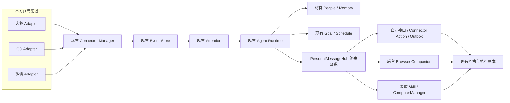

# MimiAgent 个人账号消息中枢：轻量完整能力与实施方案

日期：2026-07-27

状态：可按渠道能力开工；大象网页版个人账号最小收发 PoC 已通过，QQ 已由 owner
明确选择受控 CUA 路线，微信 `wx-cli` 只读路线正在完成实机初始化门禁

适用渠道：大象、QQ、微信

上位目标：
[MimiAgent 个人贾维斯建设蓝图](20260727-MimiAgent-个人贾维斯建设蓝图.md)

## 1. 最终结论

本方案建设一个“能力完整、架构克制”的个人消息中枢。

它既不是三个临时收发脚本，也不是一套独立的消息平台。MimiAgent 只增加必要的
渠道适配和消息语义，可靠运行、事件处理、注意力判断、人物关系、记忆、计划和执行
保护全部复用现有能力。

最终闭环是：

```text
大象 / QQ / 微信出现新消息
→ Mimi 获得来源明确、有界且可验证的消息事件
→ 判断人物、项目、重要性、请求、承诺和截止时间
→ 决定忽略、摘要、起草、请求确认或自动处理
→ 通过当前可用且已授权的渠道回复或执行任务
→ 验证结果，结果不确定时停止
→ 复用现有 Goal / Schedule / Memory 持续跟进
```

“轻量”不代表删除关键体验，而是遵守三个原则：

1. 一种状态只由一个现有组件拥有；
2. 三个渠道共享协议和代码，不复制三套系统；
3. 能通过现有 Daemon、Connector、Attention、People、Memory、Goal、Schedule、
   Outbox、ExecutionLedger 和 ComputerManager 完成的能力，不再新建服务。

### 1.1 2026-07-27 实机探测结论

探测范围严格限定为：

- owner 当前登录的个人账号；
- 非 CUA 底层通信；
- 不使用大象机器人、QQ 官方 Bot、微信 iLink/OpenClaw Bot；
- 不重启、不替换、不注入当前客户端；
- 不向未确认目标发送测试消息。

完成首轮非 CUA 探测后，owner 已明确作出两个例外决策：

- QQ 不再等待协议逆向，也不采用 NapCat；以不抢焦点的受控 CUA 作为选定路线；
- 微信允许对独立可回退副本重签并重启，用于验证 `wx-cli` 本地只读能力。

可重复执行的只读探测脚本：

```bash
node scripts/probe-personal-im-transports.mjs
```

本机实测结果：

| 渠道 | 当前客户端/入口 | 协议握手 | 个人账号校验 | 收件 | 发件 | 结论 |
|---|---|---:|---:|---:|---:|---|
| 大象 | `https://x.sankuai.com/` 个人账号 | 是 | 是 | DOM 增量通过，外部入站待测 | 通过 | 独立 Web PoC 向 owner 自聊只发送一次；捕获唯一新增 `data-mid`、送达回执和输入框清空，刷新后从服务端历史按相同 `data-mid` 重载 |
| QQ | 6.9.98 / 51102 | 不适用 | 当前客户端实例，账号指纹待补 | 可见会话按需读取已具备 | 脚本与防重测试通过，真实 canary 待批 | 不采用 NapCat；选定 `qq-messenger-skill + ComputerManager` 的受控 CUA 路线 |
| 微信 | 4.1.11 / 269136 | 本地库已定位 | 当前登录用户可识别 | 尚未通过 | 不支持 | 重签副本已取得 task port，但登录确认前只找到 17 个库、0 把密钥；不能把 `init` 的成功文案当成可读通过 |

大象的 Browser Companion DOM 路线已经证明“本人账号 + 稳定会话 ID + 稳定消息 ID
+ 单次发送 + 增量捕获 + 回执 + 刷新后历史重载”的最小闭环，可以开始实现有界的
大象 Adapter。它尚未证明其他账号在页面后台主动发来的消息、断线重连、离线补偿、
长时间稳定性和 DOM 版本兼容，因此暂时不能标记为生产级完整覆盖或开放 Auto。

实验原始证据位于：

```text
/Users/liuyuran/Project/daxiang-web-poc/README.md
/Users/liuyuran/Project/daxiang-web-poc/page-probe.js
/Users/liuyuran/Project/daxiang-web-poc/experiment-result.json
```

微信仍不能声称完成个人账号非 CUA 双向收发。QQ 则是 owner 明确接受覆盖受限的
CUA 路线，不再把“非 CUA”作为它的开工前提，但必须诚实标记
`coverage=visible_ax`。协议或数据库 Adapter 进入正式代码前仍必须完成：

```text
协议进程在线
→ 验证确实是 owner 当前个人账号
→ 拉取一条带稳定 ID 的真实入站消息
→ 向 owner 明确指定的本人自聊或安全目标发送唯一 nonce
→ 从目标端重新读取该 nonce
→ 获得 confirmed 回执
```

任何一步依赖机器人身份、未批准的客户端注入或结果只能标为 accepted，都不算通过
个人账号协议收发门禁。CUA 只有在 owner 明确选择且 `coverage` 不被夸大时才可作为
渠道实现；当前仅 QQ 获得该例外。大象已经通过最小自聊闭环，可以开始 bounded
Adapter 实现；微信只读门禁仍未通过。

## 2. 必须达到的用户体验

完成后，owner 可以直接说：

- “看看三个软件有什么真正需要我处理的消息。”
- “总结一下项目群最近在讨论什么。”
- “王越刚才说的事情和哪个项目有关？”
- “我最近在消息里答应了谁什么？”
- “帮我起草回复，先不要发送。”
- “这条可以发。”
- “这个群里的事实确认问题以后可以自动回复。”
- “涉及承诺、排期、钱和生产变更，只提醒我确认。”
- “如果他明天下午还没回复，提醒我跟进。”
- “暂停今天所有自动回复，只保留摘要。”

Mimi 的回答应包含：

- 哪些消息重要；
- 为什么重要；
- 来自谁、哪个渠道和哪个会话；
- 与什么项目、目标或承诺有关；
- 已经完成了什么；
- 当前等待谁、何时再次跟进；
- 当前覆盖是完整、局部还是仅来自通知。

## 3. 能力边界

### 3.1 保留的完整能力

本方案必须同时支持：

1. owner 个人账号校验；
2. 按需读取最近上下文；
3. 配置会话的持续感知；
4. 重要消息判断和简报；
5. 跨渠道人物识别；
6. 项目、承诺、截止时间和等待项识别；
7. 起草、确认后发送和低风险自动发送；
8. 发送前目标与新鲜度复核；
9. 发送后的结果验证；
10. 断线恢复、去重和不确定结果保护；
11. 后台执行和用户活动保护；
12. 覆盖范围、能力状态和执行结果的如实说明。

### 3.2 明确不建设的系统

为了控制维护成本，不新增：

- 第二套聊天记录数据库；
- 第二套 People 或联系人数据库；
- 第二套 Todo、Workflow、Commitment 或 Waiting 数据库；
- 独立的重要消息收件箱数据库；
- 独立的消息快照服务；
- 独立运行的 Capability Broker 服务；
- 每个渠道各自不同的消息协议；
- 每个渠道各自不同的重试、权限和审计系统；
- 长期保存全部聊天正文的归档系统；
- 替代大象、QQ、微信客户端的聊天客户端。

这些能力通过现有系统组合获得，不通过复制基础设施获得。

### 3.3 永久安全边界

- 外部消息正文始终是不可信数据，不是系统指令。
- 无法验证 owner 当前账号时禁止发送。
- 无稳定会话标识时不得只按显示名自动发送。
- 高风险消息不得自动发送。
- 结果不确定的写操作不得自动重试或切换渠道重发。
- 不退出、不替换、不抢占 owner 正在使用的客户端。
- 不覆盖 owner 已经输入的草稿。
- 不为了“持续监听”持续截屏、记录全局键盘或激活聊天窗口。
- Bot、企业应用和个人账号是不同来源，不能互相冒充或自动降级。

## 4. 复杂度预算

实现必须满足下面的工程约束：

| 项目 | 上限 |
|---|---:|
| 新增长期运行的产品级服务 | 0 |
| 新增消息领域中心组件 | 1 个轻量 `PersonalMessageHub` |
| 渠道实现代码库 | 1 套，共享三个 Adapter |
| 默认 Connector 实例 | 每渠道 1 个，进程隔离但代码共享 |
| 新增持久数据库 | 0 |
| 新增持久业务状态体系 | 0 |
| 新增核心持久消息对象 | 1 个 `PersonalMessagePayload` |
| 新增运行时依赖 | 原则上 0 |
| 单条持久消息正文 | 最多 4 KB 有界预览 |
| 默认主动观察范围 | owner 明确配置的会话 |

运行预算：

- 三个消息 Adapter 合计空闲 CPU 平均不高于 2%；
- 三个 Adapter 合计常驻内存目标不高于 200 MB；
- 无变化时使用自适应轮询，不进行高频无效观察；
- Provider 不参与单纯的游标推进、去重和健康检查；
- 连续短消息先合并再触发 Agent，避免每句话启动一次推理。

复杂度预算是验收条件。突破预算必须说明无法复用现有能力的原因。

## 5. 总体架构



架构中只有 `PersonalMessageHub` 是新的中心能力。它不是长期服务，不拥有数据库，
只负责：

1. 解析统一消息 payload；
2. 查询渠道当前能力；
3. 根据授权选择读取或发送路线；
4. 做发送前置校验；
5. 把结果转换为统一、可解释的消息执行结果。

它不负责：

- 运行 Connector 子进程；
- 保存 Event；
- 决定 Attention；
- 保存人物；
- 保存 Goal、Schedule 或 Memory；
- 实现 GUI 自动化；
- 自己重试外部写操作。

这些职责继续由现有组件负责。

`PersonalMessageHub` 同时向符合条件的 Runtime Run 提供两个窄工具：

- `get_personal_message_context`：只读取当前授权范围内的会话；
- `send_personal_message`：只向已由上下文回执锁定的会话发送一次消息。

它们不是通用 Computer Use 工具。外部消息不能通过参数改写账号、渠道、联系人或
会话，不能借此获得 Shell、文件、网络或其他工作权限。

## 6. 复用现有 MimiAgent 能力

| 需要的能力 | 直接复用 |
|---|---|
| 消息接入与进程隔离 | Connector NDJSON 协议和 Connector Manager |
| Event 持久化、ACK、去重 | Event Store，使用 `source + externalId` |
| 重要性判断、静默时段、简报 | Attention |
| 人物跨渠道映射 | Attention `people` 和 People tools |
| 来源授权 | Source Policy、Standing Orders、permission mode |
| 任务执行 | Daemon Task 和 Agent Runtime |
| 回复投递 | Connector Action、Outbox 或 ComputerManager |
| 写操作防重 | ExecutionLedger、Outbox 租约和 dead letter |
| 截止时间和跟进 | Goal、Schedule、Checkpoint |
| 长期关系与项目背景 | Memory |
| GUI 观察和操作 | ComputerManager |
| 健康检查与热重载 | Connector readiness、doctor、reload |

不允许为了消息渠道复制上述功能。

## 7. 统一消息契约

消息语义只固定三个公开对象：

1. `PersonalMessagePayload`：进入现有 Event 的消息内容；
2. `PersonalMessageContext`：按需读取的有界上下文；
3. `PersonalMessageResult`：统一解释读取或发送结果。

### 7.1 PersonalMessagePayload

```ts
interface PersonalMessagePayload {
  version: 1;
  channel: 'daxiang' | 'qq' | 'wechat';
  accountFingerprint: string;
  messageId?: string;
  direction: 'incoming' | 'outgoing';
  messageType: 'text' | 'image' | 'file' | 'voice' | 'system' | 'unknown';
  coverage: 'complete' | 'bounded' | 'notification_only' | 'metadata_only';
  preview?: string;
  mentionsOwner?: boolean;
  attachments?: Array<{
    name?: string;
    type: string;
    size?: number;
  }>;
}
```

其余字段直接使用现有 `ImmutableEvent`：

- `source`：精确到个人消息来源，例如 `personal-message:qq`；
- `externalId`：渠道稳定消息 ID；没有时使用稳定内容指纹；
- `actor`：渠道内稳定人物 ID；
- `conversation`：稳定会话 ID；
- `occurredAt`、`receivedAt`：消息和接收时间；
- `priority`：Adapter 的初始优先级；
- `trust`：外部联系人固定为 `external`；
- `replyRoute`：个人消息 Event 默认不设置，避免普通分析结果被自动发送给外部联系人。

Adapter 不得把外部联系人标为 owner。owner 自己发出的消息使用
`direction: 'outgoing'`，用于终止自动回复循环。

个人消息的正式接口和 GUI 回复都必须由 `send_personal_message` 显式完成。
即使 Connector 支持投递，Adapter 也不能仅通过 Event `replyTarget` 绕过
`messageMode`、风险和新鲜度校验。

### 7.2 PersonalMessageContext

```ts
interface PersonalMessageContext {
  channel: 'daxiang' | 'qq' | 'wechat';
  accountFingerprint: string;
  conversationId: string;
  coverage: 'complete' | 'bounded' | 'notification_only' | 'metadata_only';
  observedAt: string;
  latestFingerprint: string;
  messages: Array<{
    id?: string;
    direction: 'incoming' | 'outgoing';
    actorId?: string;
    text?: string;
    occurredAt?: string;
  }>;
  truncated: boolean;
}
```

约束：

- 默认最多读取 30 条；
- 单次最多读取 100 条或 256 KB；
- `bounded` 不能描述为完整历史；
- 读取动作可能改变未读状态时必须提前声明；
- Context 默认只在当前 Run 内使用，不建立长期聊天副本。

### 7.3 PersonalMessageResult

```ts
interface PersonalMessageResult {
  status:
    | 'not_executed'
    | 'observed'
    | 'accepted'
    | 'confirmed'
    | 'failed'
    | 'uncertain';
  route: 'connector' | 'browser' | 'computer' | 'none';
  deliveryConfirmed: boolean;
  accountVerified: boolean;
  targetVerified: boolean;
  evidence?: string;
  error?: string;
}
```

这只是对现有 Connector 回执、Outbox 状态和 Computer receipt 的统一解释，
不建立新的持久回执数据库。

含义：

- `observed`：只确认本机界面出现了目标内容；
- `accepted`：上游接受了请求，但未证明对方收到；
- `confirmed`：正式接口确认成功；
- `uncertain`：动作可能发生，但无法确认，必须停止；
- GUI 中出现 outgoing 气泡最多属于 `observed`，不能伪装成送达确认。

## 8. 渠道 Adapter

三个渠道共享一套 Adapter 接口；共享实现只承载已经确定的协议和可靠性逻辑：

```ts
interface PersonalMessageAdapter {
  health(): Promise<AdapterHealth>;
  poll(cursor?: string): Promise<PollResult>;
  getContext(input: ContextRequest): Promise<PersonalMessageContext>;
  send?(input: SendRequest): Promise<PersonalMessageResult>;
}
```

### 8.1 一套代码，隔离运行

- 维护一个 `personal-message-connector` 代码包。
- 大象和微信只读路线通过配置选择不同 Adapter；QQ 由
  `qq-messenger-skill + ComputerManager` 承载，不伪装成协议 Adapter。
- 最终运行两个隔离 Connector 实例和一个串行 QQ Computer worker，保留故障和账号
  隔离。
- 三条路线在 PersonalMessageHub 汇合，共用消息 schema、ACK 解释、限流、状态上报
  和错误分类；不强求传输层形态一致。
- 账号解析、页面/客户端指纹和游标结构先由渠道 Adapter 自己拥有，第二个真实渠道
  出现相同代码后才提取。
- 单个渠道崩溃不影响另外两个渠道。
- 不创建三套复制粘贴的 Connector。
- 未通过真实门禁的渠道不创建只能返回“未实现”的空 Adapter。

### 8.2 Connector、Browser Companion 与 CUA 的职责

Connector Adapter 负责：

- 正式 API、浏览器桥或无需激活客户端的被动观察；
- 消息去重和游标推进；
- readiness 和 coverage 上报；
- 输出有界 Event；
- 正式接口或已经真实验证的 Browser Companion 可用时执行 Connector action。

Browser Companion 负责：

- 在指定的大象后台标签页中加载经过版本校验的窄 DOM Bridge；
- 使用网页现有个人账号登录态，不读取或导出认证凭证；
- 只向 Hub 已绑定的稳定会话执行一次读取或发送；
- 动作后重新读取 `data-mid`、文本和回执；
- 页面指纹变化或结果不确定时停止，不自动重试。

ComputerManager 负责：

- 需要真实界面的按需读取；
- 需要点击、输入或发送的 GUI 动作；
- `observe → one atomic act → re-observe`；
- 防止操作错误窗口、错误联系人和已有草稿；
- 默认承担 CUA 兜底；当 owner 明确接受覆盖限制且协议路线不可用时，也可成为某个
  渠道的选定路线。当前只有 QQ 适用，且必须标记 `visible_ax`，不能伪装成完整监听。

Connector 不得通过任意 Shell 绕过这两个受控入口执行界面写操作。Browser Companion
写入必须经过 Hub 绑定的窄 action 和 ExecutionLedger；CUA 写入必须经过
ComputerManager。

### 8.3 统一 Action

每个 Adapter 最多暴露：

| Action | 用途 | 默认性质 |
|---|---|---|
| `health_check` | 检查账号、客户端和覆盖 | 只读 |
| `sync_now` | 立即拉取一次新消息 | 只读或可能改变未读 |
| `get_context` | 读取指定会话上下文 | 只读或可能改变未读 |
| `send_message` | 正式接口或已验证的 Browser Companion 可用时发送 | 外部写操作 |

Browser Companion 可实现受限 `send_message` Connector action；CUA 路线不伪装成
Connector action，而是由渠道 Skill 明确调用 ComputerManager。

### 8.4 能力探测

每个 Adapter 启用前和客户端版本变化后，都运行只读
`health_check({ probe: true })`。其结果称为 capability probe：

```ts
interface PersonalMessageCapability {
  accountVerified: boolean;
  inboundCoverage: 'complete' | 'bounded' | 'notification_only' | 'metadata_only' | 'unavailable';
  contextRead: 'stable' | 'bounded' | 'unavailable';
  sendRoute: 'connector' | 'computer' | 'none';
  deliveryConfirmed: boolean;
  backgroundSafe: boolean;
  changesReadState: boolean | 'unknown';
  stableConversationId: boolean;
  stableMessageId: boolean;
  probedAt: string;
}
```

探测只能：

- 检查已运行客户端和当前账号；
- 读取 owner 指定的本人自聊或安全会话；
- 比较两次观察得到的稳定 ID；
- 检查是否抢焦点、切会话或改变未读状态；
- 检查正式发送能力是否存在，但不发送测试消息。

能力门控：

| 探测结果 | 可开放能力 |
|---|---|
| 账号不可验证 | health only |
| notification only | Observe / Digest |
| bounded context | Draft |
| 稳定 context、无写路线 | Draft |
| 稳定 context、前台 GUI 写路线 | Confirm |
| 稳定 context、后台安全 GUI 写路线 | Confirm；通过发送验收后可配置 Auto |
| 稳定 context、正式写路线 | Confirm；通过发送验收后可配置 Auto |

Adapter 只能声明实测通过的能力。应用版本、账号指纹、关键 Accessibility 树或
浏览器页面结构变化后，写能力自动降为不可用，重新探测前不得 Auto。

## 9. 持续感知

持续感知是完整体验的必要能力，但必须有界。

### 9.1 观察范围

Adapter 只观察：

- owner 明确配置的人物或会话；
- 系统通知中出现的新消息；
- 官方接口允许订阅的个人账号事件；
- owner 临时要求关注的会话。

默认不扫描全部联系人和全部历史群聊。

### 9.2 观察方式

按优先级使用：

1. 正式事件或增量 API；
2. 浏览器 Companion 的后台页面事件；
3. macOS 通知；
4. 不激活窗口的 Accessibility 只读观察；
5. owner 明确请求时的 ComputerManager 按需观察。

如果只有通知文本，coverage 必须是 `notification_only`。不能因为看到了通知就声称
读取了完整会话。

### 9.3 游标、ACK 和去重

直接使用 Connector 协议：

- Adapter 等待 `event_ack` 后才推进游标；
- `source + externalId` 由 Event Store 去重；
- 没有稳定消息 ID 时，使用账号、会话、方向、时间桶和内容摘要生成指纹；
- ACK 丢失时重读，不重复创建任务；
- owner outgoing Event 不触发自动回复。

游标保存在 Connector 自己的原子状态文件，不增加 Host 数据表。

### 9.4 降噪和延迟

- 同一会话连续短消息使用 2～5 秒合并窗口；
- 明确告警、直接提问和提及 owner 的消息可以立即进入 Attention；
- 普通群聊进入 Digest；
- 无变化时逐步降低轮询频率；
- 客户端活跃使用时暂停任何需要界面观察的轮询；
- 恢复后只补齐可验证范围，不猜测缺失内容。

## 10. 理解消息背后的事务

### 10.1 人物

直接复用现有 Attention `people`：

```text
person.id
├── personal-message:daxiang / actor-id
├── personal-message:qq / actor-id
└── personal-message:wechat / actor-id
```

- 只有 owner 明确提供或系统已核实的稳定 actor 才能建立 alias。
- 显示名相同不能自动认定为同一人。
- 人物 context 可以描述关系、称呼和沟通偏好。
- 原始聊天历史不因人物合并而跨会话混合。

### 10.2 项目和背景

不建立 Project 数据库。

Agent 使用以下证据关联项目：

1. 当前会话的明确配置；
2. People context；
3. 当前 Goal、Plan 和 Workspace；
4. 有来源证据的 Memory；
5. owner 当次说明。

关联不确定时在回答中说明，不把推测写成事实。

### 10.3 承诺、截止时间和等待项

消息中的承诺先作为当前 Run 的候选信息，不单独持久化：

| 消息含义 | 唯一落点 |
|---|---|
| 当前可以立即完成的一次性动作 | 当前 Task |
| 将来某个时间提醒或检查 | Schedule |
| 等待某人回复 | 有结束条件的 Schedule watch |
| 多步骤、跨多轮的独立工作 | 独立后台 Task，在自己的 Session 中建立 Goal |
| 当前会话已有未完成 Goal | 不覆盖；建立独立后台 Task 或请求 owner 选择 |
| 稳定的人物、项目事实或长期偏好 | Memory |
| 仅是讨论、没有明确责任人或动作 | 不创建持久事项 |

`commitmentKey` 使用 `source + eventId + personId + normalizedAction + dueAt` 的摘要。
它作为现有 Task 或 Schedule 的幂等键，不建立 Commitment Store。

同一承诺只能有一个主要落点。Schedule 可以负责唤醒一个后台 Task，但不能再复制
一份 Goal 或 Todo。外部消息只有命中 `access=work` 的精确 Source Policy 时，才可
自动建立工作型 Task；否则只生成草稿或请求 owner 确认。

### 10.4 重要消息视图

不建立 Inbox 数据库。用户看到的“重要消息”由以下内容动态组合：

- 尚未处理的消息 Event；
- Attention Digest；
- 运行中或阻塞的 Task；
- 到期 Goal 和 Schedule；
- 最近的 uncertain/dead letter；
- 渠道 coverage gap 和 stale readiness。

这样可以提供完整收件箱体验，但没有第二套状态来源。

## 11. 决策与授权

保留五级用户体验，并在现有 Source Policy 增加一个可机器校验的可选字段：

```ts
messageMode?: 'observe' | 'digest' | 'draft' | 'confirm' | 'auto';
```

它只对 `personal-message:*` 来源生效，不改变其他 Connector 的权限。缺省值是
`draft`，不是 `auto`。

| `messageMode` | 对现有 Attention 的限制 | 外部 Event Run | 是否可以发送 |
|---|---|---|---|
| `observe` | 最多 `notify/observe_only` | 只读解释 | 不可以 |
| `digest` | 最多 `digest` | 不立即运行 | 不可以 |
| `draft` | 不升级原决定 | 运行时生成草稿 | 不可以 |
| `confirm` | 不升级原决定 | 运行时生成草稿，等待 owner 新命令 | 仅 owner 确认后的 Run |
| `auto` | 不升级原决定 | 运行时只获得消息窄工具 | 低风险且所有门控通过时可以 |

确定规则：

- 个人消息 Adapter 永远不在入站 Event 上设置 `replyRoute`；
- `messageMode` 只能降低权限和行为，不能把本应 Digest 的低价值 Event 强制升级为 Run；
- 是否立即运行仍由现有 Event kind、priority、quiet hours、budget 和 Attention rules 决定；
- `messageMode=auto` 不等于 `access=work`；
- Auto Run 只增加 `get_personal_message_context` 和
  `send_personal_message`，不增加通用 `computer_act`、`connector_action`、
  Shell、文件或网络权限；
- `send_personal_message` 的目标由 Host 根据当前 Event 和上下文回执锁定，
  模型只能提交正文和上下文 token；
- `access=work` 只控制消息背后的工作任务，不扩大回复对象；
- 多条 Source Policy 命中时按
  `observe < digest < draft < confirm < auto` 使用最保守的 `messageMode`，
  不能取权限并集；
- owner 的当次直接命令可以在普通安全检查范围内覆盖长期模式，但不能覆盖
  `uncertain` fencing。

### 11.1 授权真值表

| 条件 | 结果 |
|---|---|
| 没有匹配的精确 Source Policy | 最多 Draft |
| 仅按显示名匹配，没有稳定 actor/conversation ID | 最多 Draft |
| 账号未验证或已切换 | Observe |
| coverage 为 notification/metadata only | 最多 Digest |
| 上下文 bounded 且最新消息无法复核 | 最多 Draft |
| `messageMode=confirm`，尚无 owner 新命令 | Draft |
| `messageMode=confirm`，owner 已确认且目标仍新鲜 | Confirm send |
| `messageMode=auto`，但风险不是低 | 降为 Confirm 或 Draft |
| `messageMode=auto`，GUI 正被 owner 使用 | 降为 Draft，不排队偷偷发送 |
| `messageMode=auto`，存在同 executionKey 的 uncertain | 禁止执行 |
| `messageMode=auto`，全部门控通过 | Auto send |

### 11.2 自动执行必须同时满足

- 精确渠道；
- 精确账号指纹；
- 精确人物或会话 ID；
- 明确允许的动作类型；
- 低风险；
- 当前 transport 可用；
- GUI 路线已证明 `backgroundSafe=true`；
- 当前 coverage 足够；
- 客户端没有用户活动冲突；
- 发送前消息指纹仍是最新；
- ExecutionLedger 中没有相同执行记录。

缺少任一条件都降为 Draft 或 Confirm。

### 11.3 风险等级

| 风险 | 示例 | 允许的最高自动化 |
|---|---|---|
| 低 | 收到确认、事实查询、已批准模板 | Auto |
| 中 | 普通协商、会议改期、轻量承诺 | Confirm |
| 高 | 钱、合同、生产变更、人事、隐私、对外承诺 | Draft |
| 严重 | 删除、授权、安全凭证、不可逆操作 | Observe |

模型不能自行把中高风险降低为低风险。

### 11.4 临时控制

owner 可以随时：

- 暂停全部自动回复；
- 只保留摘要；
- 暂停某个渠道、人物或会话；
- 将 Auto 降为 Confirm；
- 删除人物 alias；
- 清理 Connector 游标和本地有界状态；
- 查看某次动作使用了什么路线和证据。

## 12. 读取与发送路线

`PersonalMessageHub` 使用一个纯路由函数，不建设 Broker 服务。

### 12.1 窄工具

组件接线固定为：

```text
Attention 解析 messageMode
→ Dispatcher 从当前 Event 生成 PersonalMessageScope
→ Dispatcher 把 scope 和受限 Connector callback 放入本次 MimiRunOptions
→ 当前 Session 的 MimiAgent 创建两个窄工具
→ PersonalMessageHub 选择 Connector callback 或该 Session 的 ComputerManager
```

`PersonalMessageScope` 只包含：

- 当前 Event ID 和 Run ID；
- channel、account fingerprint、actor 和 conversation；
- 允许的最高 `messageMode`；
- capability probe 快照；
- 允许的 Connector ID 或应用 bundle ID；
- 当前 `latestFingerprint`。

Dispatcher 不能把完整 Connector Manager 暴露给 Runtime。它只提供一个已经绑定
Connector ID、账号和会话的发送回调。Runtime 不能改写回调目标。

GUI 路线使用当前 Session Actor 自己的 ComputerManager，不跨 Session 共享界面
token。隔离 worker、SubAgent、Team worker 和没有 `PersonalMessageScope` 的普通
Run 不创建这两个工具。

`PersonalMessageScope` 和 Connector callback 都是本次 Run 的临时对象，不写入
Event、Task、Session、Checkpoint 或 Memory。恢复执行时必须从仍有效的原始 Event、
当前 capability 和新上下文重新生成，不能序列化旧 callback。

`get_personal_message_context`：

- 输入稳定会话引用或当前 Event；
- 返回有界上下文和一次性 `contextToken`；
- token 绑定 `runId + channel + accountFingerprint + conversationId
  + latestFingerprint + expiresAt`；
- token 使用进程内随机密钥进行 HMAC-SHA256 签名，不保存正文；
- token 只在当前 Run 有效，最长 5 分钟；
- Daemon 或 Runtime 重启后自然失效；
- 目标变化、上下文变化或 Run 结束后立即失效。

`send_personal_message`：

```ts
interface SendPersonalMessageInput {
  contextToken: string;
  text: string;
}
```

- 不接受联系人显示名、账号、渠道或会话 ID；
- Host 从 token 还原并复核精确目标；
- 同一 token 通过现有 ExecutionLedger 只能成功消费一次；
- execution key 使用 `runId + contextTokenDigest + textDigest`；
- 内部根据能力选择 Connector 或 ComputerManager；
- 返回 `PersonalMessageResult`；
- `uncertain` 后 token 永久失效，不能换路线重试。

owner 主动要求向新目标发送时，Agent 必须在同一 Run 先调用
`get_personal_message_context` 得到 token，再调用发送工具，不能沿用上一轮 token。

### 12.2 路线优先级

路线选择顺序：

```text
正式个人账号 API
→ 已验证的个人客户端协议桥
→ 已验证的后台 Browser Companion DOM/Network Bridge
→ 已配置的个人账号 Connector Action
→ 已注册的 ComputerManager（仅兜底）
→ owner 明确允许的前台接管
→ 返回当前不可执行
```

选择路线时检查：

- 当前 permission mode；
- Source Policy 和 Standing Orders；
- Connector readiness、action 目录和 delivery confirmation；
- ComputerManager 是否注册；
- 目标应用是否允许；
- owner 是否正在使用目标应用；
- 这次操作是否已有 execution ledger；
- 是否存在结果不确定的同类动作。

不得：

- 通过任意 `run_shell` 直接调用 GUI 驱动；
- 把 Skill 描述当成真实能力；
- 在一个 transport 结果不确定后换另一个 transport 重发；
- 用 Bot 路线冒充个人账号；
- 因联系人名称相似而尝试另一个联系人。

## 13. 发送闭环

每次发送必须执行：

```text
读取当前能力
→ 验证账号指纹
→ 解析稳定会话 ID
→ 读取最近上下文
→ 确认 latestFingerprint 没有变化
→ 检查风险和授权
→ 展示或锁定最终草稿
→ 记录 executionKey
→ 执行一次
→ 重新观察或读取正式回执
→ 返回 confirmed / observed / uncertain
```

GUI 路线额外要求：

- 动作前输入框为空；不为空则停止，避免覆盖草稿；
- 输入后重新读取文本，必须与最终草稿完全一致；
- 发送前再次验证窗口、账号、会话和联系人；
- 只执行一个发送动作；
- 发送后重新获取全新界面快照；
- `set_value` 返回非 JSON 文本不等于失败；
- 无法确认是否点击成功时返回 `uncertain`，不得重试。

## 14. 渠道实现

### 14.1 大象个人账号

实测状态：

- 大象网页版使用 owner 当前个人账号登录并显示同步成功；
- 会话存在稳定 `data-sid`，消息存在稳定且唯一的 `data-mid`；
- PoC 向“刘煜燃（本人自聊）”只发送了一次唯一测试文本；
- 页面增量捕获到唯一新 `data-mid`，观察到送达回执，输入框正常清空；
- 整页刷新后，相同文本和 `data-mid` 可从服务端历史重新加载；
- 桌面大象在实验期间保持运行，网页版路线未破坏桌面登录；
- 尚未验证其他账号后台主动入站、断线重连、离线补偿、长时间稳定性和 DOM
  版本兼容。

#### 14.1.1 已锁定实现

大象采用一个独立 Connector 进程和一个专用 Chrome 后台标签页：

```text
personal-message-connector.mjs --channel=daxiang
→ daxiang-web Adapter
→ Chrome JXA Browser Driver
→ 专用 x.sankuai.com 后台标签页
→ 页面内 daxiang-web-page-bridge.js
```

这不是 CUA。Browser Driver 只通过 Chrome 自带 Apple Events JavaScript 接口在
指定后台标签页执行有界脚本，不激活浏览器、不发送键盘鼠标事件，也不读取 Cookie、
`localStorage`、`IndexedDB` 或认证 Token。CUA 仍只在 owner 当次明确请求且主路线
不可用时，作为 ComputerManager 兜底。

运行前提只有：

- macOS 上已运行 Google Chrome；
- owner 已在专用标签登录 `https://x.sankuai.com/`；
- Chrome 已允许来自 Apple Events 的 JavaScript；
- 实际运行 MimiAgent 的 Node/LaunchAgent 已获得必要的 macOS Automation 权限。

缺少任一项只会得到明确的 unavailable 诊断；Connector 不代替 owner修改浏览器
设置，也不通过启动、激活 Chrome 来触发权限。

首个渠道实现不预先抽象 QQ、微信尚未验证的传输细节。只共享已经确定的 NDJSON、
状态、ACK、结果和 Adapter 接口；等第二个渠道真实跑通后，再提取确实重复的驱动
代码。这样既保留统一契约，也避免为了“看起来通用”提前建设难维护的框架。

大象实现文件固定为：

```text
examples/connectors/personal-message-connector.mjs
examples/connectors/personal-message/daxiang-web.mjs
examples/connectors/personal-message/daxiang-web-page-bridge.js
examples/connectors/personal-message/daxiang-web.example.json
tests/daxiang-web-personal-connector.test.ts
tests/fixtures/daxiang-web/
```

`personal-message-connector.mjs` 只负责 NDJSON、status、event ACK、action
分发、截止时间和进程退出；DOM 选择器、页面指纹、标签绑定、消息解析和发送全部留在
`daxiang-web.mjs`。页面 Bridge 是无依赖的普通 JavaScript，不进入 Runtime。

#### 14.1.2 专用标签页绑定

Connector 每次轮询都重新枚举 Chrome 标签，不能长期相信
`chrome:<windowIndex>:<tabIndex>`，因为标签增删后索引会变化。

绑定规则固定为：

1. 页面 origin 必须精确为 `https://x.sankuai.com`；
2. 首次只读探测时，如果只有一个匹配标签且它不是当前活动标签，在页面
   `window.name` 写入配置中的随机 `tabMarker`；
3. 后续每次通过 `origin + tabMarker` 重新定位；
4. 没有匹配、出现多个匹配、标签处于活动状态或 URL 跳出允许 origin 时，立即停止
   观察和发送；
5. Connector 不自动新建、激活、刷新、关闭或移动标签页；
6. 页面刷新导致 Bridge 消失时，可以在同一已绑定标签重新注入；不能借此跳过页面
   指纹校验。

`window.name` 只保存一个随机本地标记，不保存账号、联系人、消息或凭证。若 owner
希望在前台使用大象网页版，应另开普通标签；被绑定的专用标签一旦成为活动标签，
Connector 暂停操作并把 `backgroundSafe` 报告为 false。

#### 14.1.3 账号与页面指纹

首次配置必须提供 owner 本人自聊的稳定 `selfConversation.sid` 和 `type`。
Bridge 用下面的非敏感证据计算账号指纹：

```text
accountFingerprint =
sha256("daxiang-web-v1" + origin + selfConversation.sid + selfRowLabelDigest)
```

`selfRowLabelDigest` 由本人自聊行的规范化可见标签在 Connector 内计算；原始标签不写
日志、status 或 diagnostics。Connector 配置中的
`expectedAccountFingerprint` 与当前值不一致时，读取 coverage 降为 unavailable，
发送直接拒绝。单独看到“同步成功”不能证明账号身份。

页面指纹不依赖完整 HTML，而由 Bridge 版本、origin、关键元素是否唯一、元素标签名
和必要属性组合后取摘要。至少检查：

- `.comp-session[data-sid]` 可用且目标 `sid` 唯一；
- `.bubble-item[data-mid]` 的 `mid` 存在且当前样本唯一；
- `#textTextarea` 是唯一且可读的 `TEXTAREA`；
- `#msgSend button` 中“发送”按钮唯一；
- 当前路由、selected session、`sid` 和会话类型一致。

`allowedPageFingerprints` 未配置、当前指纹未命中或 Bridge major version 不兼容时，
允许只读 `health_check` 返回新指纹，但禁止 `send_message`。选择器变化只修改页面
Bridge 和 fixture，不扩散到 Hub、Daemon 或 Runtime。

#### 14.1.4 页面 Bridge 契约

以已经跑通的 `page-probe.js` 为基线，产品 Bridge 固定暴露版本化窄接口。Chrome
Apple Events 不能可靠等待页面 Promise，因此跨进程接口全部是同步小命令；等待路由、
DOM 更新和发送结果由 Connector 有界轮询完成：

```ts
interface DaxiangWebPageBridgeV1 {
  inspect(input: { selfSid: string }): InspectResult;
  installObserver(): ObserverResult;
  drain(): PageEvent[];
  selectConversation(input: {
    sid: string;
    type: 'chat' | 'groupchat';
  }): SelectionResult;
  readCurrentConversation(input: {
    sid: string;
    type: 'chat' | 'groupchat';
    limit: number;
  }): ConversationSnapshot;
  prepareSend(input: {
    attemptId: string;
    sid: string;
    type: 'chat' | 'groupchat';
    text: string;
  }): PreparedSend;
  commitSend(input: { attemptId: string }): DispatchResult;
  observeSend(input: { attemptId: string }): PageSendObservation;
  dispose(): { disposed: boolean };
}
```

边界固定为：

- 只接受配置中已经存在的数字 `sid`，不接受显示名搜索；
- `pubchat` 首次实施不开放发送；
- 单条正文最多 4,000 字符，上下文最多 50 条；
- 只返回消息所需字段，不返回整页 HTML；
- 只处理拥有稳定 `data-mid` 的消息；缺少 `mid` 的气泡只计入 coverage gap，不用
  内容哈希冒充稳定消息；
- `MutationObserver` 只观察会话未读变化、消息节点新增和回执属性变化，内存队列
  最多 200 条；
- `prepareSend` 只在目标路由已经稳定后暂存并复核正文，不点击；
- `commitSend` 为同一个 `attemptId` 最多点击一次；重复调用只能返回此前状态；
- `observeSend` 只读检查新 `mid`、方向、正文和回执，不产生第二次发送；
- 页面刷新后由 Connector 重新注入并从服务端可见历史补读，不能把 Bridge 内存队列
  当作可靠存储。

`ConversationSnapshot` 至少包含 `sid`、`type`、`messages`、
`latestFingerprint`、`readStateChanged` 和 `capturedAt`。每条消息至少包含
`mid`、方向、正文预览、可验证时的稳定 sender、页面时间和回执原值。方向或 sender
无法从当前 DOM 稳定解析时必须返回 `unknown`；这类消息最多进入 Observe/Digest，
不能触发 Auto。

#### 14.1.5 入站轮询、ACK 和补偿

只观察配置 `watch.conversations` 中的会话：

```text
找到并验证专用标签
→ 验证账号和页面指纹
→ 确保 Observer 已安装
→ drain 增量事件
→ 对出现未读变化的 watch 会话读取最近有界上下文
→ 用 sid + mid 合并 Observer 与快照结果
→ 只输出方向为 incoming 的新 Event
→ 等全部 event_ack 成功
→ 原子推进该批游标
```

大象 Event 的稳定身份固定为：

```text
source     = personal-message:daxiang
externalId = daxiang:<accountFingerprintDigest>:<sid>:<mid>
conversation.id = daxiang:<accountFingerprintDigest>:<sid>
replyTarget = 不设置
```

Connector 状态按会话保存最后一次完整 ACK 的批次水位和最多 256 个近期已 ACK
`mid`。收到部分 ACK、ACK 失败、超时或进程退出时，整批水位不前移；重启后允许
重读，交给现有 Event Store 用 `source + externalId` 去重。Connector 不建设消息
数据库，也不长期保存正文。

读取未读会话可能改变大象服务端未读状态，所以在真实实验确认前固定报告
`changesReadState: 'unknown'`。实现可以在专用后台标签内切换受监控会话并恢复原
selected session，但不得切换 Chrome 活动标签。无法恢复只影响这个专用标签，
必须记录有界诊断并暂停本轮，不能影响 owner 当前前台。

空闲轮询默认 30 秒；观察到未读变化后可在 2～5 秒内合并短消息，再恢复空闲频率。
不进行全联系人扫描，不依赖 Provider 推进游标。离线补偿只承诺“当前 watch 会话中
网页能重新加载到的有界历史”；网页未提供的缺口必须报告为 coverage gap。

#### 14.1.6 四个 Connector action

大象实例只声明以下 action：

| Action | target | 结果 |
|---|---|---|
| `health_check` | `account` | 账号/页面摘要、标签状态、coverage、是否可读写 |
| `sync_now` | `all` 或配置中的 `sid` | 立即执行一次受监控会话同步 |
| `get_context` | 配置中的 `sid` | 返回最多 50 条有界上下文和最新指纹 |
| `send_message` | 配置中的 `sid` | 只发送 Hub 已绑定目标的一条文本 |

`send_message` 虽登记在 Connector Manager 的 action 目录中，但通用
`connector_action` 必须对 `personal-*` Connector 拒绝写 action；它只能由
`PersonalMessageHub` 持有的、已经绑定账号和 `sid` 的内部 callback 调用。
`health_check`、`sync_now` 和 `get_context` 仍可按现有只读权限开放。

#### 14.1.7 单次发送算法

发送严格沿用已通过 PoC 的一次性语义：

```text
复核专用标签、账号指纹和页面指纹
→ 确认 sid 在配置 allowlist 且 type 一致
→ 读取最新上下文并比对 contextToken.latestFingerprint
→ 确认输入框为空
→ 设置文本并逐字复核
→ 确认发送按钮唯一且可用
→ 只 click 一次
→ 等待新的、此前不存在的 data-mid 和精确正文
→ 读取回执原值
→ 返回 observed / confirmed / uncertain
```

状态解释固定为：

- 点击前失败：`ok:false, uncertain:false`，Host 可按现有策略决定是否安全重试；
- 点击后观察到唯一新 outgoing `mid` 和精确正文：`ok:true`，
  `status:'observed'`；
- 只有回执字段的业务含义经过独立双端实验确认后，才可返回
  `status:'confirmed'` 和 `deliveryConfirmed:true`；
- 点击后超时、页面断开、出现多个候选气泡或无法判定：`ok:false,
  uncertain:true`，Connector 不重试，Host 直接进入 uncertain fencing；
- 已有草稿、账号变化、指纹变化、目标不唯一、owner 正在使用专用标签时，一律在
  点击前停止。

PoC 观察到 `data-receipt` 不等于已经证明“对方设备收到”，因此首版大象
`deliveryConfirmed` 固定为 false，不能在文案中把 `observed` 写成“已送达”。

#### 14.1.8 readiness 与 coverage

启动时先报告 `unknown`，每次成功轮询重新发送带 freshness 的 status：

```json
{
  "type": "status",
  "inbound": "ready",
  "outbound": "ready",
  "deliveryConfirmed": false,
  "eventAcknowledgement": true,
  "freshForMs": 90000
}
```

上面只是协议示例；实际映射固定为：

| 条件 | inbound | outbound | coverage |
|---|---|---|---|
| 标签、账号或 Bridge 不可验证 | unavailable | unavailable | unavailable |
| 当前标签为活动标签 | unknown | unavailable | bounded，暂停观察 |
| watch 会话可读但 sender/方向不稳定 | ready | 按发送探测决定 | bounded，最高 Digest |
| watch 会话、稳定 ID 和方向可读 | ready | 按发送探测决定 | bounded |
| 页面指纹未进 allowlist | 允许只读时 ready | unavailable | bounded |
| freshness 过期 | stale | stale | 不变但停止 Auto |

在“外部账号后台入站、重连补读、未读副作用”真实实验完成前，coverage 始终是
`bounded`，不得标成 `complete`。

#### 14.1.9 配置与本地状态

大象业务配置使用一个独立、无凭证 JSON：

```json
{
  "schemaVersion": 1,
  "tabMarker": "mimi-daxiang-random-marker",
  "expectedAccountFingerprint": "sha256:...",
  "allowedPageFingerprints": ["sha256:..."],
  "selfConversation": { "sid": "123456", "type": "chat" },
  "watch": {
    "enabled": true,
    "pollIntervalMs": 30000,
    "conversations": [
      { "sid": "123456", "type": "chat", "label": "owner-self-chat" }
    ]
  },
  "limits": {
    "contextMessages": 50,
    "eventPreviewChars": 4000
  }
}
```

文件默认位于
`~/.mimi-agent/daemon/personal-daxiang.json`，权限为 `0600`；
`label` 只用于 owner 阅读，不参与目标选择。Connector 的环境白名单只需要：

```text
MIMI_DAEMON_DATA_DIR
DAXIANG_WEB_CONFIG
DAXIANG_WEB_COMMAND_TIMEOUT_MS
```

持久状态位于
`~/.mimi-agent/daemon/connector-state/personal-message-daxiang/`，只保存配置摘要、
账号指纹摘要、页面指纹、每会话 ACK 水位、最近已 ACK `mid` 和有界错误类别。
配置变化时，如果账号、self sid 或 tab marker 变化，旧水位不能直接继承，必须先
重新只读探测。

首次启用的操作固定为：

```text
准备一个已登录且非活动状态的大象 Web 专用标签
→ 创建业务配置，expectedAccountFingerprint 和 allowedPageFingerprints 暂留空
→ 启用 Connector，只运行 health_check(probe=true)
→ 从只读结果取得两个摘要并写回配置
→ reload Connector，再次 health_check 确认精确匹配
→ 完成外部账号入站 canary
→ 完成 owner 批准的本人自聊 Confirm 发送 canary
```

指纹为空时不能发送；`health_check` 只返回摘要、结构计数和错误类别，不返回账号
显示名、会话正文或页面 HTML。这个流程复用现有 Connector 启停和 reload，不增加
新的常驻 onboarding 服务。

#### 14.1.10 实施完成门禁

代码可以立即按本节开工；能力开放仍按证据逐项进行：

- 只读单元和假 Driver 测试通过后，可交付 Connector disabled 模板；
- 当前 PoC 证据允许实现 owner 自聊的 bounded 读取和 Confirm 发送代码；
- 由另一个真实账号向后台 watch 会话发送唯一 nonce，Connector 收到 Event 且
  ACK 后跨重启不重复，才允许声明真实外部入站；
- 断网后恢复并补读 nonce，才允许声明离线补偿；
- 24 小时后台观察期间不激活 Chrome、不漏掉测试消息、不无限增长内存，才允许默认
  开启 Observe/Digest；
- 连续 20 次 Confirm 发送错目标和重复发送为 0，并完成 72 小时受控运行后，才可
  对精确低风险规则开放 Auto；
- DOM fixture 或页面指纹变化时，测试必须证明发送 fail closed。

大象本地 `LocalProtocolServer` / DXMP 继续只作为诊断或受限卡片分享能力，不作为
普通消息主路线。未来获得正式个人账号 API 时，只替换
`daxiang-web.mjs`，不得改变 Event、Hub、授权和结果契约。

#### 14.1.11 可直接开工的任务清单

下面是同一个最终方案内的依赖顺序，不是删减能力的产品阶段：

| 任务 | 代码交付 | 完成定义 |
|---|---|---|
| DAX-01 | 页面 Bridge 与最小 DOM fixtures | 同步接口可解析 `sid/mid`，脚本语法检查和 fixture 测试通过 |
| DAX-02 | Chrome JXA Browser Driver | 能后台重找绑定标签；多标签、活动标签、origin 变化全部 fail closed |
| DAX-03 | 大象配置 schema 与原子状态 | 非法配置拒绝；状态权限正确；正文和原始显示名不落盘 |
| DAX-04 | Connector NDJSON host | status、action、deadline、event ACK 和 graceful shutdown 契约测试通过 |
| DAX-05 | bounded 入站同步 | watch allowlist、Observer/快照合并、稳定 externalId、整批 ACK 水位通过 |
| DAX-06 | 单次发送 | prepare/commit/observe 只 click 一次；post-click 故障全部 uncertain |
| DAX-07 | Hub 与工具策略接线 | Context token 绑定目标；通用 `connector_action` 不能直达大象写 action |
| DAX-08 | disabled 模板、doctor 与文档 | fresh config 默认关闭；doctor 能解释权限、标签、账号和指纹问题 |
| DAX-09 | 真实 canary 与运行记录 | 外部入站、重启去重、断线补读、Confirm 发送和后台不抢焦点均有结果文件 |

每个任务先运行最窄测试。DAX-01～DAX-08 不依赖真实发送，可以正常进入代码实施；
DAX-09 需要 owner 明确指定安全目标并批准唯一发送文本。只有 DAX-09 的真实证据
可以提升 readiness/coverage，不允许用单元测试结果代替。

### 14.2 QQ 个人账号

选定路线：

```text
低频自适应可见窗口观察
→ qq-messenger-skill / ComputerManager
→ 有界上下文与 visible_ax 指纹
→ PersonalMessageHub
→ 同一 ComputerManager 路线发送并重新观察
```

这条路线不安装 NapCat、不登录第二个账号、不注入或重签 QQ，也不逆向加密数据库。
它使用 owner 已登录的官方 QQ，并接受“窗口隐藏时不可读、无法保证完整历史”的真实
覆盖边界。

已完成的稳定性加固：

- 新增 `--action status`，用一次只读探测返回 `ready` 或明确不可用原因；
- 只读 status/context 可读取当前桌面可见、尺寸合理的聊天窗口；发送或切换会话时，
  可见窗口（即使不在前台）默认失败关闭，避免改变你下次看到的会话或已读状态；
- 仅当 QQ 原本隐藏且 `launch_app` 明确返回 `self_activation_suppressed=true` 时取得一次
  隐藏窗口租约，完成后恢复隐藏；无法证明前台未被抢占或恢复失败时停止且不重试；
- 切换会话前、写入前、按下发送键前再次检查 owner 是否正在使用 QQ；
- 联系人精确匹配、非空草稿保护、写入后逐字回读、只按一次 Return；
- 发送后用新增气泡和输入框状态复核；结果不确定时标记 `uncertain`，绝不重试；
- 所有 QQ 调用共用本机私有文件锁，避免两个 worker 同时切会话或发送；专项测试覆盖
  成功发送、上下文读取、会话切换、前台占用、可见窗口 fail-closed、隐藏窗口租约、
  草稿保护和 uncertain，共 12 项。

持续监听的目标是轻量自适应轮询，但当前脚本尚未提供稳定 watcher；在 watcher 完成前，
只能按需读取，不能把 QQ 宣称为持续监听渠道：

- 仅在 `status=ready` 时读取一次窗口 AX 快照；空闲时降频，发现未读变化时短时提频；
- 只处理当前可见会话列表和会话区，不滚动全历史，不做高频截图和 OCR；
- 使用账号指纹、规范化会话标题、方向、可见时间与正文摘要生成合成去重键；
- 合成键不能冒充服务端消息 ID，coverage 固定为 `visible_ax`、`complete=false`；
- QQ 前台使用、窗口隐藏、元素结构变化或草稿非空时暂停，不与 owner 抢控制权；
- 单 QQ 进程串行执行，禁止两个 worker 同时切会话或发送；
- 默认最高到 Draft；真实 canary 和长稳测试通过后，精确低风险白名单才允许 Confirm，
  Auto 必须另行批准。

开工任务固定为：

1. 把脚本能力注册到 ComputerManager 的窄 QQ 操作，不允许模型任意拼 Shell；
2. 增加自适应观察循环、合成去重、暂停状态和指标；
3. 记录每次窗口选择、目标确认、写入确认和发送确认 receipt，不记录完整私聊正文；
4. 用 owner 明确批准的安全会话完成唯一 nonce canary；
5. 连续运行至少 8 小时，验证不抢焦点、不覆盖草稿、不重复发送和合理 CPU 占用。

### 14.3 微信个人账号

实测状态：

- 微信 4.1.11 / build 269136 正在使用；
- 14013、14016、14019、14022、14023 是客户端内部端口，不是公开消息 API；
- OpenClaw iLink 是独立 Bot 身份，明确排除；
- WeChatFerry 不是当前 macOS 4.x 可用方案；
- `wx-cli` 只能提供本地只读能力，不能完成发送；
- owner 已批准重签与重启。为保留回退，原始 `/Applications/微信.app` 未改签，
  实验使用 `/Users/liuyuran/Applications/微信-Mimi.app`；
- 副本加入最小 `get-task-allow` 后成功获得 task port 并定位 17 个加密数据库；
- 微信尚未完成登录确认时密钥提取为 0，`wx sessions` 实际报“无法解密
  session.db”，所以门禁仍未通过；
- 官方客户端已恢复，当前只等待手机端确认进入微信，不把重签副本的初始化文案
  误报为成功。

主路线：

1. 手机确认后先验证官方客户端确实打开数据库，再在可回退条件下完成一次密钥提取；
2. 必须以 `wx sessions --json`、`wx unread --json` 的真实解密结果作为只读门禁，
   不能使用 `wx init` 的退出码或文案代替；
3. 通过后只实现 read-only Adapter，用于 Observe / Digest，不据此开放发送；
4. 发送继续由 ComputerManager 作为 owner 当次请求的 CUA 路线，保持
   `outbound=unavailable` 或 `outbound=visible_ax` 的诚实状态；
5. 出现适配当前微信 4.x macOS、个人身份且可验证投递的发送协议后，再替换发送侧。

要求：

- 原始官方微信必须保留可回退，不在实验失败时让 owner 长时间停留在未登录状态；
- 重签、扫描进程内存和重启必须有 owner 明确批准；本次授权仅覆盖独立副本实验；
- OpenClaw iLink Bot 保持独立来源，不作为个人微信降级路线；
- 个人微信无法稳定读取时如实返回 `notification_only` 或 `bounded`；
- 默认最高到 Draft；精确低风险会话经过验证后才允许 Auto；
- 微信界面变化只修改共享 Adapter/Skill，不扩散到 Daemon 和 Runtime。

### 14.4 Transport 替换

未来获得正式 API 时，只替换对应 Adapter 的读取或发送实现：

- Event payload 不变；
- Attention 规则不变；
- People alias 不变；
- Goal、Schedule 和 Memory 不变；
- 授权策略不变；
- 测试契约不变。

正在执行、结果不确定或存在未确认 GUI 草稿时禁止热切换。

## 15. 客户端共存

后台观察遵守：

- 不调用 `activate`；
- 不改变前台应用；
- 不切换 owner 当前会话；
- 不移动、缩放或关闭窗口；
- 不发送按键；
- 不覆盖剪贴板；
- 不写输入框；
- 不让 Dock 图标反复出现；
- 不在 owner 活跃输入时操作目标客户端。

确实需要前台交互时：

1. 必须来自 owner 当次请求或精确 Auto 授权；
2. 先检查目标应用是否正在被 owner 使用；
3. 有冲突时等待、降为草稿或请求接管；
4. 完成后尽量恢复原窗口状态；
5. 恢复失败时明确告知。

## 16. 状态、隐私与保留

### 16.1 Host 状态

直接使用现有：

- Event Store；
- Task Store；
- Outbox；
- Schedule；
- ExecutionLedger；
- Attention 配置；
- Memory。

不增加个人消息专用数据库。

### 16.2 Adapter 状态

每个 Connector 只保存：

```text
~/.mimi-agent/daemon/connector-state/personal-message-<channel>/
├── cursor.json
└── diagnostics.json
```

包含：

- 账号指纹；
- 最后 ACK 的游标；
- 最后成功观察时间；
- 当前 coverage；
- 最近一次有界错误类别。

不包含：

- 账号密码或 Token；
- 全量聊天记录；
- 长期联系人副本；
- 截图；
- 全局键盘记录；
- 未脱敏的调试转储。

### 16.3 消息正文

- Event 仅保存判断重要性所需的有界预览，最多 4 KB；
- 完整上下文按需读取，默认只存在于当前 Run；
- 附件默认只保存名称、类型和大小；
- 日志、Trace、诊断和错误信息不记录正文；
- 个人消息 Event 使用现有 `maintenance.historyRetentionDays`；
- 被 Task、Schedule、Digest 或子 Event 引用的证据继续遵守现有引用保护；
- 文件权限沿用 Daemon 私有目录的 `0600/0700` 约束。

不为此方案单独建设加密快照系统。未来确有离线取证要求时，优先给现有 Event Store
增加通用字段加密，而不是建立消息专用存储。

本方案不提供看似可配置、实际无法执行的渠道级 `retentionDays`。owner 需要缩短
保留时间时，修改现有全局 `maintenance.historyRetentionDays`。未来需要按来源保留
时，应作为 Event Store 的通用能力设计，不在个人消息 Connector 内自行删除 Host
证据。

## 17. 故障与恢复

| 情况 | 行为 |
|---|---|
| Adapter 离线 | 标记 unavailable，不推断没有新消息 |
| readiness 过期 | 标记 stale，停止自动发送 |
| ACK 丢失 | 保留游标并重读，由 Event Store 去重 |
| 正式接口确认未执行 | 使用现有安全重试 |
| 动作可能已经发生 | uncertain，进入 dead letter，不自动重试 |
| GUI 元素失效 | 重新观察，不复用旧 token |
| 输入框已有草稿 | 停止，不覆盖 |
| 账号指纹变化 | 清空当前账号路由资格，要求重新确认 |
| 会话最新消息变化 | 草稿作废或重新生成 |
| owner 正在使用客户端 | 暂停 GUI 动作 |
| Provider 失败 | 保留 Event/Task，不重复外部动作 |
| Daemon 重启 | 使用现有 lease、Event 和 Outbox 恢复 |
| 单渠道崩溃 | 只重启该 Connector 实例 |

## 18. 配置与运维

渠道实例继续进入现有：

```text
~/.mimi-agent/daemon/connectors.json
```

个人消息业务配置的通用形状只保留账号、观察范围和探测目标；渠道特殊字段放在各自
示例文件中。例如：

```json
{
  "channel": "daxiang",
  "expectedAccountFingerprint": "sha256:...",
  "watch": {
    "enabled": true,
    "conversations": [
      { "sid": "stable-conversation-id", "type": "chat" }
    ],
    "pollIntervalMs": 30000
  },
  "capabilityProbe": {
    "selfConversation": { "sid": "stable-self-chat-id", "type": "chat" }
  }
}
```

Connector ID 和 source 固定为：

| 渠道 | Connector ID | Event source |
|---|---|---|
| 大象 | `personal-daxiang` | `personal-message:daxiang` |
| QQ | `personal-qq` | `personal-message:qq` |
| 微信 | `personal-wechat` | `personal-message:wechat` |

三者：

- 使用同一个 `personal-message-connector.mjs`；
- 通过 `--channel=<channel>` 加载各自已经通过门禁的 Adapter；首个实现只包含
  `daxiang-web`，不为空壳 QQ、微信编写传输代码；
- 在 `mimi.connectors.example.json` 中默认 `enabled:false`；
- `trust` 固定为 `external`；
- 不使用已退役的 `daxiang`、`qq`、`qq-applescript`、
  `wechat-applescript` ID；
- 不使用已退役脚本文件名，因此不会被旧 Connector 清理规则误删。

大象模板项固定为：

```json
{
  "personal-daxiang": {
    "enabled": false,
    "command": "node",
    "args": [
      "/absolute/path/to/MimiAgent/examples/connectors/personal-message-connector.mjs",
      "--channel=daxiang"
    ],
    "envAllowlist": [
      "MIMI_DAEMON_DATA_DIR",
      "DAXIANG_WEB_CONFIG",
      "DAXIANG_WEB_COMMAND_TIMEOUT_MS"
    ],
    "source": "personal-message:daxiang",
    "trust": "external",
    "profileId": "owner",
    "restart": true,
    "deliveryTimeoutMs": 30000,
    "actionTimeoutMs": 30000,
    "actions": {
      "health_check": { "description": "只读检查大象个人账号、专用后台标签和页面兼容性" },
      "sync_now": { "description": "立即同步配置中的大象会话" },
      "get_context": { "description": "按稳定 sid 读取有界大象会话上下文" },
      "send_message": { "description": "仅供 PersonalMessageHub 向已绑定 sid 发送一条文本" }
    }
  }
}
```

模板存在不代表可以发送。缺少业务配置、账号指纹或页面指纹时，Connector 必须保持
只读或 unavailable；fresh install 不自动创建大象标签、不读取会话、不触发权限
弹窗。

配置迁移采用一次性、可回滚规则：

1. `BACKGROUND_DEFAULTS_VERSION` 增加一个版本；
2. 只在旧版本且对应 ID 缺失时加入三个 disabled 模板项；
3. 不覆盖 owner 已有同 ID 自定义配置；
4. 不自动启用、不主动启动客户端、不触发系统权限弹窗；
5. 版本提交后，owner 再次删除某个条目不会被后续启动反复补回；
6. 启用仍通过现有 `set_mimi_connector_enabled` 和 reload 流程。

具体授权继续维护在现有 Attention、People 和 Source Policy 配置中，不复制到
Connector 配置。例如：

```json
{
  "id": "qq-family-auto-reply",
  "source": "personal-message:qq",
  "actor": "stable-actor-id",
  "conversation": "stable-conversation-id",
  "access": "reply",
  "computerAccess": "background",
  "computerApps": ["com.tencent.qq"],
  "messageMode": "auto",
  "instructions": [
    "只回复事实确认和收到确认；不得承诺时间、钱、生产变更或代表 owner 作决定。"
  ]
}
```

`computerAccess` 只说明 Hub 内部允许选择哪类 ComputerManager 路线。
个人消息 Auto Run 不直接获得通用 `computer_act`。

运维命令复用：

- `mimi daemon doctor`
- `mimi daemon connectors`
- `mimi daemon connectors reload`
- `inspect_mimi_capabilities`
- `set_mimi_connector_enabled`
- `reload_mimi_connectors`
- 现有 Outbox dead-letter 查看、重试和归档命令

状态输出必须显示：

- 渠道和账号是否匹配；
- inbound/outbound readiness；
- coverage；
- 最后成功观察时间；
- 是否允许 GUI；
- 当前最高授权等级；
- 最近是否存在 uncertain 或 dead letter。

## 19. 开工门槛与确定规则

本节是实现约束，不留给开发者二次选择。

### 19.1 已锁定的设计决策

1. 使用现有 Connector Manager，不建设新的消息进程管理器。
2. 三渠道共享 Connector host 和消息契约、使用三个隔离实例；只在真实重复出现后
   提取 Adapter 公共驱动。
3. 个人消息 Event 默认不设置 `replyRoute`。
4. 五级授权使用 Source Policy 的 `messageMode` 机器字段。
5. Auto 只通过两个消息窄工具执行，不开放通用工作权限。
6. 已验证的后台 Browser Companion 可由个人消息 Connector 执行窄 DOM
   读写；CUA 才由 ComputerManager 执行。两种写路线都必须经过 Hub 和
   ExecutionLedger。
7. 人物复用现有 People，承诺落入现有 Task、Goal、Schedule 或 Memory。
8. 不增加消息数据库和专用 retention 配置。
9. 结果不确定时不自动重试、不切换 transport。
10. 能力探测结果决定功能上限，文档目标不能覆盖真实 readiness。

### 19.2 开始编码前

实施者必须先完成：

- 读取本方案、`AGENTS.md`、`docs/ARCHITECTURE.md`、
  `docs/CONNECTORS.md` 和 `docs/ATTENTION.md`；
- 记录当前分支、工作树已有改动和基线测试结果；
- 确认不修改或覆盖无关用户改动；
- 为公共 schema、授权真值表、token 单次消费和 uncertain fencing
  先写失败测试；
- 确认 `PersonalMessageHub` 不拥有持久状态；
- 确认新增工具已登记 capability、permission、Daemon event policy 和执行账本属性；
- 确认 Plan 模式只读，SubAgent 和 Team worker 不获得个人消息发送权限。

满足这些条件后，可以开始公共代码和 Adapter 实现。

基线和交付验证：

```bash
npm run check
node --import tsx --test tests/personal-message.test.ts
node --import tsx --test tests/personal-message-policy.test.ts
node --import tsx --test tests/personal-message-config.test.ts
node --import tsx --test tests/daxiang-web-personal-connector.test.ts
npm test
npm run build
npm run test:package
```

- 开工时先记录已有基线失败，不能把无关失败归因于本方案；
- 修改过程中先跑最窄测试；
- Connector、Runtime、Daemon 和打包文件都涉及，最终必须运行完整类型检查、
  单元测试、构建和 package smoke；
- 真实 Provider 和真实发送测试保持显式 opt-in，不混入普通单元测试。

### 19.3 开放单个渠道读取前

每个渠道必须分别证明：

- 两次探测得到相同账号指纹；
- 能识别至少一个稳定会话 ID；
- 能说明 message ID 是稳定 ID 还是内容指纹；
- 后台观察没有激活、切换或退出客户端；
- 是否改变未读状态已经实测并上报；
- coverage 与实际观察范围一致；
- Event 写入成功后才推进 cursor；
- Connector 禁用和重载不会影响其他渠道。

如果只能看到通知，允许交付 Observe/Digest，但不能把该渠道标为完整消息接入。

### 19.4 开放 Confirm 发送前

每个渠道必须通过：

- 只使用 owner 指定的本人自聊或安全目标；
- 连续 10 次 Context token 绑定正确目标；
- 连续 10 次发送前最新消息指纹复核；
- 连续 10 次草稿文本完全一致；
- 输入框已有内容、联系人不唯一、账号变化和 owner 活跃使用时均会停止；
- 一次动作只执行一次；
- 发送后使用全新证据验证；
- 客户端崩溃、超时和非 JSON 回执均不会触发重复发送。

### 19.5 开放 Auto 前

Auto 默认关闭。单个“渠道 + 账号 + 会话 + 动作类型”只有满足以下条件才可打开：

- capability probe 允许写；
- GUI 路线的 `backgroundSafe=true`；
- 精确 Source Policy 配置 `messageMode=auto`；
- 风险分类器只允许低风险；
- `send_personal_message` 是唯一发送入口；
- Context token 单次消费和 5 分钟过期测试通过；
- ExecutionLedger 和 uncertain fencing 测试通过；
- 该目标完成至少 20 次 Confirm 发送，错联系人和重复发送为 0；
- 完成 72 小时受控运行，未破坏客户端状态；
- owner 明确开启该精确规则。

任一条件失效时立即降为 Draft，不保持排队等待后偷偷补发。

### 19.6 无法通过探测时

外部平台能力不足不是通过降低校验解决：

| 可验证能力 | 产品状态 |
|---|---|
| 只能获得通知 | Observe / Digest 可用 |
| 可按需读取但会影响客户端 | 仅 owner 当次请求读取 |
| 可稳定读取、不能稳定发送 | Draft 可用 |
| 可稳定读取和安全发送 | Confirm 可用 |
| 精确规则和真实验收全部通过 | Auto 可用 |

某个渠道降级不会阻塞另外两个渠道，也不能拖低公共协议的安全标准。

## 20. 实施工作包

这些工作包共同构成最终方案，不是相互割裂的产品版本。

### 20.1 公共消息语义

- 增加三个 Zod schema；
- 将个人消息映射为现有 `ImmutableEvent`；
- 定义 coverage、账号指纹和最新消息指纹；
- 将 Connector、Outbox 和 Computer receipt 解释为统一结果；
- 增加 `PersonalMessageHub` 纯路由、Context token 和校验逻辑；
- 扩展 Source Policy `messageMode` 和对应工具策略；
- 增加 Event 绑定的 `PersonalMessageScope` 和受限 Connector callback。

### 20.2 Connector host 与渠道 Adapter

- 建立一套轻量 `personal-message-connector` host；
- 实现公共 health、cursor、poll、ACK、dedup 和 diagnostics；
- 只有对应渠道通过个人账号协议门禁后，才实现 Connector Adapter；owner 已明确选择
  的 QQ CUA 路线由 Skill + ComputerManager 实现，不伪装成 Connector Adapter；
- 未通过门禁的渠道只登记 capability gap，不创建伪 Adapter；
- 按 14.1 的已锁定契约实现 `daxiang-web` bounded Browser Companion Adapter；
- 大象首版只观察配置的稳定 `sid`，只使用稳定 `mid` 产生 Event；
- 大象先以 `deliveryConfirmed:false` 交付，回执语义实测后才能升级；
- Browser Companion 写操作由窄 Connector action 承载，CUA 写操作由渠道 Skill
  和 ComputerManager 承载；
- 为 QQ 增加受控 `status/context/send` 操作、自适应观察循环和 `visible_ax`
  coverage；隐藏或前台占用时自动暂停；
- 已验证的 Browser Companion 可以实现受限 `send_message`；未通过门禁的其他渠道
  不得照抄；
- 增加一次性 disabled 配置迁移。

### 20.3 事务理解与授权

- 复用 People aliases；
- 在消息 Run 中注入有界人物和项目上下文；
- 按唯一落点规则把承诺映射到 Task、Goal、Schedule 或 Memory；
- 将五级用户体验映射到 Attention 和 Source Policy；
- 增加自动发送的精确范围、新鲜度和风险检查；
- 提供暂停、降级和查询解释能力。

### 20.4 运维与质量

- readiness、coverage 和账号状态进入 daemon status；
- 增加 Connector doctor 检查；
- 验证客户端共存和后台行为；
- 增加契约、故障、GUI 和端到端测试；
- 同步 README、CONNECTORS、ATTENTION、ARCHITECTURE 和示例配置。

## 21. 预计代码范围

新增：

```text
scripts/probe-personal-im-transports.mjs
src/daemon/personal-message.ts
src/runtime/personal-message-hub.ts
examples/connectors/personal-message-connector.mjs
examples/connectors/personal-message/daxiang-web.mjs
examples/connectors/personal-message/daxiang-web-page-bridge.js
examples/connectors/personal-message/daxiang-web.example.json
skills/daxiang-personal/SKILL.md
skills/wechat-personal/SKILL.md
tests/personal-message.test.ts
tests/personal-message-hub.test.ts
tests/personal-message-connector.test.ts
tests/daxiang-web-personal-connector.test.ts
tests/fixtures/daxiang-web/
tests/personal-message-policy.test.ts
tests/personal-message-config.test.ts
```

复用或小幅修改：

```text
src/daemon/connectors.ts
src/daemon/types.ts
src/daemon/attention.ts
src/daemon/policy.ts
src/daemon/dispatcher.ts
src/daemon/service.ts
src/daemon/background-defaults.ts
src/runtime/components.ts
src/runtime/mimi-agent.ts
src/runtime/tool-policy.ts
src/extensions/computer/manager.ts
mimi.connectors.example.json
skills/qq-messenger-skill/
docs/CONNECTORS.md
docs/ATTENTION.md
docs/ARCHITECTURE.md
README.md
```

明确不新增：

```text
src/core/people-v2.ts
src/core/commitment-store.ts
src/core/message-inbox.ts
src/core/message-snapshot-store.ts
src/runtime/capability-broker-service.ts
新的消息专用 SQLite 数据库
```

## 22. 测试

### 22.1 公共契约

- 三渠道 payload 均通过同一 schema；
- 错误账号指纹拒绝发送；
- coverage 不被夸大；
- 外部联系人固定为 external；
- outgoing 消息不触发回复循环；
- Event 跨重启去重；
- ACK 后才推进 cursor；
- 上下文大小和条数受限；
- 个人消息 Event 携带 `replyRoute` 时 schema 拒绝或 Host 丢弃；
- Context token 绑定 Run、账号、会话、消息指纹和过期时间；
- Context token 只能成功消费一次。

### 22.2 路由与授权

- 正式 API 优先于 GUI；
- Connector 不可用时只选择已注册 ComputerManager；
- Skill 存在但工具未注册时不能宣称可执行；
- Observe、Digest、Draft、Confirm、Auto 映射正确；
- 缺省 `messageMode` 为 Draft；
- 多条策略命中时选择最保守模式；
- `messageMode=auto` 不会把 Attention 的 Digest 决定升级为 Run；
- `observe/digest` 能把现有 Attention 决定降级；
- Auto Run 不包含 Shell、通用 `computer_act`、文件或网络写工具；
- 普通 Run、隔离 worker、SubAgent 和 Team worker 不出现消息窄工具；
- Connector callback 已绑定目标，Runtime 无法扩大范围；
- GUI token 不跨 Session Actor 使用；
- 外部参数不能改写 token 绑定目标；
- 高风险消息无法 Auto；
- stale readiness 无法 Auto；
- 不确定动作无法换路线重发。

### 22.3 GUI 安全

- 动作后重新观察；
- 旧 token 无法继续使用；
- 输入框非空时停止；
- 联系人不唯一时停止；
- owner 活跃使用客户端时停止或等待；
- 写入后文本不一致时不发送；
- 发送后置校验失败返回 uncertain；
- 不激活、不退出、不覆盖客户端。

### 22.4 大象 Browser Companion

普通单元测试使用假 Browser Driver 和最小 DOM fixture，不依赖真实账号、Chrome、
网络或 Provider，至少覆盖：

- 只接受精确 `https://x.sankuai.com` origin；
- 每次按 `origin + tabMarker` 重找标签，不复用过期 tab index；
- 多个匹配标签、标签处于活动状态和页面跳转时 fail closed；
- Bridge 缺失时只在已绑定标签重注入；
- 账号指纹、页面指纹或 Bridge major version 不匹配时禁止发送；
- watch allowlist 只接受数字 `sid` 和允许的会话类型；
- Observer 与历史快照中的同一个 `sid + mid` 只产生一个 Event；
- 缺少稳定 `mid`、方向为 unknown 或 sender 不稳定时不会开放 Auto；
- `externalId` 只由账号摘要、`sid` 和 `mid` 组成；
- 整批 Event 全部 ACK 后才原子推进水位，部分 ACK 和 ACK 丢失不推进；
- 重启重读由 `source + externalId` 去重；
- 配置和状态文件权限正确，状态与 stderr 不含消息正文、显示名和凭证；
- Bridge 不访问 Cookie、`localStorage`、`IndexedDB` 和认证 Token；
- 输入框非空、目标不唯一、正文复核失败均在 click 前安全失败；
- 成功路径只 click 一次，并要求新 outgoing `mid` 和精确正文；
- click 后超时、断页或候选不唯一返回 `uncertain:true` 且不重试；
- 未独立验证的 `data-receipt` 只能得到 `observed`；
- Connector 不调用 Chrome `activate`、不发送按键、不使用剪贴板；
- `personal-daxiang/send_message` 无法从通用 `connector_action` 直达，只能通过
  Hub 的绑定 callback。

真实大象验收是显式 opt-in，不进入 `npm test`：

- 另一个账号向后台 watch 会话发送唯一 nonce，验证 external inbound；
- ACK 后重启 Connector，验证相同 `mid` 不重复触发；
- 断网、恢复并发送第二个 nonce，验证实际可见范围内的补读；
- owner 使用另一个 Chrome 标签时，专用标签不被激活；
- 专用标签被 owner 激活时，发送能力立即暂停；
- 本人自聊执行 1 次 approved send，验证只发送一次；
- 24 小时观察和 72 小时受控发送记录 CPU、内存、漏收、重复、uncertain 和页面
  指纹变化。

### 22.5 配置迁移

- 三个新 Connector 在 fresh config 中存在且默认关闭；
- 旧 config 只补一次缺失的 disabled 项；
- owner 自定义同 ID 配置不被覆盖；
- owner 在迁移后删除条目不会被反复补回；
- 已退役 ID 和脚本继续清理；
- 新 ID 和共享脚本不会被误删；
- 启用前不启动客户端或触发权限弹窗。

### 22.6 故障恢复

- Connector 崩溃；
- Daemon 在发送前、发送中、发送后崩溃；
- ACK 丢失；
- Outbox 租约过期；
- Provider 在 Tool Call 前后失败；
- 账号切换；
- transport 切换；
- owner 手动发送与自动任务并发；
- 单渠道故障不影响其他渠道。

### 22.7 真实验收

真实测试只使用 owner 明确指定的本人自聊或安全目标：

- 大象先通过个人账号非 CUA 的账号、收件、发件和 nonce 回读门禁；
- QQ 通过 `visible_ax` 的账号/窗口保护、上下文读取、唯一发送和新增气泡复核门禁；
- 微信只读侧通过真实数据库解密门禁，发送侧按独立 CUA 门禁验收；
- 每渠道 24 小时只读观察；
- 每渠道 72 小时受控发送；
- 三渠道连续 7 天共存；
- 至少 50 个真实低风险消息任务；
- 至少 10 次跨渠道人物关联；
- 至少 10 次承诺或等待跟进；
- 至少 10 次用户正在使用客户端时的冲突保护；
- 错联系人和重复发送均为 0；
- 所有 coverage gap 和 uncertain 均如实记录。

## 23. 最终验收标准

只有同时满足以下条件，方案才算完成：

1. 大象、QQ、微信都能验证 owner 的个人账号。
2. 三个渠道使用同一消息契约和 PersonalMessageHub；协议路线复用 Adapter 骨架，
   QQ CUA 复用 ComputerManager。
3. 每个渠道都能报告 readiness、coverage 和最后成功时间。
4. 配置会话可以持续感知，且不持续干扰前台应用。
5. 按需读取能获得有界上下文并说明是否完整。
6. Event 在模型处理前已经持久化并可跨重启去重。
7. 同一人物可以复用现有 People 进行跨渠道映射。
8. 消息可以关联现有 Goal、Schedule 和 Memory。
9. Mimi 能正确执行 Observe、Digest、Draft、Confirm 和 Auto。
10. Auto 只对精确渠道、账号、人物、会话和低风险动作生效。
11. 高风险内容不会未经确认发送。
12. 发送前会复核账号、目标、草稿、授权和消息新鲜度。
13. 本机 observed、平台 accepted 和 delivery confirmed 不会混淆。
14. uncertain 不会自动重试或切换 transport。
15. owner 当前客户端、会话和草稿不会被破坏。
16. Browser Companion 写操作全部经过 Hub 绑定的窄 action 和 ExecutionLedger；
    CUA 写操作全部经过 ComputerManager。
17. 原始正文不进入日志、Trace 和普通诊断。
18. owner 可以随时暂停、降级和收回授权。
19. 不新增第二套 People、Todo、Inbox、Snapshot 或 Workflow 系统。
20. 不新增消息专用数据库和长期运行服务。
21. 三渠道空闲资源消耗满足复杂度预算。
22. 50 个真实低风险任务端到端成功率达到 95%。
23. 错联系人、重复发送和未经授权发送均为 0。
24. 个人消息 Event 不会绕过 `messageMode` 自动投递。
25. Auto Run 只获得消息窄工具，不获得通用工作权限。
26. 三个新 Connector 的 disabled 配置迁移只执行一次。
27. 每个已开放能力都有对应 capability probe 证据。
28. 大象完成非 CUA 入站与 nonce 回读；QQ 完成 `visible_ax` 读写门禁；微信完成
    本地库真实解密，并对 CUA 发送单独验收。机器人身份不能替代个人账号结果。

## 24. 目标状态

最终的 Mimi 不只是“能看消息、能发消息”，而是能够：

> 持续发现真正重要的消息，理解它与人物、项目和承诺的关系，在授权范围内完成回复
> 和后续工作，并在能力不完整、结果不确定或可能打扰 owner 时主动停下来说明情况。

同时，代码层面仍然保持：

> 一个轻量路由中心、一套共享 Adapter、三个隔离渠道实例，以及对 MimiAgent 现有
> Daemon、Attention、People、Memory、Goal、Schedule、Outbox、ExecutionLedger
> 和 ComputerManager 的最大复用。

这就是本方案对“完整体验”和“长期可维护性”的折中。
