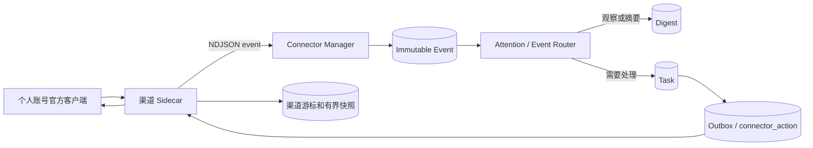

# MimiAgent 个人账号消息通道统一实现方案

日期：2026-07-27

状态：待实施

适用渠道：大象、QQ、微信

## 1. 结论

本方案只解决“托管 owner 当前使用的个人账号”，不以机器人账号、公众号、开放平台 Bot
或另一个隔离账号替代个人身份。

三个渠道复用 MimiAgent 已有 Connector、Event、Attention、Task、Outbox 和
execution ledger，不增加第二套消息队列或工作流系统。每个渠道实现为独立子进程，
通过 NDJSON 接入；渠道客户端、凭证、游标和崩溃均留在适配器侧，不进入 Runtime。

各渠道采用不同 transport，但对 MimiAgent 暴露相同语义：

| 渠道 | 默认 transport | 完整度 | 默认是否允许自动回复 |
|---|---|---:|---:|
| 大象 | 官方 `oa-skills` 用户身份 API；已知群增量轮询 | 群消息较完整，私聊/全局收件箱不完整 | 完成身份核验和真实闭环后可按会话开启 |
| QQ | 原生 QQ + Accessibility/CUA 后台适配器 | 有界可见消息，不保证全量 | 默认关闭 |
| 微信 | 原生微信 + Accessibility/CUA 后台适配器 | 有界可见消息，不保证全量 | 默认关闭 |

QQ 的 NapCat macOS 注入和微信的 Android 伴随端只作为可替换的实验 backend，
不进入默认实现，不得被自动降级启用。

## 2. 硬约束

### 2.1 身份

- 收发必须发生在 owner 明确配置并已登录的同一个个人账号。
- Connector 启动后必须生成不含明文账号的 `accountFingerprint`，并与配置中的
  `expectedAccountFingerprint` 比对。
- 无法验证当前账号时，入站可以降为只读观察，出站必须为 `unavailable`。
- 不得把 Bot、机器人、公众号、企业应用或另一个测试账号标为
  `*-personal`。

### 2.2 与用户共用客户端

- 不退出、不重启、不替换、不另起一个互斥登录的桌面客户端。
- 默认不激活 App、不抢焦点、不移动窗口、不使用全局键鼠、不清空输入框。
- 发现非空草稿、目标歧义、账号变化、客户端升级、用户正在操作或界面状态不确定时
  fail closed。
- UI 发送结果不确定时只记 dead letter，绝不自动重试。
- 被动观察不能拿到正文时，只记录 `coverage_gap`，不能把未读角标或通知摘要伪装成
  完整消息。

### 2.3 权限与自动回复

- 登录的是 owner 账号，不代表联系人发来的内容具有 owner 权限。
- 三个 Connector 均配置为 `trust: "external"`；外部消息正文始终是不可信数据，
  不能直接成为本机指令。
- 默认行为是 Event 留存、摘要和提醒。只有本机配置的 `sourcePolicy` 精确命中
  `source + actor/conversation` 且 `access: "reply"` 时，才允许在原会话回复。
- 涉及付款、账号、安全设置、法律承诺、人事承诺、发送文件或大范围群发时，即使匹配
  自动回复策略也只生成草稿或提醒 owner。

### 2.4 热插拔

- 每个渠道只有一个 Connector ID：
  `daxiang-personal`、`qq-personal`、`wechat-personal`。
- backend 由渠道自己的配置选择，MimiAgent 主代码不判断 NapCat、CIBA、
  Android 或具体 UI 版本。
- 通过 `set_mimi_connector_enabled` 和 `reload_mimi_connectors` 启停、换代；
  action/delivery 在途时沿用现有繁忙保护，不切换子进程。
- backend 之间禁止自动 fallback，避免第一条发送已成功但第二条 transport 再次发送。

## 3. 共同架构



Sidecar 只负责渠道事实：

- 发现和规范化消息；
- 等待 `event_ack` 后推进渠道游标；
- 执行一个确定的发送事务；
- 报告账号、transport、覆盖范围和 readiness；
- 将完整诊断写 stderr，不把凭证或聊天正文写日志。

MimiAgent 负责：

- `source + externalId` 去重和 Event 持久化；
- Attention、人物映射、待处理判断和简报；
- Session/Task 执行；
- Outbox、超时、dead letter 和 owner 显式重投；
- source policy 与副作用账本。

## 4. 共同 Connector 契约

### 4.1 入站 Event

普通联系人消息统一发为 `kind: "webhook"`，不要伪装成 owner `command`：

```json
{
  "type": "event",
  "externalId": "group:123:message:456",
  "kind": "webhook",
  "occurredAt": "2026-07-27T10:00:00.000Z",
  "priority": 50,
  "actor": {
    "id": "channel-stable-user-id",
    "displayName": "显示名"
  },
  "conversation": {
    "id": "channel-stable-conversation-id"
  },
  "replyTarget": "group:123",
  "payload": {
    "schemaVersion": 1,
    "eventType": "message.received",
    "channel": "daxiang",
    "direction": "incoming",
    "capture": {
      "transport": "official-cli",
      "coverage": "configured-groups"
    },
    "message": {
      "type": "text",
      "text": "消息正文",
      "attachments": []
    }
  }
}
```

约束：

- 上游有稳定消息 ID 时必须原样进入 `externalId`；所有数值 ID 按字符串处理。
- UI transport 没有消息 ID 时，使用会话稳定 ID、时间标签、方向、正文、有界邻接锚点和
  重复序号生成摘要；该结果必须标记 `capture.coverage = "bounded-visible"`。
- 相同文本连续出现时不得只按正文哈希去重。
- 图片、语音、文件等当前无法安全读取时，保留有界类型和占位信息，不猜正文，不下载
  未授权附件。
- owner 自己在客户端手动发送的消息可以记录为 `direction: "outgoing"` 和
  `kind: "ambient"`，但没有 `replyTarget`，避免形成回复循环。

### 4.2 持久游标

Connector 游标存放在：

```text
~/.mimi-agent/daemon/connector-state/<connector-id>.json
```

要求：

- 目录 `0700`、文件 `0600`；
- schema 校验、临时文件原子替换；
- 每个账号、会话分别保存 cursor 和最后一个有界消息窗口；
- 一批 Event 全部收到 `event_ack.ok=true` 后才推进 cursor；
- ACK 丢失时保留旧 cursor，由中心 `source + externalId` 去重；
- 账号 fingerprint 变化时隔离旧状态，不把两个账号的游标合并。

### 4.3 Actions

三个 Connector 使用同名最小 action 集：

| Action | 用途 | 是否有副作用 |
|---|---|---:|
| `health_check` | 返回账号、backend、覆盖范围和 readiness，不读取正文 | 否 |
| `sync_now` | 立即执行一次入站同步 | 否 |
| `recent_messages` | 返回适配器最近一次同步的有界窗口，不直接读取 Mimi Store、不冒充完整历史 | 否 |
| `send_message` | 向精确 ID 目标发送文本 | 是 |

`send_message` 的 target 只接受渠道稳定 ID，不接受模糊昵称。结果分为：

- `ok:true`：渠道返回稳定消息 ID，或 UI 前后核验明确成功；
- `ok:false, uncertain:false`：确认尚未发送，可以由 Outbox 策略重试；
- `ok:false, uncertain:true`：可能已发送，立即 dead-letter，不自动重试。

### 4.4 Health 与覆盖范围

现有 status 保持协议兼容：

```json
{
  "type": "status",
  "inbound": "ready",
  "outbound": "unknown",
  "deliveryConfirmed": false,
  "eventAcknowledgement": true,
  "freshForMs": 90000
}
```

`ready` 只表示当前声明范围可工作，不表示全量个人收件箱。`health_check` 额外返回：

```json
{
  "accountVerified": true,
  "backend": "official-cli",
  "captureCoverage": "configured-groups",
  "historyComplete": false,
  "clientCoexistence": "non-invasive"
}
```

## 5. 大象个人账号接入

### 5.1 采用方案

实现 `daxiang-personal` Sidecar，使用本机官方 `oa-skills`：

- `oa-skills daxiang message list-group` 增量读取 owner 配置的群；
- `oa-skills daxiang message send` 以当前 SSO 用户身份发送给个人或群；
- 不依赖大象机器人回调，不操作大象桌面窗口；
- 私聊和全局会话列表在官方接口补齐前明确标为 unsupported。

调研基线是 `@it/oa-skills@1.0.188`。发送接口由服务端从 token 的
`$open.empId` 确定 sender，调用方不传机器人 senderId。实施前应重新核验当前版本，
不能长期硬编码该版本。

参考：

- [以用户身份发送消息](https://km.sankuai.com/collabpage/2269540204)
- [大象 SDK 更新记录](https://km.sankuai.com/collabpage/1660717658)

### 5.2 拓扑

```text
owner SSO
  └─ oa-skills daxiang message
       ├─ list-group --raw ─> daxiang-personal Sidecar ─> Event
       └─ send --raw <────── daxiang-personal Sidecar <─ action/outbox
```

Sidecar 使用 `execFile` 传参数，不拼 shell 字符串。stdout 只解析 `--raw` JSON，
stderr 有界记录错误类别。

### 5.3 配置

渠道私有配置示例：

```json
{
  "version": 1,
  "expectedMis": "owner-mis",
  "pollIntervalMs": 15000,
  "lookbackMinutes": 30,
  "groups": [
    {
      "id": "66141386782",
      "label": "项目群",
      "enabled": true,
      "priority": 70
    }
  ]
}
```

Connector 配置示例：

```json
{
  "daxiang-personal": {
    "enabled": false,
    "command": "/absolute/path/to/node",
    "args": [
      "/absolute/path/to/daxiang-personal-connector.mjs"
    ],
    "envAllowlist": [
      "MIMI_DAXIANG_PERSONAL_CONFIG"
    ],
    "source": "daxiang-personal",
    "trust": "external",
    "profileId": "owner",
    "restart": true,
    "actions": {
      "health_check": {
        "description": "检查大象个人账号 SSO、配置群和收发就绪度"
      },
      "sync_now": {
        "description": "立即同步已配置大象群的新消息"
      },
      "recent_messages": {
        "description": "读取大象适配器最近一次同步的有界消息窗口"
      },
      "send_message": {
        "description": "以当前大象个人账号向精确 empId 或 gid 发送文本"
      }
    }
  }
}
```

### 5.4 入站算法

每个群独立执行：

1. 首次启动以 `now - lookbackMinutes` 为 `start-time`，最多读取 100 条。
2. 后续传上次已 ACK 的 `last-mid` 翻页，直到无更多消息或达到单轮上限。
3. 将结果按 `sendTime + mid` 排序，规范化为 Event。
4. `externalId` 使用 `group:<gid>:mid:<mid>`。
5. `conversation.id` 使用 `group:<gid>`；`actor.id` 优先使用稳定 `fromUid`。
6. 全批 Event ACK 后，原子写入该群 cursor。
7. 单轮最多 500 条；追赶积压时分轮执行，防止长期占用子进程。

不能获得私聊列表时不轮询 UI，也不把群历史写成个人全部消息。若官方后续提供
“最近会话 + 私聊增量”用户授权 API，只增加一个 backend/action，不改变 Event 契约。

### 5.5 出站

target 格式：

```text
person:<empId>
group:<gid>
```

文本发送：

```bash
oa-skills daxiang message send \
  --receiver-type PERSON \
  --receiver-id '<empId>' \
  --text '<text>' \
  --raw
```

实施约束：

- 仅接受纯数字 empId/gid 和有界 UTF-8 文本；
- 通过 argv 传正文，不经过 shell；
- `status.code === 0` 且存在 `msgId` 才返回成功；
- 超时、子进程中断或成功响应无法解析都返回 `uncertain:true`；
- 不自动添加 `--force-ciba`，交互认证必须由 owner 在可见终端完成；
- 不通过自动发测试消息判断 readiness。

### 5.6 账号验证

实施第一阶段先确认 `oa-skills` 是否提供不暴露 token 的 `whoami`/员工身份读取能力。
如果没有：

- `expectedMis` 仍作为 CLI 调用约束；
- inbound 通过已配置群的只读查询验证 SSO 有效；
- outbound 在完成一次 owner 明确授权的真实发送闭环前保持 `unknown`；
- 不读取、解码或记录原始 token 来伪造身份验证。

### 5.7 实施文件

```text
examples/connectors/daxiang-personal-connector.mjs
mimi.daxiang-personal.example.json
tests/daxiang-personal-connector.test.ts
docs/CONNECTORS.md
README.md
```

### 5.8 大象完成标准

- 同一个 SSO 个人身份发送，收件端显示 owner 本人而不是机器人。
- 已配置群的新消息在 Event 中可去重、可恢复、可查询。
- Daemon/Sidecar 重启不丢 cursor、不重复回复。
- 大象桌面端可以同时正常使用，测试期间没有 UI 操作。
- 私聊/全局收件箱能力明确显示 unsupported，不以空结果表示“没有消息”。

## 6. QQ 个人账号接入

### 6.1 采用方案

默认实现 `qq-personal` 的 `macos-ax` backend：

- 复用原生、已登录的 QQ 进程；
- Accessibility 观察负责发现会话变化和未读状态；
- 复用 `qq-messenger-skill/scripts/send_qq.py` 完成有界上下文读取和确定性发送；
- 不启动第二个 QQ，不要求退出当前客户端；
- 不把可见 AX 快照标成完整历史。

NapCat macOS 注入实现为显式实验 backend。它技术上可以接入当前个人 QQ 的
HTTP/WebSocket 事件，但会修改 QQ Electron 启动路径、依赖版本 offset，并扩大账号与
供应链风险；默认配置和自动修复都不得安装或启用它。

参考：

- [NapCatQQ](https://github.com/NapNeko/NapCatQQ)
- [NapCat macOS Installer](https://github.com/NapNeko/NapCat-Mac-Installer)
- [NapCat 安全说明](https://napneko.github.io/other/security)

### 6.2 Backend 对比

| Backend | 同一账号 | 入站完整度 | 对原客户端影响 | 定位 |
|---|---:|---:|---:|---|
| `macos-ax` | 是 | 有界可见 | 低 | 默认 |
| `napcat-macos` | 是 | 接近协议事件流 | 高 | 显式实验 |
| 第二 QQ 进程/私有副本 | 可能互斥 | 较完整 | 高 | 禁止作为共存方案 |
| QQ Bot | 否 | 仅 Bot 会话 | 低 | 不属于本方案 |

### 6.3 `macos-ax` 拓扑

```text
原生 QQ.app
  ├─ AXObserver / 有界轮询 ─> qq-personal Sidecar ─> Event
  └─ CuaDriver CLI <──────── qq-personal Sidecar <─ action/outbox
```

观察器使用 `AXObserverCreate` 订阅可用的 value/children/selection 变化；Electron
版本不暴露通知时，以低频只读快照降级。观察器不得：

- 激活 QQ；
- 模拟全局键鼠；
- 清空或覆盖输入框；
- 在 QQ 前台或 owner 正在编辑时切换会话；
- 读取不到正文时从通知标题推断完整正文。

### 6.4 会话映射

显示名可能重复，配置必须建立稳定映射：

```json
{
  "version": 1,
  "backend": "macos-ax",
  "expectedAccountFingerprint": "sha256:...",
  "minimumIdleMs": 5000,
  "conversations": [
    {
      "id": "private:stable-local-id",
      "match": {
        "displayName": "张三",
        "type": "private"
      },
      "enabled": true,
      "priority": 60
    }
  ]
}
```

昵称歧义或会话类型不一致时不自动选择。后续如果 QQ UI 能可靠暴露 UIN/gid，应迁移为
真实 ID；迁移保留旧 alias，不重写历史 Event。

### 6.5 入站读取与去重

1. 被动观察发现配置会话的未读状态或聊天区变化。
2. 若只是角标变化，先进入 pending，不产生 `message.received`。
3. 确认 QQ 非前台、输入框无草稿、账号匹配、会话唯一后，调用一次
   `context --to <target> --limit 20`。
4. 将新快照与该会话上次 ACK 的有界窗口做序列对齐。
5. 只把确定的新消息发为 Event；方向未知或无法建立锚点时记录
   `kind: "ambient"`、`payload.eventType: "qq.personal.coverage_gap"` 的覆盖缺口 Event。
6. 外部 ID 包含账号、稳定会话、时间标签、方向、正文摘要、邻接锚点和连续重复序号。
7. Event ACK 后才提交新窗口。

AX 无上游 message ID，无法提供与协议 API 相同的全量、严格去重保证。验收报告必须
单独统计漏读率、重复率和 coverage gap。

### 6.6 与用户并发使用

Sidecar 只持有自己的短事务锁，不能锁住 QQ 客户端。每个读取或发送原子步骤前重新检查：

- QQ PID、bundle version 和账号 fingerprint 未变化；
- QQ 不是前台活跃窗口；
- 最近 `minimumIdleMs` 内没有 QQ 输入或选择变化；
- 当前输入框为空；
- 目标会话仍唯一。

任一条件变化立即中止。不得为了“恢复现场”盲目点击旧会话；只有原选中会话可被稳定标识、
输入框为空且没有用户活动时才能恢复。失败时保留当前状态并报告，不执行第二次动作。

### 6.7 出站

target 使用配置中的稳定会话 ID：

```text
private:<stable-local-id>
group:<stable-local-id>
```

`macos-ax` 调用现有确定性 CLI：

```bash
python3 <qq-skill-root>/scripts/send_qq.py \
  --action send \
  --to '<configured-display-name>' \
  --msg '<text>'
```

只在脚本返回 `status=sent` 时 ACK。`status=uncertain` 或退出码 2 直接映射
`uncertain:true`；同一 Outbox/action ID 不再调用第二个 backend。

### 6.8 NapCat 实验 backend

只有 owner 显式设置 `"backend": "napcat-macos"` 后才加载：

- MimiAgent 不负责安装、注入、修改签名或关闭 sandbox；
- 只连接 `127.0.0.1` HTTP/WebSocket，强制独立高熵 token；
- 首个状态响应必须核对真实 UIN 的 fingerprint；
- 使用上游 `message_id` 作为 Event ID，所有 UIN/gid 保持字符串；
- 先进行至少 72 小时只读 soak，再单独开放发送；
- QQ 版本或 NapCat 版本变化时自动把出站降为 unavailable；
- 禁止失败后自动切回 `macos-ax` 发送。

如果实验 backend 必须启动另一个与普通 QQ 互斥的托管进程，则不满足本方案，必须停用。

### 6.9 实施文件

```text
examples/connectors/qq-personal-connector.mjs
examples/connectors/macos-qq-observer.swift
mimi.qq-personal.example.json
skills/qq-messenger-skill/scripts/send_qq.py
tests/qq-personal-connector.test.ts
tests/qq-messenger-skill.test.ts
docs/CONNECTORS.md
README.md
```

### 6.10 QQ 完成标准

- 证明消息来自并回复到 owner 当前个人 QQ，而非 Bot 或第二账号。
- 测试期间普通 QQ 始终可用，无退出、无前台抢占、无草稿丢失。
- 24 小时只读 soak 统计漏读、重复和 coverage gap；72 小时发送 soak 零错会话、
  零重复发送。
- 用户在发送窗口内开始操作 QQ 时，事务安全停止。
- NapCat 未经显式配置不会下载、安装、注入或启动。

## 7. 微信个人账号接入

### 7.1 采用方案

默认实现 `wechat-personal` 的 `macos-ax` backend，复用原生已登录微信。它提供
有界可见消息观察和确定性发送，不承诺完整个人收件箱。

腾讯 `openclaw-weixin` 是 iLink Bot 通道，不是个人微信账号收件箱；它可以作为
MimiAgent 的另一个独立 Bot Connector 继续存在，但不得被 `wechat-personal` 调用、
降级或计入个人账号 readiness。

当前没有找到同时满足以下四项的 macOS 官方接口：

1. 读取个人微信全部新增消息；
2. 以本人身份向任意个人联系人发送；
3. 保持原生客户端可同时正常使用；
4. 提供稳定消息 ID 和发送确认。

因此文档和 UI 必须把 `macos-ax` 标为 bounded，而不是假装已经全量托管。

参考：

- [Tencent openclaw-weixin](https://github.com/Tencent/openclaw-weixin)
- [Android NotificationListenerService](https://developer.android.com/reference/android/service/notification/NotificationListenerService)
- [Android RemoteInput](https://developer.android.com/reference/android/app/RemoteInput)

### 7.2 Backend 对比

| Backend | 同一账号 | 入站完整度 | 对 Mac 客户端影响 | 定位 |
|---|---:|---:|---:|---|
| `macos-ax` | 是 | 有界可见 | 低 | 默认 |
| `android-companion` | 待实测多端共存 | 通知级，可能截断 | 无 | 可选实验 |
| `openclaw-weixin` | 否，Bot 通道 | 仅 Bot 会话 | 无 | 排除 |
| 本地数据库/Hook | 可能 | 未知 | 高 | 不实施 |

### 7.3 `macos-ax` 拓扑

```text
原生 WeChat.app
  ├─ AXObserver / 有界轮询 ─> wechat-personal Sidecar ─> Event
  └─ CuaDriver CLI <──────── wechat-personal Sidecar <─ action/outbox
```

实现一个独立 `wechat-messenger-skill` CLI，行为与 QQ Skill 对齐：

```text
context --to <configured-conversation> --limit 20
send --to <configured-conversation> --msg <text>
```

它必须输出结构化 `context | sent | failed | uncertain`，保护非空草稿，发送后重新读取
聊天区确认文本出现。不得用 AppleScript、剪贴板、全局回车或像素坐标作为正式路径。

### 7.4 入站、去重和会话映射

与 QQ `macos-ax` 使用相同的 pending → context → 序列对齐 → ACK → 提交窗口流程，
但渠道状态完全隔离。

微信显示名、备注名和群名都可能重复。首版只监听 owner 显式配置且能唯一匹配的会话：

```json
{
  "version": 1,
  "backend": "macos-ax",
  "expectedAccountFingerprint": "sha256:...",
  "minimumIdleMs": 5000,
  "conversations": [
    {
      "id": "private:stable-local-id",
      "match": {
        "displayName": "家人备注名",
        "type": "private"
      },
      "enabled": true,
      "priority": 80
    }
  ]
}
```

只检测到系统通知而无法核对聊天正文时，通知可以触发 `sync_now`，但不能直接成为可自动
回复的消息 Event。通知文本可能被系统或微信隐私设置截断。

### 7.5 Android 伴随端实验 backend

当 `macos-ax` 的漏读率不能接受时，可单独实施专用 Android 伴随端：

- 使用官方微信 App 登录同一 owner 账号；
- 通过 `NotificationListenerService` 接收系统实际展示的通知；
- 仅当通知公开 `RemoteInput` action 时执行快捷回复；
- 首选 USB + `adb reverse` 把设备 loopback 连接到 Mac 本地 Sidecar，不直接暴露公网；
- Mac 端仍以 `wechat-personal` NDJSON Connector 接入 Event；
- 通知被静音、合并、隐藏正文或未提供快捷回复时明确报告 coverage gap；
- Android Accessibility UI 操作不进入默认范围。

实施前必须先证明该账号的手机端与 Mac 端可持续共存。伴随端掉线不得让 Mac backend
自动补发历史消息或重复发送。

### 7.6 与用户并发使用及出站

微信沿用 QQ 的短事务检查：

- 微信前台或 owner 正在操作时不切换会话；
- 草稿非空时拒绝发送；
- 每个 UI 动作后重新观察，不复用旧 element token；
- 目标、文本或发送结果不确定时停止且不重试；
- 不自动恢复到 Bot 通道或 Android 通道发送。

target 只接受配置中的稳定 ID：

```text
private:<stable-local-id>
group:<stable-local-id>
```

### 7.7 实施文件

```text
examples/connectors/wechat-personal-connector.mjs
examples/connectors/macos-wechat-observer.swift
mimi.wechat-personal.example.json
skills/wechat-messenger-skill/SKILL.md
skills/wechat-messenger-skill/scripts/send_wechat.py
tests/wechat-personal-connector.test.ts
tests/wechat-messenger-skill.test.ts
docs/CONNECTORS.md
README.md
```

Android 伴随端若实施，应放在独立仓库或独立插件包，MimiAgent 只保留协议和示例配置，
不把 Android SDK 加入主包依赖。

### 7.8 微信完成标准

- 证明消息来自并回复到 owner 当前个人微信，而非 iLink Bot。
- 原生 Mac 微信始终可正常使用，无退出、无焦点抢占、无草稿丢失。
- 对所有漏读和通知级事件显示 bounded/coverage gap，不声称全量。
- 24 小时只读 soak、72 小时发送 soak 零错会话、零重复发送。
- Android backend 单独验收多端共存、通知完整度和 RemoteInput 支持率。

## 8. Attention 与托管策略

Connector 启用不等于开启自动回复。建议分四级渐进开放：

| 等级 | 行为 |
|---|---|
| Observe | 只写 Event，不调用模型 |
| Digest | 进入简报，回答“有哪些重要消息” |
| Draft | 判断并生成建议回复，只通知 owner |
| Auto reply | 精确人物/会话策略命中后自动回复 |

示例：

```json
{
  "decisionPolicy": {
    "sourcePolicies": [
      {
        "id": "daxiang-project-reply",
        "source": "daxiang-personal",
        "kinds": [
          "webhook"
        ],
        "conversation": "group:66141386782",
        "access": "reply",
        "instructions": [
          "只回复事实明确、无需新增承诺的问题",
          "涉及排期、资源、权限和对外承诺时只提醒我"
        ]
      }
    ]
  }
}
```

QQ 和微信在 bounded transport 阶段默认最多开放到 Draft。只有真实 soak 证明覆盖率和
错会话率满足要求后，才允许为少数会话开启 Auto reply。

“当前有哪些需要重点处理的消息”从已持久 Event、Digest 和 Task 状态查询，不临时扫描
三个客户端后把不完整快照冒充全局收件箱。回答应同时展示：

- 消息来源和会话；
- 捕获方式及完整度；
- 为什么需要关注；
- 已处理、待回复或 coverage gap。

## 9. 实施顺序

三个渠道可以独立开发，但共享契约先冻结：

### P0：公共测试夹具

- 为 NDJSON event/status/action/event_ack 建立 fake Host。
- 建立原子 cursor store、消息规范化和不确定发送测试工具。
- 不把渠道 SDK、CuaDriver 或 Android 依赖加入 Runtime。

### P1：大象

- 先完成官方 CLI 群轮询和个人身份发送。
- 运行真实只读同步，再由 owner 授权一条真实发送闭环。
- 达标后可为单个群开放 Auto reply。

### P2：QQ

- 先实现 macOS AX 观察和现有 QQ Skill 复用。
- 先只读 soak，再开启 Draft，最后评估少数会话 Auto reply。
- NapCat 作为单独 milestone，不阻塞默认 backend。

### P3：微信

- 实现 macOS AX 观察和新的确定性 WeChat Skill。
- 以 bounded 模式交付。
- 只有漏读率不满足需求时，再决定是否建设 Android 伴随端。

## 10. 测试矩阵

每个 Connector 必须覆盖：

- 配置 schema、未知字段、路径和权限错误；
- stdout 拆包、超长行、非法 JSON、stderr 噪声；
- 稳定 ID、连续相同文本、乱序、分页、重启和 ACK 丢失；
- 账号切换、客户端升级、进程退出和 readiness 过期；
- 目标歧义、非空草稿、用户中途操作；
- 发送成功、确认未执行、超时、子进程退出、ACK 丢失和 uncertain；
- 热禁用、热重载、action 在途保护；
- 外部消息 prompt injection 不获得 owner 工具权限；
- source policy 未命中时不能调用 `send_message`。

验证顺序：

```bash
node --import tsx --test tests/<channel>-personal-connector.test.ts
npm run check
npm test
npm run build
```

真实验收不得通过批量测试消息进行。每个渠道由 owner 明确指定一个目标和一次发送内容，
一次完成后不重放。

## 11. 上线、停用与回滚

- 三个新 Connector 初始均为 `enabled:false`。
- 启用顺序为 health → read-only → Event → Draft → send。
- 每个渠道提供独立 kill switch：禁用 Connector 后停止新观察和新 action，不删除历史
  Event、cursor 或 dead letter。
- 配置无效或 backend 升级失败时保留旧 Connector 在线；不得同时运行新旧 backend。
- UI 客户端版本变化时 `macos-ax` 先降为 unavailable，完成 AX fixture 回归后恢复。
- 实验 backend 回滚只修改渠道私有配置并 reload，不修改 MimiAgent Runtime。

## 12. 总体验收

只有同时满足以下条件，某个渠道才可以宣称“个人账号已接入”：

1. 收件端和本机身份均证明是 owner 本人账号，不是 Bot 或替代账号。
2. Event 在发送任何回复前已经持久化。
3. `source + externalId` 可跨重启去重。
4. 原生客户端可同时正常使用，没有被退出、替换、抢焦点或丢草稿。
5. 发送不确定时没有自动重试。
6. Connector 可独立启停和换代，不改 Runtime 业务逻辑。
7. capability/readiness 如实展示覆盖范围，没有把 bounded 说成 complete。
8. 自动回复只对 owner 显式配置的少数 actor/conversation 生效。

未满足以上任一条件，只能标记为“实验”“有界观察”或“不可用”，不能标记为已托管。
