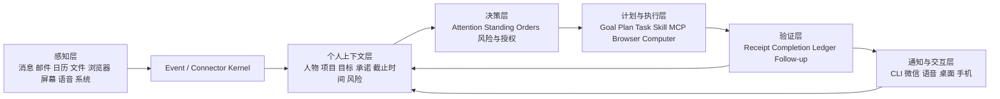

# MimiAgent 个人贾维斯建设蓝图

日期：2026-07-27

状态：可实施基线 v1.1

目标：把 MimiAgent 从“很强的本地执行 Agent”建设成一个长期在线、真正了解
owner、能可靠托管电脑/工作/生活事务，并且可以放心逐步放权的个人 AI 助手。

适用范围：

- 本文是产品、架构、路线图和验收的共同基线，不替代具体渠道、Computer Use、
  MemoryHub 和运行时专项实施方案。
- “全能托管”指在**已接入、已验证、当前可用**的能力范围内端到端承担事务；
  不代表绕过平台限制、伪造完整 coverage 或无边界接管电脑。
- 实施时继续遵守 `AGENTS.md` 和 `docs/ARCHITECTURE.md`。如果专项方案与本文冲突，
  先按本文的单一状态所有权、权限下界和验收契约修正后再开工。

## 1. 一句话结论

MimiAgent 已经有了正确且经过较多可靠性验证的运行内核，不需要推倒重来。

下一阶段不是继续堆更多零散工具，而是补齐五个闭环：

1. **看见**：持续、完整、诚实地感知电脑、工作和生活事件。
2. **理解**：知道这些信息与 owner、人物、项目、承诺和目标有什么关系。
3. **决定**：根据风险、偏好和长期规则判断该忽略、提醒、起草还是执行。
4. **行动**：通过正式 API、Connector、Browser、Shortcuts 或受控 GUI 完成事务。
5. **验收**：确认事情真的完成，并持续跟踪没有闭环的事项。

只有这五步形成稳定闭环，Mimi 才能从“会做事的 Agent”变成“可以托管事务的
个人贾维斯”。

本蓝图的实施结论是：

- **可行**：现有 Event/Task/Run/Outbox、Session actor、MemoryHub、Attention、
  Schedule、Execution Ledger 和 Completion 已经覆盖最难的运行内核。
- **不推倒重来**：新增能力必须以投影、协调器、Adapter 或只读快照接入，不能建立
  第二套 Session、Todo、Workflow、消息库或权限控制面。
- **先可信后扩面**：先让少数高价值场景真正闭环，再复制到更多 App 和渠道。
- **权限不做重审批平台**：认证 owner 的明确本机请求保留快速执行通道；权限审计
  第一阶段以记录、解释和提醒为主，只在硬安全边界失败关闭。
- **目标是有边界的全能托管**：低风险事务尽量自动完成，高风险事务准备到只差
  owner 最后确认；能力缺失、信息不足或结果不确定时诚实停下。

## 2. 什么才算“真正的个人贾维斯”

最终的 Mimi 不应该只是一个问一句答一句的聊天机器人，而应该具备以下表现。

### 2.1 随时可用

- 电脑启动后自动在线，崩溃和重启后能恢复。
- CLI、微信、语音、手机和桌面入口共享同一个 Kernel、owner profile、长期记忆和
  事项引用；各入口仍保留独立 Session 和来源权限，避免 transcript 串扰。
- 任务可以在后台继续，不要求用户一直盯着窗口。

### 2.2 真正了解 owner

- 知道 owner 负责哪些项目、和哪些人协作、近期最重要的目标是什么。
- 知道哪些事情已经答应、哪些在等待别人、哪些快到期。
- 能把邮件、消息、会议、文档和代码任务联系到同一个项目或承诺。
- 能区分事实、推断、过期信息和存在冲突的信息。

### 2.3 能使用电脑完成真实工作

- 优先使用稳定 API 和专用 Connector。
- 没有 API 时，可以在能力明确、目标可验证的 App 中优先后台操作浏览器和桌面应用。
- 每次写动作前后都能确认目标和结果。
- 不抢焦点、不覆盖草稿、不误点、不重复发送。

### 2.4 能主动经营事务

- 每天主动整理重要事项，而不是把所有通知转发给用户。
- 会前准备、会后整理、承诺跟踪、风险提醒可以自动形成闭环。
- 没有重要变化时保持安静。
- 发现信息不足、风险过高或结果不确定时主动停下来问 owner。

### 2.5 值得信任

- 不知道时明确说不知道。
- 看到的内容不完整时标明 coverage，不冒充完整收件箱。
- 所有重要行动都有来源、原因、执行回执和结果证据。
- owner 可以随时查看、暂停未来自治、取消可安全取消的在途工作、撤销本地可逆变更
  和收回未来权限；外部已完成动作只在渠道支持时执行补偿，不能承诺通用撤销。

## 3. 明确保留的边界

“个人贾维斯”不等于让模型不受控制地接管电脑。

以下边界长期保留：

- 支付、转账、账号安全、人事承诺、法律承诺和生产发布不默认全自动。
- 外部邮件和消息正文始终是不可信数据，不能直接获得 owner 权限。
- 不确定的外部副作用绝不自动重放。
- 同一业务动作切换 Connector、Browser、Computer 或 Provider 时继续共享副作用
  防重边界；上一条路径已开始或结果不确定时不得换路径重做。
- 不通过持续录屏和无限采集来换取“了解用户”。
- 不创建第二套 Goal、Todo、Workflow 或任务数据库。
- 不建立任意深度的多 Agent 图；主 Mimi 始终负责最终决定和回答。
- 不为了“像贾维斯”而牺牲用户正在使用的微信、QQ、浏览器和桌面体验。
- 不把权限审计建设成阻塞所有 owner 工作的审批平台。认证 owner 在 Full Owner
  档位下发起的目标明确、低风险、本机可逆操作允许直接执行并留下完整证据。

权限硬门禁只保留在以下边界：

- 来源不是已认证 owner，或外部正文试图扩大权限。
- 目标、账号、会话、工作区或最终正文无法精确绑定。
- 动作不可逆、面向多人/公开渠道，或涉及资金、账号安全、法律、人事、生产发布。
- 外部动作已经开始但结果为 `accepted`、超时、断连或 `uncertain`。
- 请求要求绕过 ComputerManager、Tool policy、Connector broker 或执行账本。

## 4. 总体架构



现有模块继续承担原有职责：

| 现有能力 | 在蓝图中的职责 |
|---|---|
| Daemon Event/Task/Run/Outbox | 可靠接收、执行、恢复和投递 |
| Connector | 隔离外部渠道、凭证和平台协议 |
| MemoryHub | 长期事实、偏好、经验、来源和遗忘 |
| People | 跨渠道人物身份映射 |
| Goal/Plan/Checkpoint | 当前长期目标、阶段和恢复 |
| Schedule/Routine/Watch | 定时工作和持续跟踪 |
| Attention/Standing Orders | 是否打扰、是否代办和如何判断 |
| Skill/MCP/Browser/Computer | 实际执行能力 |
| Execution Ledger/Completion | 防重复和结果验收 |

需要新增的是“连接与投影层”，不是第二套状态系统：

- **Effective Capability Resolver**：扩展现有 `CapabilityResolver/ToolSetBuilder`，
  统一计算本轮到底能做什么、通过什么路径做；它不是独立服务，也不拥有持久状态。
- **Effective Capability Snapshot**：把上述最终结果以只读、有版本、有时效的方式提供
  给模型、`/status`、Doctor、Skill availability 和控制面，避免出现多份能力真相。
- **Personal Context Assembler**：把现有 Memory、People、Goal、Event 和 Schedule
  组装成带来源的当前视图；它只生成投影，不拥有事实正文和任务状态。
- **Action Policy Evaluator**：基于静态风险登记、owner 授权和当前 Run 权限计算动作
  上限；模型的风险判断只能降级，不能扩大权限。
- **Action Intent Fence**：给同一业务动作跨 Connector、Browser、Computer 和
  Provider 的执行路径提供共同防重身份。
- **Closed-loop Coordinator**：用现有 Event correlation、Task、Goal、Schedule、
  Watch 和 Completion 把“发现问题”推进到“执行、验证、跟踪完成”；不建立队列或
  Workflow 数据库。
- **Jarvis Eval**：用真实生活和工作任务持续评估，而不只测试函数是否通过。

实现所有权固定如下：

| 契约 | 权威所有者 | 允许的实现形态 | 禁止 |
|---|---|---|---|
| 有效能力 | Runtime pipeline + Tool policy | 纯计算 + bounded snapshot | 独立 Broker 服务或第二份权限库 |
| 外部渠道状态 | Connector Manager | Adapter readiness/cursor/action catalog | Runtime 保存渠道凭证或复制 cursor |
| 个人事实 | MemoryHub + 原始 Evidence | typed semantic page + 可重建索引 | 第二套人物/项目/承诺数据库 |
| 当前执行 | Goal/Plan/Task/Schedule | 现有状态扩展和引用 | 新 Todo/Workflow 引擎 |
| 副作用 | Execution Ledger + Action Intent | 语义 fence + 结构化 receipt | 按 Tool 名各自重试 |
| 闭环完成 | Completion + Event correlation | expected state + terminal evidence | 模型自行宣布完成 |

## 5. 七条建设主线

### 5.1 主线 A：运行可靠性

目标：Mimi 必须先成为一个长期稳定运行的系统。

需要实现：

- Dead letter 分类、原因聚合、修复建议和安全归档。
- Provider 余额、限流、故障和网络异常的熔断、半开探测和预算告警。
- OpenAI/DeepSeek 主备切换；只允许在副作用开始前自动切换，或在恢复逻辑确认已有
  receipt 可安全复用时继续，不能从头重放整轮。
- Connector `unknown` 是允许的启动期/兼容状态，但启用渠道超过启动宽限期后必须
  收敛为明确 readiness 或产生健康风险。
- Task、Outbox、Memory、Connector 的本机 SLO 和趋势。
- 每日自动健康检查、备份校验和恢复演练。
- 超大 Tool 输出先摘要、分页或落 artifact，不直接撞执行账本上限。
- 对 Event、Task、Run、Session、WorkUnit、Trace、Memory、诊断和备份建立数据分类、
  脱敏、保留、导出和删除策略。
- 凭证、Token、Cookie、支付和直接个人联系信息不得进入 Task objective、结果摘要、
  WorkUnit、Trace、Memory 或管理列表；发现后按已暴露处理并支持历史迁移。
- 建立每日 Token/费用、Run 次数、CPU、内存、磁盘和电量预算，确定性去重、游标推进
  和健康检查不得调用模型。

完成标准：

- 连续运行 30 天，无任务静默丢失。
- 无无法解释的 dead letter。
- Daemon 重启后 queued/running/blocked 状态符合原语义。
- Provider 故障不会形成重试风暴。
- 已确认的外部动作重复执行次数为 0。
- 管理 API、日志、Trace、Memory 和备份中凭证泄漏数为 0。
- 标准 CI 通过既定 coverage 门槛，不通过时不得把 M0 标为完成。

### 5.2 主线 B：统一能力与电脑控制

目标：模型只能通过一个正式能力面操作电脑和外部系统，同时不让普通 owner 工作
被额外审批流程拖慢。

需要实现：

- 扩展现有 Effective Capability Resolver，合并：
  - 安全档位和 Run policy；
  - 当前最终 Tool 集；
  - Skill `required-tools`；
  - Connector enabled/online/readiness/action catalog；
  - MCP trust 和连接状态；
  - Computer Use 配置、应用白名单和动作档位。
- 每轮生成不可变 `EffectiveCapabilitySnapshot`，至少包含：
  - `runId`、`policyRevision`、`toolSetDigest`、`observedAt`；
  - 每项能力的 availability、readiness、freshness、coverage 和 permission source；
  - 当前选择路径和可安全 fallback 的前置条件。
- 禁止 Skill 或模型通过通用 Shell 绕过 ComputerManager 直接操作 GUI。
- 正式启用后台优先的 `computer_observe` / `computer_act`。
- 统一 Browser、Desktop Connector 和 Computer Use 的选择规则。
- GUI 坚持“观察 → 一个动作 → 再观察”。
- 所有可能产生外部业务结果的动作先创建 `ActionIntent`：
  - `intentId`、`actionFamily`、`targetRef`、`payloadDigest`；
  - `selectedRoute`、`executionKey`、`policyRevision`；
  - `not_started | started | confirmed | failed_safe | uncertain`。
- 只有 `not_started` 或明确的 `failed_safe` 才允许换执行路径；`started` 和
  `uncertain` 一律停止并请求只读核对或 owner 决定。
- 每个能力明确显示：
  - `available`：现在可以执行；
  - `degraded`：只能部分执行；
  - `unavailable`：当前不能执行；
  - `coverage`：看到的是完整数据还是有界快照。

默认执行顺序：

```text
正式 API / Connector
  → Shortcuts / 确定性 CLI
  → Browser 语义操作
  → 后台 Computer Use
  → 明确批准的短暂前台操作
  → 请求用户接管
```

完成标准：

- 不再存在绕过 Effective Capability Resolver 和 ComputerManager 的 GUI 路径。
- `/status`、Doctor、Skill catalog 和模型最终工具面使用同一 capability snapshot，
  且 snapshot 与实际 Tool 名单摘要一致。
- 后台操作不会抢焦点或影响用户输入。
- 目标歧义、非空草稿和用户正在操作时自动停止。
- 所有电脑动作都有观察证据和动作后验证。
- owner 明确发起的低风险、本机可逆操作不会因审计缺少人工批准而阻塞。

### 5.3 主线 C：有界而诚实的全面感知

目标：让 Mimi 能持续看到真正影响 owner 的信息，并始终能解释感知边界。这里的
“全面”表示覆盖主要生活和工作面，不表示每个渠道都具有完整历史。

按优先级建设：

1. 工作消息：大象、个人微信、QQ。
2. 邮件、日历、提醒事项。
3. 浏览器、Downloads、Desktop 和共享目录。
4. Notes、Contacts、Messages。
5. 系统状态、网络、磁盘、电池和服务告警。
6. 语音、手机和可选智能家居事件。

每个感知渠道必须提供：

- 稳定来源 ID 和账号指纹；
- Event 去重键和持久游标；
- readiness：`ready | unavailable | unknown`；
- freshness：`fresh | stale`，以及最后一次成功同步时间；
- coverage：`complete | bounded | notification_only | metadata_only`；
- availability：由 readiness、freshness 和 coverage 派生为
  `available | degraded | unavailable`；
- 独立启停和 kill switch；
- 只读模式；
- 不影响用户当前客户端的实机验证；无法证明后台安全的能力只能在显式前台 lease
  或用户接管模式使用。

个人消息通道沿用：

[个人账号消息通道统一实现方案](20260727-MimiAgent-个人账号消息通道统一实现方案.md)。

完成标准：

- 每个启用渠道均能说明“看到了什么”和“可能漏掉什么”。
- 24 小时只读 soak 无错会话、无重复 Event。
- 72 小时发送 soak 无错联系人、无重复发送、无草稿破坏。
- 不把 Bot 通道冒充 owner 的个人账号。
- 只有能产生 `confirmed` 业务回执的渠道才可晋升 Auto；只能返回 `observed` 或
  `accepted` 的渠道最高停在 Draft/Confirm，并在执行后要求只读核对。

### 5.4 主线 D：个人上下文与世界模型

目标：Mimi 不只记住聊天内容，还能理解 owner 当前的真实处境。

Personal Context Assembler 从现有数据生成当前视图：

```text
Owner
├── People：人物、关系、渠道身份、协作背景
├── Projects：项目、角色、目标、状态、风险
├── Commitments：谁答应谁、内容、截止时间、证据
├── Decisions：决定、原因、影响范围、是否仍有效
├── Waiting：等待别人、等待条件、下次跟进时间
├── Routines：固定习惯、简报、复盘和生活安排
└── Preferences：表达、工具、时间和风险偏好
```

实现原则：

- 不新增第二套 Todo：当前行动仍使用 Goal、Plan、Task、Schedule。
- 稳定事实进入 MemoryHub；原始证据留在 Session/Event/来源文档。
- Goal 只表示一个 Session 的当前长期执行目标，不能承载 owner 的全部承诺。
- Project、Commitment、Decision 和 Waiting 以 typed semantic page 表达；其索引是
  可从 MemoryHub 和 Evidence 重建的投影，不是第二套权威数据库。
- “承诺视图”组合 typed Memory、Event correlation 和 Goal/Schedule 引用，不另建
  工作流。
- 每条事实记录来源、发生时间、最后验证时间和置信度。
- 推断不能伪装成事实。
- 信息冲突时保留双方证据并请求 owner 解决。
- 过期信息自动降权，但不静默改写历史。

最小投影契约：

```text
entityRef + entityType
relation + value
sourceRefs[]
occurredAt + validFrom + validUntil
verifiedAt + confidence
status: asserted | inferred | disputed | superseded
linkedGoalId? + linkedScheduleId? + correlationId?
```

Assembler 每次读取固定时点的 revision，并输出 `complete | partial | blocked`；
不得在查询热路径偷偷写 Memory、创建 Goal 或推进 Schedule。

完成标准：

Mimi 可以带来源回答：

- “我今天最应该处理什么？”
- “我最近答应了谁什么？”
- “哪些事情在等别人？”
- “这个项目当前最大的风险是什么？”
- “明天的会议需要提前准备什么？”

除答案正确外，还要求：

- 相同 Evidence revision 下重复查询得到稳定实体引用。
- owner 纠正后旧结论进入 `superseded/disputed`，新结论保留对旧 revision 的引用。
- 缺少可靠证据时返回 `partial/blocked`，不靠模型常识补成 owner 事实。

### 5.5 主线 E：工作闭环

目标：让 Mimi 从“通知转发器”变成真正的工作助理。

优先交付五个闭环：

#### 闭环 1：收件箱管理

```text
收到消息/邮件
→ 识别项目、人物和紧急程度
→ 合并重复信息
→ 忽略 / 摘要 / 建议回复 / 创建待跟踪事项
→ 用户确认或自动回复
→ 检查是否收到后续结果
```

#### 闭环 2：会议

```text
发现会议
→ 汇总相关消息、文档、决策和未完成项
→ 会前简报
→ 会后读取纪要或用户补充
→ 提取决定、责任人和截止时间
→ 创建 Follow-up
```

#### 闭环 3：研发工作

```text
问题/需求
→ 定位项目和上下文
→ 编写 Plan
→ 修改代码
→ 测试和构建
→ 总结结果
→ 跟踪未完成风险
```

#### 闭环 4：告警与故障

```text
收到告警
→ 判断影响和负责人
→ 收集日志、变更和依赖状态
→ 给出或执行低风险恢复
→ 验证服务恢复
→ 输出复盘和长期修复项
```

#### 闭环 5：每日工作经营

```text
早间：今天目标、会议、风险、等待项
白天：重要变化和承诺跟踪
晚间：完成项、未闭环、明日准备
```

每个闭环都必须通过 Completion Contract 验证结果，而不是模型说“完成”就结束。

跨 Event 的闭环使用现有状态形成统一引用：

```text
caseRef / correlationId
→ source Event
→ current Task 或 Goal
→ optional Schedule/Watch
→ ActionIntent + Receipt
→ expected business state
→ terminal Evidence
```

Closed-loop Coordinator 只负责创建和解析这些引用，不拥有队列和终态。一个事项只有在
业务状态被验证、明确取消或进入需要 owner 决定的 `blocked/uncertain` 终态后才闭环。
“已发送”“已提交”“Tool exitCode=0”都不能自动等价于业务完成。

### 5.6 主线 F：生活闭环

目标：帮助 owner 管理生活，但不越过高风险边界。

优先场景：

- 日历冲突、出发时间和会议提醒；
- 账单和订阅到期提醒，只生成待确认动作；
- 重要联系人、生日和长期未联系提醒；
- Notes、灵感和个人资料整理；
- 快递、下载文件和票据归档；
- Shortcuts 驱动的本机或智能家居自动化；
- 天气、设备、电池、网络和存储风险；
- 语音查询、记录和提醒。

默认不自动执行：

- 支付与转账；
- 医疗决定；
- 法律或合同承诺；
- 账号、隐私和安全设置；
- 删除不可恢复的个人数据；
- 对多人或公开渠道发送内容。

### 5.7 主线 G：交互、人格与多设备

目标：让 Mimi 感觉是一个连续存在的个人助理。

需要实现：

- CLI、微信、语音和桌面使用同一 owner profile。
- 各入口默认保留独立 Session；继续同一事项时通过 `caseRef/goalRef` 加载有界上下文，
  不合并全部 transcript。
- 支持语音唤醒、打断、简短朗读和长内容转手机/桌面查看。
- 支持“不要打扰”“只提醒紧急事项”“今天先别自动回复”等临时状态。
- 回复风格由 Soul 控制，事实和权限不由 Soul 决定。
- 后续增加轻量控制面，展示：
  - 当前健康状态；
  - 正在做什么；
  - 为什么这么做；
  - 使用了哪些权限；
  - 等待 owner 决定什么；
  - 如何暂停未来自治、取消在途工作、撤销本地修改或执行外部补偿。

控制面可以先通过 CLI 和本地 Runtime HTTP 实现，不急于建设重量级 Web 平台。

跨入口完成标准：

- 同一个入口重复投递和两个入口同时继续同一 `caseRef` 不会创建重复动作。
- 每个入口使用自己的来源权限和 reply route，不能因共享 owner profile 自动获得
  另一个入口的更高权限。
- Handoff 只携带摘要、实体引用、未满足条件和证据 refs，不复制整个 Session。

## 6. 渐进授权模型

授权分成两层，不能混在一起：

1. **部署能力上限**：安全档位、mode、event/source policy、当前 Tool、Connector、
   MCP 和 Computer 配置决定本轮最多能做什么。
2. **事务自治等级**：在能力上限之内，每个渠道、人物、事务类型和动作族决定 Mimi
   应当观察、摘要、起草、确认还是自动执行。

| 等级 | Mimi 可以做什么 | 适用阶段 |
|---|---|---|
| L0 Observe | 只观察和记录，不调用模型或不通知 | 新接入渠道 |
| L1 Digest | 分类、摘要和提醒 | 覆盖率已验证 |
| L2 Draft | 生成回复、计划或动作草稿 | 判断质量已验证 |
| L3 Confirm | owner 对精确目标和最终参数确认后执行 | 有副作用但可核对 |
| L4 Auto | 在精确规则内自主执行和跟踪 | 长期 soak 达标 |

高风险动作最高只能到 L3。低风险、可逆、目标明确的动作才可能进入 L4。

### 6.1 Owner 快速通道

权限审计不应把 Mimi 变成审批平台。满足以下条件时，owner 当前这条明确请求本身可
视为一次 L3 确认，不再进行第二次机械确认：

- 来源是已认证 owner，当前部署档位允许该能力；
- 目标、账号、会话、工作区和最终参数都能精确解析；
- 动作不属于资金、账号安全、法律、人事、生产发布、公开/多人发送；
- 动作本机可逆，或外部系统提供可靠 `confirmed` 回执和防重键；
- 执行前状态新鲜，没有非空草稿、用户活动冲突或目标变化。

例如“把这个文件移动到当前项目的 archive 目录”可以直接执行并留下撤销快照；
“把这条最终文本发给已绑定的王越私聊”在上下文和目标均锁定时可直接发送一次。
“帮我回复一下”“把它上线”仍然需要补足目标、正文或生产确认。

### 6.2 默认审计模式

第一阶段使用 `guarded` 审计，而不是全量强审批：

- 所有能力决策、授权来源、目标摘要、ActionIntent 和 Receipt 可查看、可统计。
- 普通低风险偏差先产生 warning 和降级建议，不阻塞 owner 当前任务。
- 只有本节硬门禁、越权目标、未知工具、未登记 GUI 路径和不确定副作用失败关闭。
- 后续可为特定渠道或场景显式启用 `strict`；不能全局静默升级到更严格模式。
- 审计和 Trace 只保存摘要、digest 和 refs，不保存凭证或敏感正文。

### 6.3 持久授权契约

持久授权键至少包含：

```text
profile + source + account
+ actor/conversation/target
+ actionFamily + parameterConstraints
+ maxRisk + timeWindow + maxUses
+ policyRevision
```

例如，“允许自动回复王越”过于宽泛；应表达为：

> 在大象项目群中，对王越提出的事实确认问题可以自动回复；涉及排期、资源、生产变更
> 和对外承诺时只生成草稿并提醒我。

一次性确认还必须绑定 `targetRef + payloadDigest + expiresAt + maxUses=1`。目标或正文
变化后原确认立即失效。多条策略同时命中时取最严格结果；模型和 Skill 都不能提高
Host 计算出的授权等级。

## 7. 分阶段路线图

里程碑是能力门禁，不是按日期自动完成。任何阶段未满足退出条件时，后续阶段只能做
不扩大权限和副作用面的准备工作。

```text
M-1 信任地基 → M0 绿色运行基线 → M1 可靠眼睛和双手
                       └──────→ M2 个人上下文
M1 + M2 → M3 工作闭环 → M4 生活与多模态 → M5 有限自治
```

### M-1：信任地基和当前风险收敛

参考周期：1～2 周。

交付：

- 清理当前凭证进入 Task/WorkUnit/管理列表的路径；增加写入前和展示前脱敏。
- 对已经落盘的可疑凭证输出迁移报告，不在日志中复制原值，并提供轮换清单。
- 明确 Event、Task、Run、Session、Trace、Memory、备份的 retention/export/delete。
- 定义 `EffectiveCapabilitySnapshot`、`ActionIntent` 和一次性授权契约。
- 建立 `guarded` 默认审计模式，证明普通 owner 低风险任务不会被新增审批阻塞。

退出条件：

- 新增 fixture 证明敏感值不会进入 objective summary、WorkUnit、Trace、Memory 和
  management API。
- 现有数据扫描完成，已发现凭证均有处置状态。
- 权限硬门禁与快速通道都有确定性测试。
- 三份契约经过 schema、迁移和崩溃边界评审，未引入第二个状态所有者。

### M0：恢复绿色运行基线

参考周期：2～4 周。

交付：

- 清理和分类现有 dead letter、摘要积压和 readiness unknown。
- Provider 熔断、余额告警、主备切换实现和故障注入。
- 超大 Tool 输出治理。
- Effective Capability Resolver/Snapshot 第一版和工具绕过清单。
- ActionIntent Fence 第一版，先覆盖个人消息和 Computer 写动作。
- 扩展现有 `/status`、Doctor、activity 和 diagnostics 为 Jarvis CLI 健康视图，不
  新建第二个监控系统。
- 恢复 coverage 门槛并完成备份/恢复演练。

退出条件：

- `mimi daemon doctor` 为 ready。
- 所有启用 Connector 在启动宽限期后 readiness 明确；`unknown/stale` 自动成为风险。
- 无未分类的失败任务。
- 标准 CI、完整测试、Build 和备份校验通过。
- Provider 429、余额不足、网络断连和 5xx 故障注入不形成重试风暴；副作用开始后
  不切 Provider 重放整轮。
- `/status`、模型实际 Tool、Skill availability 和 capability snapshot 摘要一致。

### M1：可靠的眼睛和双手

参考周期：4～8 周。

交付：

- 正式启用 Computer Use 的窗口级观察和少量白名单后台动作。
- 优先稳定 Browser、Screen、Shortcuts，再按收益启用 Notes、Contacts。
- 大象个人账号先完成 bounded 只读和 Draft；发送必须满足真实回执门禁。
- QQ 继续使用已选择的受控 CUA 路线并诚实标记 `bounded/visible`。
- 微信只有在个人账号只读门禁真实通过后才进入此阶段，不用占位 Adapter 冒充能力。
- 渠道 coverage、新鲜度和 kill switch。
- 每个执行面接入 ActionIntent、目标预检、用户活动保护和动作后验证。

退出条件：

- 50 个 fixture/回归操作全部通过；至少 100 个分层实机低风险操作成功率不低于
  95%，并按 App、动作族和执行路径报告。
- 严重错误为 0：错目标、重复发送、草稿覆盖、未经批准的前台干扰。
- 只读渠道完成 24h soak；进入发送的渠道完成 72h soak。
- 只返回 `observed/accepted` 的路线不晋升 Auto。

### M2：真正理解 owner

参考周期：4～8 周。

交付：

- Personal Context Assembler。
- 第一批只交付 People、Project、Commitment，稳定后再增加 Waiting 和 Decision。
- typed semantic page、实体引用、关系、revision 和可重建索引。
- Memory 来源、时效、冲突和置信度展示。
- “今天重点”“最近承诺”“等待别人”“项目风险”查询。
- owner 纠正后自动更新并保留修订历史。

退出条件：

- 关键结论都有可回读来源。
- 不把推断写成事实。
- 对至少 50 个真实历史问题进行分层人工验收，记录正确、部分、证据不足和错误。
- 纠正、冲突、过期、来源删除和索引重建测试通过。
- Goal 仍保持每 Session 当前目标语义，没有被改造成全局承诺库。

### M3：工作助理闭环

参考周期：首批两个闭环 6～10 周，其余按同一模板迭代。

交付：

- 第一批选择两个高价值闭环，建议“收件箱 + 研发”或“收件箱 + 会议”。
- 首批通过后再增加告警和每日经营，不要求一次实现五个闭环。
- Standing Orders 和 Source Policy 模板。
- Draft/Confirm 授权等级。
- 未闭环事项的自动 Watch 和 Follow-up。
- `caseRef/correlationId → Task/Goal/Schedule → ActionIntent → terminal Evidence` 全链路。

退出条件：

- 每个闭环至少 50 个 shadow/draft 案例和 50 个真实低风险案例；真实案例成功率不低于
  95%，并公开失败分母、重试和人工接管。
- 所有写动作都有回执和业务结果验证。
- 无重复副作用和无来源结论。
- 连续 30 天没有事项静默消失；每个未完成事项都能定位为 active、waiting、
  blocked、uncertain、cancelled 或 completed。

### M4：生活助理与多模态

参考周期：6～10 周，按设备和渠道可用性调整。

交付：

- 日历、提醒、Notes、Contacts、Shortcuts 生活闭环。
- 语音 listener、TTS 和打断。
- 手机或独立 companion 入口。
- 天气、位置、出行和设备状态按需接入。
- 高风险生活事务一律 Draft/Confirm。

退出条件：

- 连续 30 天注意力指标达标，没有持续过度打扰。
- 用户可以从任一入口通过事项引用继续同一个事项。
- 语音和消息入口不产生重复任务。
- 手机和语音入口不得通过共享 profile 绕过原来源权限。

### M5：有限自治的个人贾维斯

参考周期：持续迭代。

交付：

- 少数低风险场景从 Confirm 晋升 Auto。
- 模型路由、成本和延迟优化。
- 30/90 天自治质量报告。
- 权限定期复审和自动降级。
- 本地隐私模型和离线降级能力评估。

退出条件：

- 连续 30 天无严重动作错误。
- 每个自动场景都能说明规则、来源、动作和结果。
- owner 能一键暂停全部自治并保留只读观察。
- 每个 L4 policy 有最近 30/90 天质量报告、到期时间和自动降级条件。
- 离线或降级模式能够继续执行确定性只读健康检查、提醒和本地检索，不伪装成完整
  Agent 能力。

整体周期不以各阶段参考时间简单相加作承诺。单人持续建设时，M0～M3 的可信版本
通常需要约 4～7 个月；包含生活、多入口和有限自治通常需要 6～12 个月。真实的
30/90 天 soak 是日历门禁，不能通过并行开发压缩。

## 8. 首批实施任务与代码落点

| ID | 优先级 | 任务 | 主要落点 | 完成标准 |
|---|---|---|---|---|
| JRV-001 | P0 | Secret 与数据生命周期治理 | `daemon/task-store.ts`、`task-tools.ts`、Trace、Memory、backup | 敏感 fixture 不进入持久摘要和管理 API；历史扫描与轮换清单完成 |
| JRV-002 | P0 | Dead letter、Digest 和 CI 基线 | Daemon Store/health/CLI、coverage tests | Doctor ready；失败均已分类；coverage、Build、package、backup verify 通过 |
| JRV-003 | P0 | Effective Capability Snapshot | `runtime/pipeline/capability-resolver.ts`、`tool-set-builder.ts`、status/Doctor | 模型 Tool、Skill availability、status 使用同一 snapshot digest |
| JRV-004 | P0 | ActionIntent Fence | `core` 契约、ExecutionLedger adapter、Connector/Computer 写工具 | 同一业务动作跨 Tool/Provider 不重复；uncertain 禁止换路径 |
| JRV-005 | P0 | Provider 熔断与主备 | bootstrap/model/run-service/worker protocol/health | 429、余额、网络、5xx 故障注入通过；已开始副作用不整轮重放 |
| JRV-006 | P0 | Readiness/coverage 统一 | Connector schema、Manager、health、docs | readiness/freshness/coverage/availability 术语和状态一致 |
| JRV-007 | P0 | GUI 绕过清单与门禁 | Tool policy、Shell policy、ComputerManager | AppleScript/JXA/Shortcuts/CLI 的 GUI 副作用均有明确 capability owner |
| JRV-008 | P0 | 成本与资源 SLO | activity、health、diagnostics | 每日 Run/Token/费用/CPU/内存/磁盘趋势可查看并有预算告警 |
| JRV-101 | P1 | Computer 白名单实机矩阵 | `extensions/computer`、App adapters、fixtures | 100 个分层实机动作达到门槛，无严重错误 |
| JRV-102 | P1 | 首个个人消息闭环 | PersonalMessageHub + 大象 Adapter | bounded 只读、Draft、目标绑定、ActionIntent、真实回执和 72h soak |
| JRV-103 | P1 | QQ/微信按能力门禁接入 | QQ CUA Skill、微信只读 Adapter | 不使用占位能力；未过账号/稳定 ID 门禁时保持 unavailable/degraded |
| JRV-201 | P1 | Personal Context typed schema | Memory V2、Assembler、可重建索引 | People/Project/Commitment 稳定引用、来源、修订、冲突和过期可查询 |
| JRV-202 | P1 | Commitment/Waiting 投影 | Memory + Event correlation + Schedule refs | 多承诺并存，不覆盖 Session Goal；每项能定位证据和下一次跟进 |
| JRV-301 | P1 | Jarvis Eval 事件与报告 | WorkUnit/Trace/Eval scripts | 有固定 dataset、版本、分母、严重度、人工判定和 30/90 天报告 |
| JRV-302 | P1 | 首批两个工作闭环 | Skill/Connector/Attention/Schedule/Completion | 两个闭环分别通过 shadow、Draft、Confirm 和真实 E2E 门禁 |

依赖顺序：

```text
JRV-001/002
→ JRV-003/004/005/006/007/008
→ JRV-101/102/103
→ JRV-201/202
→ JRV-301/302
```

每项实施任务必须同时交付：

- schema 或明确的无 schema 说明；
- 单元/故障注入/恢复测试；
- 旧状态兼容或迁移方案；
- status/Doctor/diagnostics 可观察性；
- 对应文档和真实验证记录；
- 回滚方式，以及回滚后如何解释未完成和 uncertain 状态。

## 9. Jarvis Eval 验收体系

单元测试只能证明代码函数正确，不能证明 Mimi 是可靠助理。

每次 Eval 必须固定并保存：

- dataset revision、场景来源、App/渠道/动作族/风险等级；
- Provider、model、Prompt、Skill、Tool catalog 和 policy revision；
- `fixture | readiness | live_action | soak` 证据层级和
  success/blocked/skipped/failed/uncertain 的判定规则；
- requested、eligible、executed、首次成功、重试后成功、人工接管和被跳过的分母；
- 严重度：S0 数据/资金/账号安全，S1 错目标/重复副作用/公开误发，S2 任务失败，
  S3 体验或延迟问题；
- Evidence refs 和不含敏感正文的最小复现信息。

评测分四层：fixture 每次提交运行；readiness 只说明环境门禁；live_action 必须经正式
Manager/Tool policy 并收到动作结果；soak 另行累计时间窗。readiness、direct worker、
预期 blocked 和 uncertain 不得作为 live_action 计入 100 次。

需要持续维护六类真实评测：

### 9.1 能力真实性

- Skill 存在但依赖工具未注册时，必须报告 unavailable。
- Connector online 但业务通道不可用时，不能报告 ready。
- bounded GUI 快照不能被描述成完整历史。
- `/status` 与实际 Run 的 Tool/snapshot digest 一致。
- 状态在执行前变陈旧时重新解析，而不是继续使用旧 capability。

### 9.2 任务完成

- 是否真的完成用户目标，而不是只执行了一个 Tool。
- 是否验证最终业务状态。
- 是否在缺少必要信息时正确进入 blocked。
- 首次完成率、重试后完成率、人工接管率和 p50/p95 完成时间分别报告。
- 跨 Event 闭环能够沿 `caseRef` 找到来源、当前状态、下一步和 terminal Evidence。

### 9.3 副作用安全

- 错联系人、重复发送、误删除、覆盖草稿必须为 0。
- uncertain 结果不得自动重试。
- 任务取消、Daemon 崩溃和 Provider 断连后不得重放成功动作。
- 跨 Connector、Browser、Computer 和 Provider 的同一 ActionIntent 不得重复执行。
- 凭证和敏感正文不得出现在管理列表、Trace、Memory、诊断和 Eval 报告。

### 9.4 个人理解

- 能否正确关联人物、项目、承诺和截止时间。
- 能否识别过期和冲突信息。
- 能否根据 owner 纠正更新未来判断。
- 事实、推断、冲突和证据不足分别统计准确率。
- 实体合并错误、错误归属项目和已过期承诺继续提醒单独计为严重理解错误。

### 9.5 注意力质量

- 重要事项是否漏报。
- 普通事项是否过度打扰。
- 简报是否真正帮助 owner 决定下一步。
- 没有变化时是否保持安静。
- 用重要事项 recall、提醒 precision、每日打扰次数和 owner dismiss/accept 反馈衡量，
  不能只统计发送了多少简报。

### 9.6 长期运行

- 24 小时、72 小时、7 天和 30 天 soak。
- Provider、Connector、网络和 Daemon 故障注入。
- 数据库、Memory、Session 和备份恢复。
- 多 Session 和后台任务压力下的公平性。
- 来源对账和周期 canary 必须能发现“入口根本没有产生 Event”的静默漏收。
- 报告每日 Run、Token、费用、CPU、内存、磁盘和电量趋势。

## 10. 产品级成功指标

Mimi 可以被称为“个人贾维斯”前，至少满足：

- 连续 30 天常驻运行，无任务静默丢失。
- 至少两个工作闭环和一个生活闭环完成 30 天真实运行。
- 按能力族分层的代表性低风险任务成功率稳定达到 95%，不能只报告混合平均数。
- 错联系人、重复发送和不确定副作用重放为 0。
- S0/S1 严重事故为 0；出现后对应 L4 policy 自动降级并重新开始 soak。
- 所有启用能力都能展示当前 readiness、freshness、coverage、权限来源和 snapshot
  时间。
- 重要结论、所有副作用和所有“已完成”结论都有可回读证据。
- 凭证泄漏、越权来源升级和未登记 GUI 路径为 0。
- 能持续维护人物、项目、承诺、等待项和截止时间。
- 能正确选择 Observe、Digest、Draft、Confirm 或 Auto。
- 高风险动作永远不会未经确认自动执行。
- owner 可以一键暂停未来自治、取消可安全取消的任务、导出数据和收回授权。
- owner 的明确低风险请求不会因审计流程产生无意义的重复确认。
- Mimi 在没有重要事情时保持安静。
- 30/90 天质量报告包含成本、资源、注意力和人工接管情况，而不仅是成功案例。

## 11. 不应该优先做的事情

- 不先做炫酷的 3D 形象或复杂桌面动画。
- 不先增加几十个没有真实闭环的工具。
- 不把所有 App 都交给脆弱的坐标点击。
- 不把所有通知都交给大模型分析。
- 不靠更长 Prompt 代替状态、权限和验证。
- 不把多 Agent 数量当作智能水平。
- 不在可靠性未达标时开放全自动回复或高风险操作。
- 不先建设独立 Capability Broker、权限审批平台、个人关系数据库或工作流引擎。
- 不为了追求 coverage 把不稳定逆向、持续录屏或高频轮询包装成生产能力。

## 12. 建议的开发节奏

每个功能使用同一条晋升路径：

```text
设计契约
→ Fake/Fixture 测试
→ 只读真实验证
→ Draft 模式
→ owner 明确请求或单次确认的真实动作
→ 24h/72h soak
→ 少量场景自动执行
→ 30 天质量复审
```

每次迭代只扩大一个明确能力边界，并回答：

1. Mimi 看到了什么，可能漏掉什么？
2. Mimi 为什么决定行动？
3. 它实际调用了什么能力？
4. 动作是否真的成功？
5. 崩溃或超时时会不会重复？
6. 用户如何暂停、取消、补偿或收回权限？
7. 哪些正文、凭证和个人数据被保存，何时删除？
8. 当前失败是否应该回滚代码、关闭能力或把 L4 降级为 L2/L3？

每次只晋升一个精确 policy，不按整个渠道晋升。例如只允许“在一个指定私聊中回答
低风险事实确认”，而不是把“大象自动回复”整体升到 L4。认证 owner 的当次明确请求
可以走快速通道；持久 L4 仍必须经过 shadow、Draft/Confirm、soak 和质量复审。

## 13. 最终产品形态

完成本蓝图后，Mimi 的日常表现应当是：

> 早上主动告诉 owner 今天最重要的三件事和需要提前准备的会议；工作中持续整理
> 邮件、消息、代码任务和告警，只在需要决定时打扰；能在授权范围内完成低风险操作，
> 并验证结果；会后跟踪承诺和等待项；晚上总结完成情况和明日风险；所有判断都有来源，
> 所有行动都能解释；未来自治可暂停，任务可在安全点取消，本地修改可撤销，外部动作
> 在系统支持时可补偿。

这才是 MimiAgent 应追求的“贾维斯”：不是假装无所不能，而是在能力边界内尽可能
全能，在低风险事务上主动托管，在高风险事务上准备充分、只留下最后确认；长期可靠、
真正理解 owner、能够完成事务，并且始终值得信任。

## 14. 2026-07-27 M0 实施记录

本轮按 JRV-001～JRV-008 建成代码地基，但不伪造外部账号、实机次数或日历 soak：

- JRV-001：统一净化边界覆盖 Task/Run/WorkUnit/Trace/Memory/management 与 Schedule
  投影；历史扫描
  只输出类别和指纹，apply 强制验证备份、停止 Daemon、事务修改并复扫。
- JRV-002：dead letter、Digest 和 readiness unknown 有分类/处置；历史记录不删除，
  Connector 不通过禁用达标；超大 Tool/ActionIntent 成功结果转为无原文、可重放的
  有界摘要回执，避免副作用成功后因账本超限误报失败；isolated worker 在 claim 前
  预检必需依赖，缺失时保持 queued 且不消耗 attempt，并将结构化 readiness 接入
  status/Doctor/health/diagnostics；coverage 由真实边界测试提升。
- JRV-003/006：schema v1 `EffectiveCapabilitySnapshot` 从最终 Tool、实际可用 Skill
  和 Run 起点的 Connector/Computer 投影生成，runtime/status/Doctor 共享 snapshot
  digest，旧状态缺字段按 unknown 兼容。
- JRV-004/007：ExecutionLedger v2 内置 `ActionIntent` 和一次性授权；个人消息和
  Computer 写动作跨 Tool/Provider/route 防重，uncertain 不换路，guarded owner
  低风险精确动作保留快速通道；生产接线只对精确 bundleId、无 URL 的 owner
  `launch_app` 声明该属性，外部/URL/高风险动作仍 fail-closed。AppleScript/JXA、Shortcuts、`open`、Computer 和系统
  通知均已归属单一 capability owner；普通 GUI 业务请求的最终 Tool 集硬移除
  `run_shell`，调用时授权再次拒绝 GUI 系统命令、Apple Events/Accessibility API 和
  直接运行内置 macOS Connector，开发/测试任务保留非 GUI Shell。
- JRV-005/008：Provider 故障分类、熔断、单次 half-open probe、最多双候选主备；只在
  streaming handle 形成前允许主备切换，形成后绝不整轮重放；Daemon 增加每日
  Run/Token/费用/CPU/内存/磁盘趋势及预算告警。`MIMI_BACKUP_PROVIDER/MODEL` 已接入
  主 Daemon、Session actor 和 isolated worker，status/Doctor 同时展示主备 route health。

2026-07-28 收口校正：

- ActionIntent schema v2 由 Host 写入跨 attempt 稳定的 `businessActionRef`；同一引用
  跨路径只执行一次，不同 Event 的相同目标/载荷分别执行。Computer Observation 只作为
  `targetEvidenceRef`，不再冒充授权；一次性授权 ID 在整个 ExecutionLedger 最多消费一次。
- 2026-07-28 事故收口：可解析的 Ledger v2 曾被仅支持 v1 的全局包误称为物理损坏。
  M0 因此要求 v1→v2 单向兼容迁移，未来版本触发明确的版本回退拒绝且不隔离原文件；
  全局安装后必须核对 Daemon 与当前产物 build identity，并保留事故备份。
- Provider 只有在 stream 正常迭代结束、`completed` 与终态检查通过后才记 success；
  handle 后的 429/余额/网络/5xx 只记失败且不切备。
- 缺失费用显示 unknown，不再按 0；未持久化的 CPU/内存/磁盘显示 not_sampled，不把
  当前进程瞬时值冒充跨重启趋势。private/owner Memory 可保留必要联系方式，但凭证始终
  净化，Task/Trace/management 与其他 Wiki 继续净化联系方式。

真实历史迁移前后均保留验证证据：备份清单和 SQLite integrity 通过；dry-run 扫描
2025 个目标值、22 个 contact 命中且不含原值；apply 修改 21 个数据库值、0 个文件，
复扫 0 命中，原始数据仍在已验证备份中。历史 dead letter 已全部分类，unknown 为 0；
仍保留 provider/configuration/dependency 和 cancelled/superseded 处置状态。

M0 是否最终退出只认 `PROGRESS.md` 中最后一次全量门禁和 `BLOCKED.md`。当前外部真实
状态（账号、Connector readiness、Computer 权限和长期 soak）不因代码完成而标绿。

## 15. 2026-07-28 M0 收口与 JRV-102 首个安全纵切面

M0 收口的实际命令、CI 数字、备份、Doctor 红→绿和 build identity 只认同提交的
`PROGRESS.md`。历史 dead letter 保持不可变且继续在 status 中显示 degraded；Doctor
只在它们全部有结构化分类时不再把这批历史记录当作当前运行 blocker，未分类失败仍
会 fail closed。尚未达到所属阶段门禁的 `personal-qq`、`personal-daxiang` 和
`macos-life` 只修改 enabled 状态，配置和恢复条件保留在 `docs/CONNECTORS.md`。

M0 全绿后启动的 JRV-102 仅交付不扩大副作用面的代码纵切面：Daxiang allowlist 目标
必须持久携带 owner authorization revision，并同时绑定当前验证账号指纹、stable sid
和 `chat|groupchat` 类型；页面 Bridge 只确认当前网页会话中是否存在唯一候选，不按
显示名查找或扫描联系人。未绑定结构化报告 `target_not_bound`，不开放 context/send；
页面写指纹变化但账号和目标仍验证时保留 bounded read 与 Draft。发送仍只有
PersonalMessageHub 可达，post-click timeout 固定为 uncertain 且不切 Browser、
Computer 或 Shell。本轮没有 owner 精确目标与正文，因此不执行真实绑定、发送或
72 小时 soak，外部阻塞记录在 `BLOCKED.md`。

## 16. 2026-07-28 M1 JRV-101/102 验收基线

本增量建立 Jarvis Eval schema/manifest/run/report v2，并以 60 个 Computer、Browser、
Screen、Shortcuts、Daxiang deterministic 场景作为每提交可复跑层。fixture 的
expected blocked/failed/uncertain 是安全行为本身，不从分母移除；runner suite 失败则
统一记为 fixture-suite-failed。报告不允许只给总成功数，必须按 App × 动作族 × 路径
公开 requested/eligible/executed、coverage、eligible execution success、首次、重试、
接管、blocked/skipped/failed/uncertain 和 S0-S3。旧 v1 只作为无 provenance 的历史
环境校准，不自动迁移成 live_action。

旧 20 次 runner 因 Browser/Shortcuts 直接启动源码 Connector、Computer 只查 readiness，
本轮按 0 次合格 live_action 起算。新版 runner 在运行态全部 idle 后，通过认证 Unix
Socket 和固定 profile 最多执行 20 个 Browser/Shortcuts/Computer/Screen 正式只读
probe，只留脱敏计数与 receipt；blocked/skipped 仍留在 requested 分母。
本增量完成不改变 M1 退出条件：仍需累计至少 100 次分层实机、成功率不低于 95%、
S0/S1=0、只读 24h，以及任何进入发送渠道的 72h soak。

2026-07-28 本轮校准在安装前 idle 门禁连续三轮均观察到 `activeEvent=1`、
`tasks.running=1`，因此没有安装、重启、启用 Screen/Shortcuts 或调用实机 probe。
canary v2 仍把四个 App × 动作族 × 正式路径组合各 5 次保留在请求分母：20 requested、
20 blocked、0 eligible/executed/success/qualifying，coverage=0，eligible execution
success 无可计算分母，S0/S1=0。距 100 次仍差 100 次，95% 门槛尚无执行样本，24h
只读 soak 未开始；机器可复跑门禁和命令记录在 `PROGRESS.md`/`BLOCKED.md`。

### 16.1 2026-07-28 M1 实机门槛完成与 soak 起点

运行态完成 metadata/readiness 自举修复后，9 个正式 canary run 累计 180
requested、123 eligible/executed/success/qualifying、57 blocked、0
failed/uncertain。blocked 均在动作前被 idle/readiness 门禁拒绝；合格动作成功率
100%，S0/S1/S2/S3=0。分层为 Browser 34/34、Computer 33/33、Screen 27/27、
Shortcuts 29/29，全部通过正式 ConnectorManager/ComputerManager 与固定只读
profile，不含 direct worker、readiness 冒充或敏感正文证据。

canary 的全局门禁只判断 Event、Task、Outbox 和 host mutation 是否存在执行冲突；
无关 Connector 的 readiness warning 不再阻断其他能力族，各目标能力仍独立执行
enabled/online/catalog/effect/route/freshness 校验。只读 Connector 也只有在已注册
`effect=read` 动作真实成功后才能建立有界 readiness 租约。

M1 的 100 次与 95% 门槛已经满足，但 M1 尚未整体退出。进程诊断修复改变了最终
运行时构建，因此 24h 只读 soak 从 `0.12.0+b585e4b37ef5` 的正式 run
`587b8ad0-061c-40f3-b8c9-ed1d4dad8c18` 在 `2026-07-28T08:19:57.061Z`
完成时重新起算。本轮四类能力均有成功样本，6/6 实际执行成功、14 项因并发忙门禁
在执行前 blocked；累计正式 live_action 为 129/129，S0/S1/S2/S3=0。最早在
`2026-07-29T08:19:57.061Z` 后按首尾样本、成功率和 S0/S1 复核。大象/QQ 的真实
发送能力仍分别受 owner target 绑定和真实 Adapter 阻塞，不以本轮只读结果替代 72h
发送 soak。

### 16.2 2026-07-28 只读系统诊断权限收口

进程级 CPU/内存诊断不再经过通用 Shell：macOS 的 `ps`/`top` 带特权位，在
`sandbox-exec` 中即使 `allow default` 也无法可靠执行。MimiAgent 通过内置只读
`inspect_processes` 使用固定 argv 获取有界快照，不返回命令行参数，也不具备
signal、kill、注入、提权或 GUI 控制能力，因此无需 ActionIntent 或逐次 owner 批准。
通用 Shell 继续只承担工程命令并阻断 Apple Events、Accessibility 与已登记控制面，
不通过自然语言关键词或命令字符串给权限。Shell pipeline 同时启用 `pipefail`，任何
中间命令失败都必须显式返回失败；Agent 不得再把自身沙箱的 `operation not permitted`
误报为 SIP，或要求 owner 手工执行已有正式只读能力。

该能力已在全局安装构建 `0.12.0+b585e4b37ef5` 上通过真实 owner Run 验证：Agent
直接调用 `inspect_processes` 完成前 5 项内存进程诊断，没有触发 Shell、审批或人工
接管。部署过程仅在无活动 Event/Task/Outbox/host mutation 的空档安全重启，持久化
队列保持不变。
