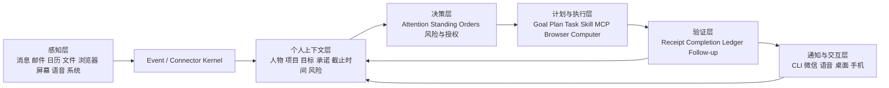

# MimiAgent 个人贾维斯建设蓝图

日期：2026-07-27

状态：蓝图基线

目标：把 MimiAgent 从“很强的本地执行 Agent”建设成一个长期在线、真正了解
owner、能可靠代办电脑/工作/生活事务，并且可以放心逐步放权的个人 AI 助手。

## 1. 一句话结论

MimiAgent 已经有了正确的运行内核，不需要推倒重来。

下一阶段不是继续堆更多零散工具，而是补齐五个闭环：

1. **看见**：持续、完整、诚实地感知电脑、工作和生活事件。
2. **理解**：知道这些信息与 owner、人物、项目、承诺和目标有什么关系。
3. **决定**：根据风险、偏好和长期规则判断该忽略、提醒、起草还是执行。
4. **行动**：通过正式 API、Connector、Browser、Shortcuts 或受控 GUI 完成事务。
5. **验收**：确认事情真的完成，并持续跟踪没有闭环的事项。

只有这五步形成稳定闭环，Mimi 才能从“会做事的 Agent”变成“可以托付事务的
个人贾维斯”。

## 2. 什么才算“真正的个人贾维斯”

最终的 Mimi 不应该只是一个问一句答一句的聊天机器人，而应该具备以下表现。

### 2.1 随时可用

- 电脑启动后自动在线，崩溃和重启后能恢复。
- CLI、微信、语音、手机和桌面入口是同一个 Mimi，而不是多个人格。
- 任务可以在后台继续，不要求用户一直盯着窗口。

### 2.2 真正了解 owner

- 知道 owner 负责哪些项目、和哪些人协作、近期最重要的目标是什么。
- 知道哪些事情已经答应、哪些在等待别人、哪些快到期。
- 能把邮件、消息、会议、文档和代码任务联系到同一个项目或承诺。
- 能区分事实、推断、过期信息和存在冲突的信息。

### 2.3 能使用电脑完成真实工作

- 优先使用稳定 API 和专用 Connector。
- 没有 API 时，可以在后台操作浏览器和桌面应用。
- 每次写动作前后都能确认目标和结果。
- 不抢焦点、不覆盖草稿、不误点、不重复发送。

### 2.4 能主动经营事务

- 每天主动整理重要事项，而不是把所有通知转发给用户。
- 会前准备、会后整理、承诺跟踪、风险提醒可以自动形成闭环。
- 没有重要变化时保持安静。
- 发现信息不足、风险过高或结果不确定时主动停下来问 owner。

### 2.5 值得信任

- 不知道时明确说不知道。
- 看到的内容不完整时标明 coverage，不冒充完整收件箱。
- 所有重要行动都有来源、原因、执行回执和结果证据。
- owner 可以随时查看、暂停、撤销和收回权限。

## 3. 明确保留的边界

“个人贾维斯”不等于让模型不受控制地接管电脑。

以下边界长期保留：

- 支付、转账、账号安全、人事承诺、法律承诺和生产发布不默认全自动。
- 外部邮件和消息正文始终是不可信数据，不能直接获得 owner 权限。
- 不确定的外部副作用绝不自动重放。
- 不通过持续录屏和无限采集来换取“了解用户”。
- 不创建第二套 Goal、Todo、Workflow 或任务数据库。
- 不建立任意深度的多 Agent 图；主 Mimi 始终负责最终决定和回答。
- 不为了“像贾维斯”而牺牲用户正在使用的微信、QQ、浏览器和桌面体验。

## 4. 总体架构



现有模块继续承担原有职责：

| 现有能力 | 在蓝图中的职责 |
|---|---|
| Daemon Event/Task/Run/Outbox | 可靠接收、执行、恢复和投递 |
| Connector | 隔离外部渠道、凭证和平台协议 |
| MemoryHub | 长期事实、偏好、经验、来源和遗忘 |
| People | 跨渠道人物身份映射 |
| Goal/Plan/Checkpoint | 当前长期目标、阶段和恢复 |
| Schedule/Routine/Watch | 定时工作和持续跟踪 |
| Attention/Standing Orders | 是否打扰、是否代办和如何判断 |
| Skill/MCP/Browser/Computer | 实际执行能力 |
| Execution Ledger/Completion | 防重复和结果验收 |

需要新增的是“连接层”，不是第二套状态系统：

- **Capability Broker**：统一回答本轮到底能做什么、通过什么路径做。
- **Personal Context Assembler**：把现有 Memory、People、Goal、Event 和 Schedule
  组装成当前可信的个人上下文。
- **Risk Classifier**：判断动作应当自动执行、生成草稿、请求确认还是禁止。
- **Closed-loop Coordinator**：把“发现问题”推进到“执行、验证、跟踪完成”。
- **Jarvis Eval**：用真实生活和工作任务持续评估，而不只测试函数是否通过。

## 5. 七条建设主线

### 5.1 主线 A：运行可靠性

目标：Mimi 必须先成为一个长期稳定运行的系统。

需要实现：

- Dead letter 分类、原因聚合、修复建议和安全归档。
- Provider 余额、限流、故障和网络异常的熔断。
- OpenAI/DeepSeek 主备切换，但不能重放结果不确定的动作。
- Connector readiness 必须是 `ready`、`degraded` 或 `unavailable`，不能长期
  `unknown`。
- Task、Outbox、Memory、Connector 的本机 SLO 和趋势。
- 每日自动健康检查、备份校验和恢复演练。
- 超大 Tool 输出先摘要、分页或落 artifact，不直接撞执行账本上限。

完成标准：

- 连续运行 30 天，无任务静默丢失。
- 无无法解释的 dead letter。
- Daemon 重启后 queued/running/blocked 状态符合原语义。
- Provider 故障不会形成重试风暴。
- 已确认的外部动作重复执行次数为 0。

### 5.2 主线 B：统一能力与电脑控制

目标：模型只能通过一个正式能力面操作电脑和外部系统。

需要实现：

- 建立统一 Capability Broker，合并：
  - 安全档位和 Run policy；
  - 当前最终 Tool 集；
  - Skill `required-tools`；
  - Connector enabled/online/readiness/action catalog；
  - MCP trust 和连接状态；
  - Computer Use 配置、应用白名单和动作档位。
- 禁止 Skill 或模型通过通用 Shell 绕过 ComputerManager 直接操作 GUI。
- 正式启用后台优先的 `computer_observe` / `computer_act`。
- 统一 Browser、Desktop Connector 和 Computer Use 的选择规则。
- GUI 坚持“观察 → 一个动作 → 再观察”。
- 每个能力明确显示：
  - `available`：现在可以执行；
  - `degraded`：只能部分执行；
  - `unavailable`：当前不能执行；
  - `coverage`：看到的是完整数据还是有界快照。

默认执行顺序：

```text
正式 API / Connector
  → Shortcuts / 确定性 CLI
  → Browser 语义操作
  → 后台 Computer Use
  → 明确批准的短暂前台操作
  → 请求用户接管
```

完成标准：

- 不再存在绕过 Capability Broker 的 GUI 路径。
- 后台操作不会抢焦点或影响用户输入。
- 目标歧义、非空草稿和用户正在操作时自动停止。
- 所有电脑动作都有观察证据和动作后验证。

### 5.3 主线 C：全面感知

目标：让 Mimi 能持续看到真正影响 owner 的信息。

按优先级建设：

1. 工作消息：大象、个人微信、QQ。
2. 邮件、日历、提醒事项。
3. 浏览器、Downloads、Desktop 和共享目录。
4. Notes、Contacts、Messages。
5. 系统状态、网络、磁盘、电池和服务告警。
6. 语音、手机和可选智能家居事件。

每个感知渠道必须提供：

- 稳定来源 ID 和账号指纹；
- Event 去重键和持久游标；
- `complete`、`bounded` 或 `notification-only` coverage；
- 新鲜度和最后一次成功同步时间；
- 独立启停和 kill switch；
- 只读模式；
- 不影响用户当前客户端的证明。

个人消息通道沿用：

[个人账号消息通道统一实现方案](20260727-MimiAgent-个人账号消息通道统一实现方案.md)。

完成标准：

- 每个启用渠道均能说明“看到了什么”和“可能漏掉什么”。
- 24 小时只读 soak 无错会话、无重复 Event。
- 72 小时发送 soak 无错联系人、无重复发送、无草稿破坏。
- 不把 Bot 通道冒充 owner 的个人账号。

### 5.4 主线 D：个人上下文与世界模型

目标：Mimi 不只记住聊天内容，还能理解 owner 当前的真实处境。

Personal Context Assembler 从现有数据生成当前视图：

```text
Owner
├── People：人物、关系、渠道身份、协作背景
├── Projects：项目、角色、目标、状态、风险
├── Commitments：谁答应谁、内容、截止时间、证据
├── Decisions：决定、原因、影响范围、是否仍有效
├── Waiting：等待别人、等待条件、下次跟进时间
├── Routines：固定习惯、简报、复盘和生活安排
└── Preferences：表达、工具、时间和风险偏好
```

实现原则：

- 不新增第二套 Todo：当前行动仍使用 Goal、Plan、Task、Schedule。
- 稳定事实进入 MemoryHub；原始证据留在 Session/Event/来源文档。
- “承诺视图”是对现有证据和 Goal/Schedule 的组装，不另建工作流。
- 每条事实记录来源、发生时间、最后验证时间和置信度。
- 推断不能伪装成事实。
- 信息冲突时保留双方证据并请求 owner 解决。
- 过期信息自动降权，但不静默改写历史。

完成标准：

Mimi 可以带来源回答：

- “我今天最应该处理什么？”
- “我最近答应了谁什么？”
- “哪些事情在等别人？”
- “这个项目当前最大的风险是什么？”
- “明天的会议需要提前准备什么？”

### 5.5 主线 E：工作闭环

目标：让 Mimi 从“通知转发器”变成真正的工作助理。

优先交付五个闭环：

#### 闭环 1：收件箱管理

```text
收到消息/邮件
→ 识别项目、人物和紧急程度
→ 合并重复信息
→ 忽略 / 摘要 / 建议回复 / 创建待跟踪事项
→ 用户确认或自动回复
→ 检查是否收到后续结果
```

#### 闭环 2：会议

```text
发现会议
→ 汇总相关消息、文档、决策和未完成项
→ 会前简报
→ 会后读取纪要或用户补充
→ 提取决定、责任人和截止时间
→ 创建 Follow-up
```

#### 闭环 3：研发工作

```text
问题/需求
→ 定位项目和上下文
→ 编写 Plan
→ 修改代码
→ 测试和构建
→ 总结结果
→ 跟踪未完成风险
```

#### 闭环 4：告警与故障

```text
收到告警
→ 判断影响和负责人
→ 收集日志、变更和依赖状态
→ 给出或执行低风险恢复
→ 验证服务恢复
→ 输出复盘和长期修复项
```

#### 闭环 5：每日工作经营

```text
早间：今天目标、会议、风险、等待项
白天：重要变化和承诺跟踪
晚间：完成项、未闭环、明日准备
```

每个闭环都必须通过 Completion Contract 验证结果，而不是模型说“完成”就结束。

### 5.6 主线 F：生活闭环

目标：帮助 owner 管理生活，但不越过高风险边界。

优先场景：

- 日历冲突、出发时间和会议提醒；
- 账单和订阅到期提醒，只生成待确认动作；
- 重要联系人、生日和长期未联系提醒；
- Notes、灵感和个人资料整理；
- 快递、下载文件和票据归档；
- Shortcuts 驱动的本机或智能家居自动化；
- 天气、设备、电池、网络和存储风险；
- 语音查询、记录和提醒。

默认不自动执行：

- 支付与转账；
- 医疗决定；
- 法律或合同承诺；
- 账号、隐私和安全设置；
- 删除不可恢复的个人数据；
- 对多人或公开渠道发送内容。

### 5.7 主线 G：交互、人格与多设备

目标：让 Mimi 感觉是一个连续存在的个人助理。

需要实现：

- CLI、微信、语音和桌面使用同一 owner profile。
- 支持语音唤醒、打断、简短朗读和长内容转手机/桌面查看。
- 支持“不要打扰”“只提醒紧急事项”“今天先别自动回复”等临时状态。
- 回复风格由 Soul 控制，事实和权限不由 Soul 决定。
- 后续增加轻量控制面，展示：
  - 当前健康状态；
  - 正在做什么；
  - 为什么这么做；
  - 使用了哪些权限；
  - 等待 owner 决定什么；
  - 如何暂停或撤销。

控制面可以先通过 CLI 和本地 Runtime HTTP 实现，不急于建设重量级 Web 平台。

## 6. 渐进授权模型

每个渠道、人物和事务类型分别管理授权，不能一次性“全部交给 Mimi”。

| 等级 | Mimi 可以做什么 | 适用阶段 |
|---|---|---|
| L0 Observe | 只观察和记录，不调用模型或不通知 | 新接入渠道 |
| L1 Digest | 分类、摘要和提醒 | 覆盖率已验证 |
| L2 Draft | 生成回复、计划或动作草稿 | 判断质量已验证 |
| L3 Confirm | owner 一次确认后执行 | 有副作用但可核对 |
| L4 Auto | 在精确规则内自主执行和跟踪 | 长期 soak 达标 |

高风险动作最高只能到 L3。低风险、可逆、目标明确的动作才可能进入 L4。

授权键至少包含：

```text
source + account + actor/conversation + action + risk + time window
```

例如，“允许自动回复王越”过于宽泛；应表达为：

> 在大象项目群中，对王越提出的事实确认问题可以自动回复；涉及排期、资源、生产变更
> 和对外承诺时只生成草稿并提醒我。

## 7. 分阶段路线图

### M0：恢复绿色基线

参考周期：1～2 周。

交付：

- 清理和分类现有 dead letter、摘要积压和 readiness unknown。
- Provider 熔断、余额告警、主备切换设计。
- 超大 Tool 输出治理。
- 统一 Capability Broker 设计与工具绕过清单。
- Jarvis 健康看板的 CLI 版本。

退出条件：

- `mimi daemon doctor` 为 ready。
- 所有启用 Connector readiness 明确。
- 无未分类的失败任务。
- 标准 CI、完整测试、Build 和备份校验通过。

### M1：可靠的眼睛和双手

参考周期：3～5 周。

交付：

- Capability Broker 第一版。
- 正式启用后台 Computer Use。
- Browser、Screen、Shortcuts、Notes、Contacts 的分批启用。
- 大象个人账号通道。
- QQ/微信 bounded 只读观察。
- 渠道 coverage、新鲜度和 kill switch。

退出条件：

- 50 个代表性电脑操作成功率达到 95% 以上。
- 严重错误为 0：错目标、重复发送、草稿覆盖、前台干扰。
- 个人消息渠道完成规定的只读 soak。

### M2：真正理解 owner

参考周期：4～6 周。

交付：

- Personal Context Assembler。
- 人物、项目、承诺、等待项和决定视图。
- Memory 来源、时效、冲突和置信度展示。
- “今天重点”“最近承诺”“等待别人”“项目风险”查询。
- owner 纠正后自动更新并保留修订历史。

退出条件：

- 关键结论都有可回读来源。
- 不把推断写成事实。
- 对至少 30 个真实历史问题进行人工验收。

### M3：工作助理闭环

参考周期：4～6 周。

交付：

- 收件箱、会议、研发、告警、每日经营五个闭环。
- Standing Orders 和 Source Policy 模板。
- Draft/Confirm 授权等级。
- 未闭环事项的自动 Watch 和 Follow-up。

退出条件：

- 50 个真实低风险工作任务端到端成功率达到 95%。
- 所有写动作都有回执和业务结果验证。
- 无重复副作用和无来源结论。

### M4：生活助理与多模态

参考周期：4～8 周。

交付：

- 日历、提醒、Notes、Contacts、Shortcuts 生活闭环。
- 语音 listener、TTS 和打断。
- 手机或独立 companion 入口。
- 天气、位置、出行和设备状态按需接入。
- 高风险生活事务一律 Draft/Confirm。

退出条件：

- 连续 30 天不会过度打扰。
- 用户可以从任一入口继续同一个事项。
- 语音和消息入口不产生重复任务。

### M5：有限自治的个人贾维斯

参考周期：持续迭代。

交付：

- 少数低风险场景从 Confirm 晋升 Auto。
- 模型路由、成本和延迟优化。
- 30/90 天自治质量报告。
- 权限定期复审和自动降级。
- 本地隐私模型和离线降级能力评估。

退出条件：

- 连续 30 天无严重动作错误。
- 每个自动场景都能说明规则、来源、动作和结果。
- owner 能一键暂停全部自治并保留只读观察。

## 8. 首批十个实施任务

| 优先级 | 任务 | 完成标准 |
|---|---|---|
| P0 | Dead letter 与摘要积压治理 | 每项有分类、原因、处置状态和安全重试条件 |
| P0 | Provider 熔断和主备方案 | 余额/限流立即降级，不消耗重试次数，不重放副作用 |
| P0 | Capability Broker | `/status` 与模型看到的真实能力一致 |
| P0 | 禁止 Shell 绕过 GUI 权限 | 所有 GUI 动作经过 ComputerManager |
| P0 | Connector readiness 收敛 | 启用渠道不再长期 unknown |
| P1 | 后台 Computer Use 上线 | 50 项桌面任务通过，无焦点干扰 |
| P1 | 大象/QQ/微信个人通道 | 先只读，再 Draft；coverage 如实展示 |
| P1 | Personal Context Assembler | 能带证据回答五个核心个人状态问题 |
| P1 | 承诺与等待项闭环 | 从消息/会议识别后用 Goal/Schedule 跟踪 |
| P1 | Jarvis E2E Eval | 覆盖电脑、消息、会议、研发、生活和恢复场景 |

## 9. Jarvis Eval 验收体系

单元测试只能证明代码函数正确，不能证明 Mimi 是可靠助理。

需要新增六类真实评测：

### 9.1 能力真实性

- Skill 存在但依赖工具未注册时，必须报告 unavailable。
- Connector online 但业务通道不可用时，不能报告 ready。
- bounded GUI 快照不能被描述成完整历史。

### 9.2 任务完成

- 是否真的完成用户目标，而不是只执行了一个 Tool。
- 是否验证最终业务状态。
- 是否在缺少必要信息时正确进入 blocked。

### 9.3 副作用安全

- 错联系人、重复发送、误删除、覆盖草稿必须为 0。
- uncertain 结果不得自动重试。
- 任务取消、Daemon 崩溃和 Provider 断连后不得重放成功动作。

### 9.4 个人理解

- 能否正确关联人物、项目、承诺和截止时间。
- 能否识别过期和冲突信息。
- 能否根据 owner 纠正更新未来判断。

### 9.5 注意力质量

- 重要事项是否漏报。
- 普通事项是否过度打扰。
- 简报是否真正帮助 owner 决定下一步。
- 没有变化时是否保持安静。

### 9.6 长期运行

- 24 小时、72 小时、7 天和 30 天 soak。
- Provider、Connector、网络和 Daemon 故障注入。
- 数据库、Memory、Session 和备份恢复。
- 多 Session 和后台任务压力下的公平性。

## 10. 产品级成功指标

Mimi 可以被称为“个人贾维斯”前，至少满足：

- 连续 30 天常驻运行，无任务静默丢失。
- 代表性低风险任务成功率稳定达到 95%。
- 错联系人、重复发送和不确定副作用重放为 0。
- 所有启用能力都能展示当前 readiness、coverage 和权限来源。
- 所有完成结论都有可回读证据。
- 能持续维护人物、项目、承诺、等待项和截止时间。
- 能正确选择 Observe、Digest、Draft、Confirm 或 Auto。
- 高风险动作永远不会未经确认自动执行。
- owner 可以随时暂停、撤销、导出数据和收回授权。
- Mimi 在没有重要事情时保持安静。

## 11. 不应该优先做的事情

- 不先做炫酷的 3D 形象或复杂桌面动画。
- 不先增加几十个没有真实闭环的工具。
- 不把所有 App 都交给脆弱的坐标点击。
- 不把所有通知都交给大模型分析。
- 不靠更长 Prompt 代替状态、权限和验证。
- 不把多 Agent 数量当作智能水平。
- 不在可靠性未达标时开放全自动回复或高风险操作。

## 12. 建议的开发节奏

每个功能使用同一条晋升路径：

```text
设计契约
→ Fake/Fixture 测试
→ 只读真实验证
→ Draft 模式
→ 单次 owner 确认的真实动作
→ 24h/72h soak
→ 少量场景自动执行
→ 30 天质量复审
```

每次迭代只扩大一个明确能力边界，并回答：

1. Mimi 看到了什么，可能漏掉什么？
2. Mimi 为什么决定行动？
3. 它实际调用了什么能力？
4. 动作是否真的成功？
5. 崩溃或超时时会不会重复？
6. 用户如何暂停、撤销和收回权限？

## 13. 最终产品形态

完成本蓝图后，Mimi 的日常表现应当是：

> 早上主动告诉 owner 今天最重要的三件事和需要提前准备的会议；工作中持续整理
> 邮件、消息、代码任务和告警，只在需要决定时打扰；能在授权范围内完成低风险操作，
> 并验证结果；会后跟踪承诺和等待项；晚上总结完成情况和明日风险；所有判断都有来源，
> 所有行动都能解释、暂停和撤销。

这才是 MimiAgent 应追求的“贾维斯”：不是无所不能，而是长期可靠、真正理解 owner、
能够完成事务，并且始终值得信任。
