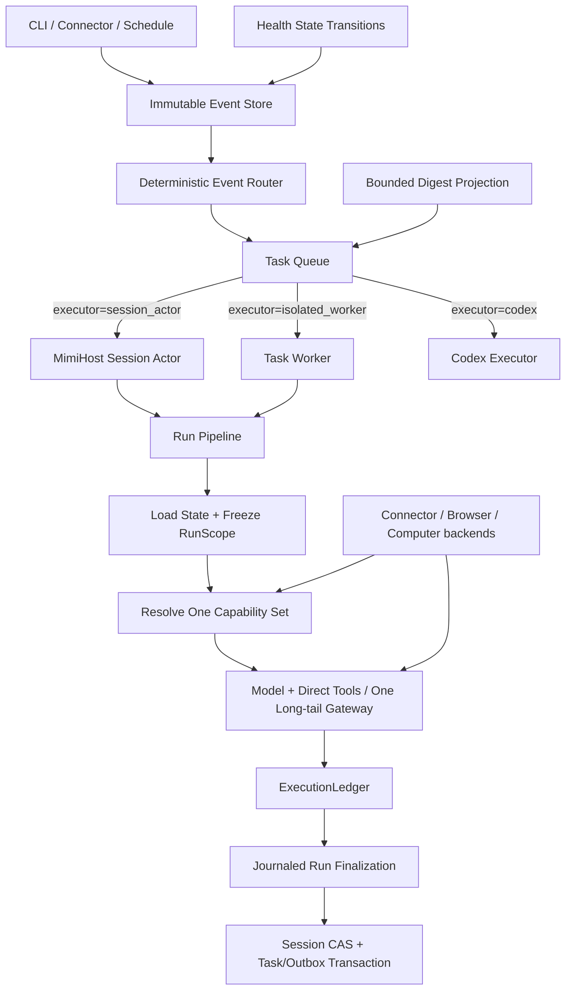

# MimiAgent M1 架构收敛重构计划

日期：2026-07-31

状态：待实施基线 v2（2026-07-31 Review 收敛版）

定位：完整 M1 收口的唯一执行计划；完成并通过最终冻结构建的真实运行验收前，不进入
M2 产品实现，不新增 M2～M5 产品能力。

关联文档：

- [个人贾维斯建设蓝图](20260727-MimiAgent-个人贾维斯建设蓝图.md)
- [架构说明](../ARCHITECTURE.md)
- [Event / Task 分层设计](20260720-MimiAgent-Event-Task分层设计.md)
- [上下文、记忆与运行架构改造计划](20260724-MimiAgent上下文记忆与运行架构改造计划.md)
- [系统性架构修复计划](20260730-MimiAgent-systemic-architecture-repair.md)

## 1. 决策摘要

本轮不是继续打补丁，也不是推倒重写。目标是对现有架构做一次**减法型深度重构**：

1. 保留已经证明正确的 Event、Task、Session actor、ExecutionLedger、Outbox、MemoryHub、
   Connector 和 ComputerManager。
2. 删除同一概念的多份真相、重复路由和模型可见中间协议。
3. 把模型热路径压缩为“加载上下文 → 获得直接能力 → 执行 → 验证 → 单点提交”。
4. 把 Daemon 执行权收敛到 Task 的 `executor`，不再由 Task type、进程类型和多份列表
   共同猜测。
5. 把 Plan 恢复为进度信息；Goal/Completion Contract 与 Host 普通 Run 矩阵共同决定业务终态。
6. 把健康监控从高频事件制造器改成状态变化检测器，恢复 Briefing 和 Digest 的消费闭环。
7. 建立唯一可追溯发布基线，再用 24 小时读取、72 小时写入和 7 天真实运行决定是否进入 M2。

改造完成不等于自动获得 10 分。8～9 分可以由本计划的静态、回归、真实任务和 7 天
运行证据证明；接近 10 分必须继续完成蓝图要求的 30 天真实 soak，不能由代码量或测试
数量替代。

### 1.1 完整 M1 产品合同

本计划中的“M1 完成”只表示以下五组条件在**同一最终冻结构建**上全部成立，不允许把
“工程实现完成”“历史构建曾经成功”或“外部条件暂未满足”改写成 M1 完成：

1. **M0 运行健康**：Doctor 连续 ready，Task/Digest/Briefing/Connector/Provider 和资源预算
   均形成可运营闭环，没有未分类失败、静默积压、重试风暴或构建漂移。
2. **本机眼睛和双手**：Browser、Computer、Screen、Shortcuts 通过正式 Host/Manager 路径
   完成观察、动作、回读、清理和 no-replay，不用 direct worker 或 readiness 冒充成功。
3. **个人消息闭环**：大象完成历史读取、上下文、精确目标发送和业务回读；QQ 使用已选择的
   CUA 路线；微信使用真实 Adapter。三者都必须报告 readiness/freshness/coverage、支持
   kill switch，且没有占位能力、猜测目标或 `observed/accepted` 冒充 `confirmed`。
4. **统一执行正确性**：Task executor、Capability Snapshot、ExecutionLedger 和
   RunFinalization 各有唯一权威；普通任务、Goal、Plan、取消、恢复和 uncertain 均有确定
   终态，副作用不跨 Tool、Provider 或 route 重放。
5. **最终构建证据**：至少 50 个 deterministic fixture 全绿、至少 100 个分层正式
   `live_action` 达到成功率和严重度门槛、读取能力 24 小时、所有实际进入写入/发送的能力
   72 小时、同一 build 连续 7 天通过运行门槛。

历史 129/129 live action 继续作为能力和回归来源，但本轮会改变模型 Tool 面、能力路由和
Run 提交路径，因此不能替代最终冻结构建的 100 次验收，也不能补算新的 soak 日历窗口。

### 1.2 M2 开工规则

- Phase 0～5 代码完成不等于 M1 完成；只有 Phase 6 的 M2 Go/No-Go 记录为 `GO` 后，才可
  合并或部署 M2 产品实现。
- 30 天质量窗口不阻塞 M2 开工，但必须在 M2 开发期间继续累计；若出现 S0/S1、重复副作用、
  系统性 dead letter、静默漏收或连续 Doctor 非 ready，立即冻结 M2 合并/部署，回到 M1 修复
  并从修复后的新 build 重新建立受影响的 soak。
- M2 只能从 Personal Context 开始；不得把任何 M1 未完成项改名后带入 M2。

## 2. 当前基线与问题证据

以下数字来自 2026-07-31 对真实 Daemon、当前工作树和测试的只读检查。它们只是 ARC-000
开工前快照；实施时必须重新采集，不能把本表当成不会变化的迁移输入。

| 维度 | 当前证据 | 结论 |
|---|---|---|
| Daemon | `mimi daemon doctor --json` 为 `ready=false` | 当前运行基线不合格 |
| Task | 162 个 dead letter，其中 30 个未分类 | 失败终态没有运营收口，数量仍在增长 |
| Digest | 1957 个 pending | 健康事件和未消费注意力仍在持续积压 |
| Briefing | 10 个 queued，最早自 2026-07-25，attempt 均为 0 | 存在确定的执行者接线漏洞 |
| Connector | 8 个 enabled、5 个 ready；大象 unavailable，Screen/Shortcuts unknown | 能力在线不等于可用 |
| 运行预算 | 最近 24 小时 201 Runs，高于配置的每日 100 | 运行成本和任务来源未收敛 |
| Browser | Backend 直接调用 1/1；Mimi 0/1，约 4 分钟 discovery loop | 模型到能力的中间层过重 |
| Computer | 单次 Manager observation 70,837 bytes、212 elements；Mimi Run 435,071 token | 观察输出与交互轮次失控 |
| 当前源码 | typecheck 通过；完整测试 836/838，失败位于 Context continuity 和 Session model context | 当前工作树不是可发布版本 |
| 构建 | Daemon build `87ba93fa845a`，源码 HEAD `024084c57557` 且有大量未提交改动 | 无法建立连续 soak |
| 组合根 | `mimi-agent.ts` 约 3321 行、`service.ts` 约 2376 行、`store.ts` 2610 行 | 职责集中，改动影响面过大 |

### 2.1 已确认的结构性缺陷

#### A. Task type 和 executor 同时决定执行者

Briefing 创建为 `executor=session_actor`，主 Dispatcher 却只领取 `conversation`；
Task Supervisor 虽列出 `briefing`，又只接受 `isolated_worker/codex`。因此 Briefing
合法入队但永远没有执行者。

根因不是少一个 `briefing` 字符串，而是调度所有权存在两份真相。

#### B. 高频能力走了低频能力的发现协议

Browser、Computer 与普通 Connector/MCP/Skill 一样经过能力查询和通用 invoke。
模型需要先理解 MimiAgent 的能力元协议，再完成普通页面或窗口操作。Backend 可用而
Agent 失败，说明问题位于模型到能力的架构边界。

#### C. Plan、Completion、Task outcome 语义相互覆盖

普通 Run 只要创建过 Plan 且有步骤未标 completed，最终回答就会抛错。该错误再经过
Dispatcher retry/dead-letter 逻辑，最终把“进度元数据未收口”升级成“任务执行失败”。

#### D. 健康状态被实现成无界 Event/Digest 流

Connector health 周期检查不断追加相同告警，而不是只记录状态变化。Digest 是待处理
注意力投影，却被用成健康历史仓库；Briefing 又无法执行，形成单向积压。

#### E. 运行架构有阶段组件，但仍由巨型组合根手工穿线

仓库已有 `RunScope`、`StateLoader`、`CapabilityResolver`、`ToolSetBuilder`、
`ContextAssembler`、`AgentRequestFactory` 和 `RunCommitCoordinator`，但关键流程仍在
`MimiAgent` 大方法中共享可变成员。组件存在，主链尚未真正阶段化。

#### F. 发布版本和持久配置没有共同演进节奏

源码、安装包和真实 Daemon 长期漂移，连续 soak 被反复打断；严格 JSON schema 在同一
版本内演进时会让旧 Build 把新配置判为不兼容。运行状态正确性因此依赖“当前恰好是哪
个 checkout 写过文件”。

#### G. 普通 Run 缺少确定性的业务终态规则

现有 Completion Contract 能约束显式 Goal，但普通任务仍可能由模型回答、Plan 状态和 Tool
结果分别暗示不同终态。ExecutionLedger/RunFinalization 已能证明“调用过什么”，却不能让
未经业务回读的副作用自动变成 completed。若只删除 incomplete Plan 门禁而不补普通 Run
规则，会把一类误失败转换成另一类误成功。

#### H. 运行预算只有告警，没有阻止自治噪声的闭环

最近 24 小时 Run 已超过配置日预算，未变化的 health/maintenance 仍可能制造 Event、Task
和模型调用。M1 不能只把 backlog 清到 0；还必须证明确定性检查不调用模型、自治来源受预算
约束、owner 主动请求不被误伤，且每天的 Run/Token/资源来源可以解释。

## 3. 重构原则与复杂度预算

### 3.1 必须遵守

1. **先删后加**：新增一个中心抽象前，必须说明它替代并删除哪些现有路径。
2. **一个概念一个 owner**：Task 执行者、能力集合、动作事实、最终结果各只有一个权威。
3. **高频能力直接暴露**：文件、Shell、Browser、Computer、PersonalMessage、Memory 查询、
   Goal/Plan 和 Background Task 不经过通用能力发现。
4. **长尾能力按需发现**：Skill、MCP 和 Connector action 共用一个目录入口，不再套两层
   inspect/invoke。
5. **模型处理业务意图，Host 处理协议细节**：sessionRef、observationId、route、effect key、
   retry disposition 和提交顺序不交给模型维护。
6. **数据在边界处有界**：Tool 输出进入模型前必须有硬预算，不能依赖 Context 压缩事后兜底。
7. **可靠性不是审批**：目标校验、回执、原子提交和 no-replay 继续保留；不新增隐私、安全、
   逐动作审批或风险分级项目。
8. **真实运行优先于模拟通过**：fixture 证明契约，live E2E 和 soak 才证明产品可用。

### 3.2 明确禁止

- 不引入新的常驻服务、消息队列、ORM、工作流引擎、Capability Broker 或状态数据库。
- 不增加新依赖来解决已有 Node/SQLite/TypeScript 可以解决的问题。
- 不创建第二套 Goal、Plan、Todo、Task 或 Run 状态机。
- 不用 Router LLM、关键词分类器或 Prompt 特判选择工具。
- 不为每个 Connector、App 或 Tool 建独立 manager/service/repository 层。
- 不通过拆文件制造“模块化”：只移动代码但不删除职责不算完成。
- 不把历史兼容分支永久留在主热路径；兼容只能位于读取/迁移边界。
- 不在本轮增加 M2 Memory schema、M3 工作流、M4 多模态或 M5 自治功能。

### 3.3 复杂度硬预算

| 指标 | 当前 | 重构目标 |
|---|---:|---:|
| 新运行依赖 | 0 | 0 |
| 新常驻进程/服务 | 0 | 0 |
| 持久状态系统 | JSON/Markdown + 现有 SQLite | 不增加 |
| `src/runtime/mimi-agent.ts` | 约 3321 行 | 不高于 1800 行 |
| `src/daemon/service.ts` | 约 2376 行 | 不高于 1800 行 |
| `src/daemon/store.ts` | 2610 行 | 不高于 1900 行 |
| `core/runtime/daemon` 本轮触及生产代码 | 基线实施时记录 | 净减少至少 10%，目标 15% |
| M1 Connector/Adapter 增量 | 基线实施时单列 | 只保留渠道协议差异，不复制 Host/Policy/Ledger/Store |
| 模型可见能力目录入口 | 两层以上 | 一个 |
| Browser 模型执行面 | Connector + 通用 gateway + direct | 一个 direct surface |
| Task 执行者判定来源 | type + executor + 多份列表 | 只认 `executor` |

行数是防止继续膨胀的报警线，不是拆文件 KPI。任何新模块必须满足至少一项：拥有独立
不变量、替代两个以上现有分支、或让同一逻辑可以独立故障注入。纯转发 wrapper 不允许。

### 3.4 轻量实现硬门槛

完整 M1 表示覆盖完整，不表示引入完整平台。每个 ARC 在行为验收外还必须通过以下门槛：

1. **中心概念不增加**：除把已有 Finalization 正式化为 `RunOutcome` 外，不新增 Broker、
   Orchestrator、Workflow、Repository、Monitor、Todo 或第二本 Ledger。
2. **复用现有持久面**：Task/Event/Digest/Outbox/Run 继续使用现有 SQLite；Session/Goal/Plan
   继续使用现有原子 Store；Eval 只写 artifact，不新建产品数据库或后台服务。
3. **Adapter 保持薄**：Daxiang/QQ/WeChat 只实现账号/目标解析、协议调用和业务回读，统一
   readiness、route、预算、授权、Ledger、retry、finalization 由现有 Host/Manager 负责。
   不允许每个渠道各建 manager/service/repository 三件套。
4. **协议一次映射**：外部协议只在 Connector/Adapter 边界转换一次；runtime 不通过 Tool
   调 Tool，不复制 schema，不在 Prompt 中维护 sessionRef/observationId/effect key。
5. **删除量可核对**：每个新增核心模块在 PR/提交说明中列出删除的旧分支和净 LOC；如果没有
   删除职责、独立不变量或故障注入价值，就内联到现有 owner。
6. **成本先于扩展性**：不为未来未知渠道预建插件平台。只有第二个真实消费者已经出现且
   当前重复包含同一不变量时才抽公共 helper。
7. **M2 不反穿底座**：M1 结束时，M2 Personal Context 只能通过现有 StateLoader、
   ContextAssembler 和 MemoryHub 投影接入；若仍需修改 Dispatcher、Ledger、Task 状态机或
   再造 Context 服务，ARC-503 必须 `NO-GO`。

任一功能测试通过但违反上述门槛，该 ARC 仍视为失败。Review 必须优先删除层级和状态，再
考虑调高预算、增加缓存、引入 facade 或拆更多文件。

## 4. 目标架构



### 4.1 四个唯一真相

| 问题 | 唯一权威 | 其他模块只能做什么 |
|---|---|---|
| 谁执行 Task | `Task.executor` | type 只表达业务类别，不参与抢占和领取 |
| 本轮能调用什么 | `EffectiveCapabilitySnapshot` | status、Skill 和模型工具面只做同一对象投影 |
| 动作实际发生了什么 | `ExecutionLedger` | Tool、Connector、Computer 不再各自推导完成 |
| Run 最终结果是什么 | `RunFinalization` | Session、Task、Trace、Outbox 引用同一结果 |

### 4.2 运行热路径

```text
capture immutable RunScope
→ load bounded state
→ resolve one capability set
→ build direct + deferred tools
→ build bounded model request
→ execute model/tool loop
→ derive outcome from Contract + Ledger + typed failure facts
→ journal finalization and commit each owner projection
```

每一步只有不可变输入和有界输出。阶段失败必须带 typed disposition，不能依赖错误文本
决定重试、blocked 或 dead letter。Session JSON 与 Daemon SQLite 不伪装成跨存储事务：
Task/Outbox 在同一 SQLite 事务提交，Session 使用 runId/revision CAS，Run Finalization
Journal 负责崩溃恢复和一致性对账，但绝不重放 Tool 副作用。

### 4.3 能力分层

**Direct Core Tools**：当前任务高频、参数稳定、调用收益高，满足条件时直接进入模型。

- 文件读取/编辑、Shell；
- Browser `open/observe/act/wait/assert/close`；
- Computer `observe/act`；
- PersonalMessage `context/send` 两个业务工具；渠道 route 由 Host 冻结，不按渠道增加 Tool；
- Memory search/remember；
- Goal/Plan、Background Task、runtime summary。

**Deferred Capability Catalog**：低频、数量动态或来自扩展。

- Skills；
- MCP tools；
- Connector actions；
- 未来少量可选扩展。

Deferred 只保留一个 `inspect_capabilities` 和一个 `invoke_capability`。它直接读取 Host 已经
过滤后的 registry，并直接调用原始 Tool；不得再由 runtime gateway 调 connector gateway，
也不得要求模型先发现同名 direct tool。

### 4.4 单 Owner 能力路径

- Owner General/Ultra 默认 Full Owner，当前 OS 用户已配置能力直接可用。
- Plan 继续是明确的只读工作方式，这是 Mode 契约，不扩展为新的 Security 系统。
- Safe/Workstation 仅在配置读取边界兼容，不能继续作为每个 Tool、Snapshot 和 Run 阶段的
  组合维度；兼容读取后折叠为当前 Mode/Task capability set。
- 外部 Event 使用 Task 创建时已经冻结的结构化能力集合；本轮不新增来源权限工程。

### 4.5 必须删除或退出热路径的旧设计

| 旧设计 | 最终处理 | 不允许的妥协 |
|---|---|---|
| `claimTaskTypes` 与多份 Task type allowlist | 删除；调度只认 `executor` | 新旧列表同时维护 |
| runtime gateway 调 connector gateway | 删除；统一目录直接调用 Host registry | 再包一层 facade 保留旧链 |
| Browser Connector action 作为模型通用执行面 | 降为 Host 私有 backend | direct 和 Connector 两条模型路径长期共存 |
| Computer 返回 raw + normalized 重复观察 | 删除 raw 模型投影 | 只依赖后续 Context 压缩 |
| `planOwned && incomplete` 直接使 Run 失败 | 删除；由 Contract + 普通 Run 矩阵决定 outcome | 默认成功或给错误文本加特判 |
| 未变化 Connector health 持续产生 Event | 删除；只记录 transition/recovery | 仅提高 Digest 上限 |
| Safe/Workstation/SecurityProfile 贯穿 Owner 热路径 | 移出热路径，兼容读取后折叠 | 新增更多 profile 分支 |
| Session、Task、Trace 分别推导最终结果 | 删除；统一引用 RunFinalization | 新旧 finalization 双写 |

## 5. 分阶段实施

ARC 依赖图是唯一实施顺序；同一热路径严格串行，互不依赖的 fixture、Adapter 和核心契约
可以并行。外部账号/Driver blocker 不阻止无依赖的核心 ARC，但所有路径必须在 ARC-402
前汇合；未通过的 ARC 不得进入最终部署、T0 或 ARC-501。

### Phase 0：冻结、保护现场与特征化基线

目标：把当前变化中的源码和运行态变成可比较、可回滚的起点。

实施：

1. 停止 M2～M5 和所有新增能力开发；当前 Browser/Computer/Context/Model 改动只允许完成
   已开始的 M1 契约、修复回归或被隔离到独立分支，不得继续扩面。
2. 重新记录当前 HEAD、tracked/untracked diff、Daemon build、Doctor、Task/Digest/Connector、
   最近 24 小时按来源 Run/Token 和当前完整测试数字。
3. 为真实 `~/.mimi-agent` 创建并验证备份；后续数据迁移先在备份副本演练。
4. 处理当前完整测试的两个真实失败：Context continuity 和 Session model context。分别明确
   是产品回归、测试迁移还是应撤回的范围外改动；Computer 套件独立连续运行两次，不能把
   偶发绿冒充稳定基线。
5. 把所有未提交改动分类为 `纳入 M1 | 独立完成后纳入 | 暂停并移出基线`，记录 owner、
   依赖和验证；冻结提交不得混入未完成的 M2、Skill 或无关产品能力。
6. 冻结至少 50 个 deterministic fixture 和 Phase 6B 的 100 次 live matrix；固定
   success、partial、blocked、failed、uncertain、S0～S3 和 evidence eligibility 定义。
7. 建立外部前置清单：Computer AX/视觉、Daxiang owner target、QQ CUA、WeChat Adapter。
   每项记录 `ready | owner_action_required | external_dependency`、唯一 owner、恢复命令、
   fail-closed 行为和最终 live 验收；外部阻塞允许代码阶段继续，但不能被豁免为 M1 完成。
8. 运行 `npm run ci`，生成第一个冻结提交；不部署 dirty tree。

退出条件：

- 当前聚焦测试、完整 CI、Build、package smoke 全绿，skip/todo 为 0。
- 工作树中的改动均有明确归属，不存在“稍后再收口”的共享热路径或无法归因的 dirty build。
- 真实数据备份校验通过，未修改真实 Task/Digest。
- 每个后续改造项都有红测或可复现运行证据。
- Daemon build 和源码可以明确区分，禁止把旧 build 结果记到新源码。
- 四项外部前置均有可执行恢复条件；状态不是 ready 时必须在 `BLOCKED.md` 保持显式阻塞。

### Phase 1：Task 执行所有权与 Attention 闭环

目标：消灭合法 Task 永久无人领取的可能，并恢复 Digest → Briefing → Delivery 闭环。

#### 1.1 `executor` 成为唯一调度键

- `MimiDispatcher` 领取所有且仅有 `executor=session_actor` 的 ready Task，不再维护
  `claimTaskTypes`。
- `TaskProcessSupervisor` 领取所有且仅有 `executor=isolated_worker|codex` 的 Task。
- Worker 只领取 Supervisor 指定的精确 taskId，不再维护另一份 type allowlist。
- Task type 仅决定输入模板、默认优先级和结果展示。
- enqueue 时验证 `type/executor/workspaceAccess` 合法组合，映射只有一处。
- Briefing 固定为 `isolated_worker + read`；Conversation 固定为 `session_actor`。

#### 1.2 schema v16 迁移

- 把现有 queued Briefing 原子改为 `isolated_worker + read`，保留 id、Event 和 Digest 引用。
- 对无法解释的历史组合只报告，不猜测修改。
- 迁移记录修改计数、前后状态和数据库 integrity；支持从备份回滚。
- 新库直接创建 v16 最终 schema，不先创建旧结构再依赖运行期补丁。

#### 1.3 健康事件变成状态变化

- Connector health 定时检查只更新当前 health state。
- 仅 `ready→unavailable/stale/unknown`、原因变化和恢复产生 Event。
- 未变化 heartbeat 不进入 Event 和 Digest。
- `system:connector-health` 的重复历史项在显式迁移中按 Connector/状态合并；保留原 Event，
  只结束旧 Digest 投影并写 audit。
- Briefing 成功后继续在同一 Task 事务中提交 `digested_at` 和 Outbox。

#### 1.4 失败终态重新归类

- `blocked`：需要信息、依赖或外部状态，未来可继续。
- `failed`：确定性验证、配置、状态或实现错误，不应自动重试。
- `dead_letter`：明确 transient 重试耗尽，或 uncertain 需要人工核对。
- `cancelled`：Owner/系统明确终止。
- 所有边界使用 `RunFailureDisposition`，自然语言 error 只用于说明，不参与分类。

#### 1.5 自治来源与资源预算闭环

- unchanged health、cursor/dedupe 推进、readiness 租约刷新、预算计算和备份检查必须是
  deterministic Host 工作，不创建模型 Run。
- Event、Task 和 Run 都保留稳定 `source/cause`，activity 按 owner 对话、Connector、
  health、briefing、maintenance、routine 和 eval 分组报告 Run/Token；unknown source 不得
  长期存在。
- 达到小时/日来源预算时，只合并或延后非紧急自治工作并留下结构化原因；直接 owner 请求、
  已 dispatch 副作用收尾和恢复核对不被机械丢弃。
- 同一来源的 budget-exhausted 通知按状态变化生成一次，不得再次制造告警循环。

主要落点：

- `src/daemon/task-store.ts`
- `src/daemon/store.ts`
- `src/daemon/dispatcher.ts`
- `src/daemon/task-supervisor.ts`
- `src/daemon/task-worker-entry.ts`
- `src/daemon/attention.ts`
- `src/daemon/service.ts`
- `src/daemon/persistence/schema/`

退出条件：

- 每个合法 executor 都有且只有一个领取者；非法组合创建时即失败。
- 临时数据中 10 个旧 Briefing 全部被领取并形成终态，不重复消费 Digest。
- 相同 Connector 状态运行 10,000 次 heartbeat 只产生 0 个新 Event；状态变化和恢复各
  产生 1 个。
- 上述 10,000 次 unchanged heartbeat 同时产生 0 个 Task、0 个模型 Run 和 0 Token。
- 基线中全部未分类 dead letter 在迁移演练中得到 disposition，新增确定性失败只执行一次。
- 预算压力 fixture 证明非紧急自治来源停止增长，而 owner 请求和 uncertain 核对仍可执行。
- 真实部署后 pending Briefing 最老年龄小于 1 小时，Digest 开始单调下降。

### Phase 2：能力系统做减法

目标：让模型直接获得当前任务需要的高频能力，不再学习 MimiAgent 内部路由协议。

#### 2.1 一个 Registry、一个 Snapshot

- 所有 builtin、Browser、Computer、Memory、Goal、Skill、MCP、Connector Tool 先进入
  一个 Host registry。
- CapabilityResolver 只合并 Mode、Task capability、环境 readiness 和 route owner。
- ToolSetBuilder 只完成 direct/deferred 分类与最终 SDK Tool 列表，不再兼任运行状态查询。
- `EffectiveCapabilitySnapshot.tools` 必须等于 SDK 实际 `getAllTools()` 的模型可见名称。
- `/status`、Doctor、Skill availability 和运行 instructions 只读取该 snapshot。

#### 2.2 删除双层 gateway

- 用一个 `inspect_capabilities/invoke_capability` 替代模型可见的
  `inspect_runtime_capabilities`、`inspect_mimi_capabilities` 及嵌套转调。
- ConnectorManager 暴露有界结构化 catalog API，runtime 不通过 Tool 调 Tool。
- 旧 Tool 名只在一版兼容读取/历史 transcript 适配中识别，不进入新 Run 工具面。
- 发现结果按当前 Run 缓存，readiness 变化使缓存失效；不保存第二份持久 capability 状态。

#### 2.3 唯一路由所有者

- Browser 模型调用只走 direct Browser tools；Browser Connector 是 Host 私有 backend。
- Computer 模型调用只走 `ComputerManager`。
- 大象、QQ、微信的模型调用只走 `PersonalMessageHub` 的业务工具；具体 Connector/CUA 是
  Host 私有 backend。PersonalMessageHub 在 Run 开始前冻结唯一 route，模型不跨路径试错。
- 同一 capability id 同一 Run 最多一个 ready route；替代路径只在动作 dispatch 前切换。

主要落点：

- `src/runtime/pipeline/capability-resolver.ts`
- `src/runtime/pipeline/tool-set-builder.ts`
- `src/runtime/tool-policy.ts`
- `src/runtime/mimi-agent.ts`
- `src/daemon/connectors.ts`
- `src/daemon/connector-action-tool.ts`

退出条件：

- 简单 Browser/Computer 请求首轮直接看见对应 Tool，不需要 capability discovery。
- 个人消息请求首轮只看见已冻结渠道的 context/send 业务面，不看见 Connector、Browser、
  Computer 或 Shell 的同目标替代路线。
- 长尾能力只通过一个 gateway 精确发现和调用。
- 同一 Browser/Computer/个人消息能力不存在两个模型可见 route。
- 50 个 Tool + 50 个 MCP + 50 个 Connector action 时，首轮 schema 仍在既定预算内。
- 两次完全相同 discovery 不产生循环；第三次阻断逻辑不再是正常热路径所必需。

### Phase 3：M1 原生执行面与个人渠道

目标：把本机 Backend 和个人渠道变成模型可以稳定、低成本使用且能够验证业务结果的
正式能力。

#### 3.1 Browser

- Host 持有 Browser session，不向模型暴露 Connector sessionRef。
- 模型只使用 `browser_open/observe/act/wait/assert/close`。
- `browser_act` 使用 discriminated strict schema，按动作类型只展示相关字段。
- 动作回执包含最小业务验证和下一步建议，不复制完整 DOM/网络内容。
- Run 结束只清理 Host 自己创建的会话；绑定的用户标签只 unbind。
- typed/fill 等正文不进入 Ledger 和 Trace。

#### 3.2 Computer

- Observation 原始数据只存于 Manager；模型投影硬限制 16 KiB。
- 删除 raw driver data 与 normalized elements 的重复返回。
- 默认最多返回 40 个可操作元素；更多内容通过 query/分页重新观察。
- observationId 由 Host 绑定，模型动作参数只包含业务动作和元素引用。
- 每次动作消费当前 Observation；动作后产生最小 verify receipt，新动作必须基于新观察。
- 直接 Owner Full Owner 操作不经过二次 approval；Plan 仍不可写。

#### 3.3 Screen、Shortcuts 与个人消息

- Screen 返回有界窗口/OCR 观察，明确 coverage，不把截图正文或临时图像写入持久证据。
- Shortcuts 以正式 Connector catalog 和稳定 shortcut id 执行；列表、执行和结果回读分开，
  不让模型把名称猜测当成目标绑定。
- Daxiang 完成已登录账号指纹、stable sid、历史/上下文和 owner 精确目标绑定；发送后重新读取
  同一会话，只有稳定业务结果可以晋级 `confirmed`。
- QQ 使用正式 `PersonalMessageHub → ComputerManager/CUA` 路径，遵守一观察一动作、用户活动
  保护、草稿保护和动作后回读；不得用占位 Connector、Shell 或前台键盘脚本替代。
- WeChat 必须提供真实个人账号 Adapter 和稳定目标/回执；只有配置槽位、Bot/OpenClaw 通道或
  模拟 action 不算个人微信完成。
- 三个个人渠道均提供 readiness、freshness、coverage、账号指纹、稳定目标、kill switch 和
  `confirmed | failed_safe | uncertain`；unavailable 时只报告恢复条件，不跨路径试错。

#### 3.4 E2E 反作弊

- Fake backend 只证明 schema、预算、句柄和 no-replay。
- macOS live test 必须通过正式 installed Manager/Driver，不允许直接调用 worker 冒充。
- Browser live test 必须使用真实 Host-owned session，不允许脚本直接调用 Connector 计入成功。
- Screen/Shortcuts live test 必须经过 installed ConnectorManager；个人消息必须来自真实 owner
  账号、稳定目标和正式 PersonalMessageHub，测试账号/自会话可以使用，但 fixture 页面和 Bot
  通道不能计为 personal live_action。

主要落点：

- `src/extensions/browser/`
- `src/extensions/computer/`
- `src/runtime/personal-message-hub.ts`
- `examples/connectors/personal-message/`
- `examples/connectors/macos-screen-connector.mjs`
- `examples/connectors/macos-shortcuts-connector.mjs`
- `src/runtime/mimi-agent.ts`
- `src/runtime/pipeline/tool-set-builder.ts`
- `tests/browser-tools.test.ts`
- `tests/computer.test.ts`

退出条件：

- 单个 Observation 模型文本不超过 16 KiB，且不含重复 raw 数据。
- 普通 Browser/Computer 任务没有 discovery loop。
- Browser/Computer 的 deterministic suite 和正式 Host 路径 smoke 全绿，错目标、重复动作和
  S0/S1 为 0；开发阶段 smoke 只证明接线，不计入 Phase 6B 最终构建的 100 次分母。
- Screen、Shortcuts、大象、QQ、微信的 deterministic suite 全绿，并分别通过至少一次正式
  readiness + live read；所有写/发送 live_action 留到 owner 目标明确且整机 idle 时执行。
- 三个个人渠道都存在真实 Adapter/route；任何一个仍为占位、无稳定目标或无法回读时，Phase 3
  只能标记 `implemented_blocked`，不得标记 completed。
- 简单任务 median 输入低于 30K token，p95 低于 80K；任何单任务不得再接近 435K。
- Browser/Computer 简单任务 p95 在 60 秒内完成；外部页面自身等待时间单独报告。

### Phase 4：Run Pipeline 与结果语义收敛

目标：让 `MimiAgent` 真正成为薄 facade，各阶段独立测试，Run 只有一个终态来源。

#### 4.1 阶段化现有组件

复用现有模块，不再创建平行 pipeline：

1. `RunScope`：冻结 Session、workspace、Mode、Task、Provider 和 owner/cause。
2. `StateLoader`：读取 Session、Goal、Plan、Memory、Guidance 和恢复点。
3. `CapabilityResolver + ToolSetBuilder`：生成唯一能力与工具面。
4. `ContextAssembler + AgentRequestFactory`：生成有界请求。
5. SDK Runner：只负责模型/tool loop 和流式事件。
6. `RunCommitCoordinator`：根据 Contract、普通 Run 矩阵、Ledger 和 failure disposition
   形成最终提交。

新增代码优先写进这些已有模块；只有 Run 阶段编排仍无法独立测试时，才允许增加一个
无持久状态的 `RunPipeline` facade。

#### 4.2 RunOutcome

统一结果：

```text
completed   业务目标已满足并有证据
partial     完成了有价值部分，未宣称整体完成
blocked     缺少输入、依赖或外部状态，可继续
interrupted 被取消、抢占或进程终止，保留恢复点
failed      确定性失败，不应自动重试
uncertain   动作可能已发生，必须核对且不得重放
```

- Plan 是 UI/Agent 进度，不再单独阻止 `completeRun`。
- 显式 Goal/Completion Contract 是强约束；普通 Run 也必须按下述 Host 规则形成 outcome，
  不能以“没有 Contract”为由默认 completed。
- Ledger 中存在 uncertain 时，RunOutcome 至少为 uncertain，不能由模型回答覆盖。
- RunFinalization 生成唯一 answer digest、Tool manifest、Outcome 和 evidence refs。
- Session、Task、Trace、Journal、Outbox 只引用同一个 Finalization。

##### 4.2.1 普通 Run 确定性终态矩阵

终态只由结构化执行事实决定；自然语言答案可以解释结果，但不能提升 outcome：

| 结构化事实 | Host 最终 outcome |
|---|---|
| SDK 未正常结束、取消、抢占或进程退出 | `interrupted`，保留 checkpoint |
| 任一已 dispatch 动作是 `started/uncertain` 且业务结果无法核对 | `uncertain`，永久 no-replay |
| 显式 Contract 全部满足，且要求的 evidence/receipt 均验证通过 | `completed` |
| 普通只读/无 Tool 任务正常结束，要求的读取成功且没有未处理失败 | `completed`；只证明本轮执行闭合，不伪造外部事实 coverage |
| 普通副作用任务有同一业务对象的 `confirmed` receipt 和动作后回读 | `completed` |
| 发生有价值进展，但 Contract 未满足、部分 Tool 失败或只有 interaction/accepted 证据 | `partial` |
| 缺少 owner 输入、登录、外部依赖或当前能力，且已形成可继续 nextAction | `blocked` |
| pre-dispatch validation/policy/state/unsupported 确定性失败且无有效结果 | `failed` |

- inactive Plan step 本身不改变 outcome；但模型若把 Plan step 标 completed，仍必须通过现有
  evidence/receipt 校验。
- Tool manifest 只证明调用事实，不证明自然语言中的任意事实。副作用、文件产物和外部事务的
  “已完成”必须绑定结构化 evidence；缺少证据时 Host 降级 outcome 并使用安全终态回答。
- failed-safe 历史调用不会把新的成功 Run 降级；failed/uncertain 当前调用不能被模型回答掩盖。

##### 4.2.2 最终回答一致性

- 非 completed outcome 由 Host 生成或约束最终状态段，明确已完成部分、未完成原因、nextAction
  和 evidence refs；模型原答不能继续宣称整体完成。
- answer digest 必须对 Host 最终提交的可见答案计算，而不是对随后会被覆写的模型草稿计算。
- 恢复路径只重放 Finalization 投影，不重新执行 Tool；发现 Session/Journal/Task digest 或
  manifest 漂移时停止投递并进入可诊断终态。

#### 4.3 组合根瘦身

- `MimiAgent` 保留创建、执行 facade、控制面查询和当前 Run ownership。
- Tool 注册移入 ToolSetBuilder/各扩展；上下文组装移入 ContextAssembler；提交移入
  RunCommitCoordinator。
- `service.ts` 只做 Daemon composition、生命周期和 RPC dispatch，业务处理器按现有
  daemon 模块归位。
- `store.ts` 继续是事务 facade；只把已存在独立表和不变量的 Event/Task/Digest/Outbox
  方法移到现有或紧邻 adapter，不引入 repository 框架。

主要落点：

- `src/runtime/mimi-agent.ts`
- `src/runtime/run-service.ts`
- `src/runtime/pipeline/`
- `src/core/run-finalization.ts`
- `src/core/run-failure.ts`
- `src/daemon/dispatcher.ts`
- `src/daemon/store.ts`
- `src/daemon/service.ts`

退出条件：

- pipeline 每阶段可用不可变 fixture 独立测试。
- 两个 Session 并发、旧 Run 迟到、取消、Provider 断线和 uncertain 动作都不能写错终态。
- Plan 未更新不再产生 dead letter；显式 Completion 未满足仍不能冒充 completed。
- 普通 read、file mutation、Browser interaction、confirmed external action、partial Tool failure、
  blocked dependency 和 uncertain dispatch 全部按矩阵先红后绿；模型错误自述不能提升 outcome。
- 所有最终表面的 outcome、answer digest 和 Tool manifest 一致。
- 三个热点文件达到复杂度预算，且本轮触及的 `core/runtime/daemon` 生产代码净减少至少 10%；
  M1 Adapter 增量单列并通过第 3.4 节轻量门槛。

### Phase 5：持久配置、发布与运行基线

目标：让代码、配置、安装包和 Daemon 以一个可迁移版本运行，结束 build 漂移。

#### 5.1 状态版本治理

- 每个持久 JSON 的结构变化必须提升 version 或提供显式兼容 decoder。
- `models.json` 同版本不得出现不兼容 strict schema 变化。
- 新版本读取旧版本时原子迁移；旧程序读取未来版本时明确拒绝但不修改文件。
- schema migration 在临时副本、真实备份副本和新库三种路径验证。

#### 5.2 可追溯部署

- 安装包 build identity 必须包含提交 SHA 和 dirty 标志。
- release/soak build 必须来自 clean commit；dirty build 可开发运行但不能建立 T0。
- Doctor 同时展示 installed build、运行 build 和可选 workspace HEAD；不一致只报告漂移，
  不重启或修改工作树。
- 每次部署先等待 Event/Task/Outbox/host mutation 到达可切换点，备份并验证后再重启。
- 同一 T0 后禁止继续改动并反复部署；发现缺陷则结束本轮 soak，修复后建立新 T0。

#### 5.3 历史状态收口

- 对 ARC-000 重新采集的全部历史 dead letter 逐类形成
  `archive | retry_after_fix | blocked | manual_verify`。
- uncertain side effect 只核对，不批量重试。
- 清理操作必须有 backup、dry-run、计数、事务和 audit，不删除原 Event 事实。
- pending Digest 在 Briefing 修复后自然消费；历史 health spam 使用一次性投影迁移收口。

退出条件：

- 新旧 Models config、v15→v16 DB、备份恢复与未来版本拒绝测试通过。
- `npm run ci`、安装包 smoke 和真实 Doctor 使用同一 build identity。
- Doctor 为 ready，unclassified dead letter 为 0，enabled Connector 均有明确 readiness；
  Computer 必须是 operational ready，不能用 transport health 代替。
- Browser、Computer、Screen、Shortcuts、大象、QQ、微信的正式 Adapter/route 均已安装并
  operational ready，稳定测试目标可用；任何 `owner_action_required/external_dependency`
  未解除时不得建立最终 T0。Phase 6 的样本和 soak 不在此处提前宣称完成。
- 冻结构建建立可验证 T0；installed build、running build、Git SHA 和 M1 dataset revision
  四者被同一验收记录冻结。

### Phase 6：真实任务验收与 soak

目标：证明重构后的 Mimi 不是“测试通过”，而是能连续完成 M1 真实任务。

#### Phase 6A：固定真实场景族

至少包含，且每项都有 success 和相邻 failure/blocked/uncertain fixture：

1. Browser 打开登录态页面、读取目标信息并关闭 Host-owned session。
2. Browser 填写一个可撤销表单、提交并验证页面状态。
3. Computer 发现 Calculator/Notes 等目标、执行动作并回读结果。
4. Computer 连续两个动作必须使用两个 Observation。
5. Screen 读取 owner 明确允许的窗口，报告 coverage，完成后不保留正文/图像。
6. Shortcuts 列出稳定 id，执行 owner 批准的可验证测试 Shortcut 并读取结果。
7. 大象列出会话、读取完整目标上下文、向 owner 自会话发送并回读同一消息。
8. QQ 通过正式 CUA 路线读取有界上下文、保护现有草稿、发送并回读同一目标。
9. 微信通过真实个人 Adapter 读取有界上下文、发送并取得业务回执。
10. Connector unavailable 后恢复，只产生一次故障 Event 和一次恢复 Event；10,000 次未变化
    health 不产生 Event/Task/Run。
11. Digest 进入 Briefing、成功投递并在同一事务清空对应 items；空 Briefing 不调用模型。
12. Provider 429、余额不足、网络断连和 5xx 分别得到正确 disposition；只允许 dispatch 前
    切一次 backup，stream/副作用开始后不切换、不重放。
13. 普通任务带未更新 Plan、部分 Tool failure、confirmed side effect 和 uncertain side effect
    时分别得到矩阵规定的 outcome，不进入错误重试。
14. Daemon 重启后 queued/blocked/interrupted/uncertain Task 保持正确状态，lifecycle 可解释，
    已完成或 uncertain 动作均不重放。

#### Phase 6B：最终构建 100 次 live matrix

所有样本必须来自 T0 冻结的 installed Host/Manager 正式边界，保存 requested、eligible、
executed、success、blocked、failed、uncertain、首次/重试/接管和 evidence refs。最低合格分层：

| 能力族 | 最低 eligible live_action | 必须覆盖 |
|---|---:|---|
| Browser | 20 | 登录态读取、可撤销写入、业务断言、Host session 清理 |
| Computer | 20 | 多 App 观察/动作/回读、每动作新 Observation、草稿和前台保护 |
| Screen | 10 | 窗口读取、coverage、敏感正文不持久化 |
| Shortcuts | 10 | catalog、稳定 id、可验证且非破坏性执行 |
| Daxiang | 15 | 历史/上下文、稳定目标，72h 内至少 3 次 owner 自会话 confirmed send |
| QQ | 15 | CUA read/send、草稿保护，72h 内至少 3 次测试目标 confirmed send |
| WeChat | 10 | 真实 Adapter read/send，72h 内至少 3 次测试目标 confirmed send |
| **合计** | **100** | 不允许用 readiness、fixture、direct worker、blocked 或历史 build 补数 |

- 全体及每个能力族 eligible execution success 均不低于 95%；最低样本不足即 fail，不用
  “无可计算分母”通过。
- requested coverage 必须同时报告；大量 blocked 不能被 eligible success 掩盖。
- S0/S1、错账号/联系人/会话/窗口、重复副作用、草稿覆盖和意外前台干扰均为 0。
- Browser/Computer 简单任务输入 median <30K、p95 <80K，完成时间 p95 <60 秒；其他能力
  分别报告 p50/p95，不用混合平均数掩盖慢路径。

#### Phase 6C：晋级窗口

- **24 小时读取窗口**：所有 required read route 在窗口首尾和中间都有正式样本；Doctor
  始终 ready，无重复 Event、静默漏收、readiness unknown 或无法解释的 backlog 增长。
- **72 小时写入窗口**：Browser/Computer 及大象/QQ/微信的测试写动作跨至少三个时间点；
  confirmed 业务结果可回读，错目标、重复、草稿破坏、前台干扰和 uncertain replay 为 0。
- **7 天 M2 开工窗口**：同一 build、dataset 和配置不漂移；Doctor 连续 ready；没有新增
  系统性 dead letter；Digest/Briefing 达标；自治 Run/Token 来源在配置预算内；Provider、
  Connector、Daemon 重启和备份恢复演练均通过。
- **30 天质量窗口**：在 M2 开发期间继续累计，用于长期可靠性和 9.5+ 评分；不替代 7 天
  Go/No-Go，出现第 1.2 节所列回归时冻结 M2 合并/部署。

#### Phase 6D：M2 Go/No-Go

ARC-503 生成一份不可覆盖的 M1 exit record，至少包含 Git SHA、build identity、dirty=false、
dataset revision、CI/coverage/skip 数字、迁移与恢复摘要、100 次完整分母、24h/72h/7d 起止
时间、Doctor/资源趋势、失败注入结果、所有 BLOCKED disposition 和原始 evidence 索引。

只有以下条件全部为真时 decision 才能为 `GO`：

1. Phase 0～5 的退出条件全部通过，没有临时豁免、过期 blocker 或未归属 dirty diff。
2. Phase 6B 每个能力族达到最低样本、成功率和 S0/S1 门槛。
3. Phase 6C 三个晋级窗口在同一 build 上完成，期间未重置或补算时间。
4. Doctor ready、unclassified/systemic dead letter 为 0、Briefing/Digest/资源预算全部达标。
5. 大象/QQ/微信真实 Adapter、稳定 owner 测试目标和 confirmed 业务结果均已验证。
6. owner/external prerequisite 为 0 个 unresolved；若客观无法解除，decision 必须是 `NO-GO`，
   由 owner 明确修改蓝图里程碑后才能改变产品范围，实施者不得自行降级。

`GO` 后可以创建 M2 开发分支并从 Personal Context 开工；M1 exit record 和 30 天监控继续
作为 M2 的发布门禁输入，而不是复制成第二套运行系统。

## 6. 实施任务与依赖

| ID | 任务 | 主要结果 | 前置 |
|---|---|---|---|
| ARC-000 | 冻结与基线 | clean CI、备份、≥50 fixtures、live matrix、当前红测和外部前置 | 无 |
| ARC-101 | Executor 单一所有权 | 只按 `executor` 领取 Task | ARC-000 |
| ARC-102 | Briefing/Digest 修复 | Briefing 可执行、health 只按变化发 Event | ARC-101 |
| ARC-103 | Outcome/失败分类 | blocked/failed/dead-letter/uncertain 正确 | ARC-101 |
| ARC-104 | 自治预算闭环 | unchanged health 零模型 Run，来源和预算可解释 | ARC-102 |
| ARC-201 | Capability Registry 收敛 | 一个 snapshot、一个 deferred gateway | ARC-000 |
| ARC-202 | Browser 原生面 | Host session + direct tools | ARC-201 |
| ARC-203 | Computer 原生面 | 16 KiB observation + direct tools | ARC-201 |
| ARC-204 | Screen/Shortcuts 正式面 | 有界观察、稳定 id 和正式回读 | ARC-201 |
| ARC-205 | 三个个人消息闭环 | Daxiang/QQ/WeChat 真实 route、目标和回执 | ARC-201、外部前置 |
| ARC-301 | Run Pipeline | 阶段化 prepare/execute/finalize | ARC-103、ARC-201 |
| ARC-302 | 普通 Run 终态 | outcome 矩阵、Host 最终回答和多表一致 | ARC-301 |
| ARC-303 | 组合根瘦身 | 热点文件和生产 LOC 达标 | ARC-302 |
| ARC-401 | schema v16 与配置迁移 | DB/JSON 前向迁移和回滚证据 | ARC-102、ARC-302 |
| ARC-402 | 可追溯部署 | clean build、identity、T0 | ARC-104、ARC-202～205、ARC-303、ARC-401 |
| ARC-501 | 最终构建真实 E2E | 14 场景族、7 能力族和 100 次完整分母 | ARC-402 |
| ARC-502 | 24h/72h/7d soak | 同 build 稳定性、效率和恢复证据 | ARC-501 |
| ARC-503 | M1 exit decision | 不可覆盖 exit record 与 M2 `GO/NO-GO` | ARC-502 |

```text
ARC-000
├─ ARC-101 ─┬→ ARC-102 → ARC-104 ─────────────────────┐
│           └→ ARC-103 ─┐                             │
└─ ARC-201 ─────────────┼→ ARC-301 → ARC-302 → ARC-303 → ARC-401
    └→ ARC-202/203/204/205 ───────────────────────────┘
ARC-104 + ARC-202/203/204/205 + ARC-303/401 → ARC-402 → ARC-501 → ARC-502 → ARC-503
```

### 6.1 实施范围

允许修改：

- `src/runtime/pipeline/`、`mimi-agent.ts`、`run-service.ts`、`tool-policy.ts`；
- `src/runtime/personal-message-hub.ts` 及其 Daemon Host 接线；
- `src/daemon` 的 Task 调度、Attention、health、Store、schema、service composition；
- `src/extensions/browser/`、`src/extensions/computer/`；
- M1 所需的 Screen、Shortcuts、Daxiang、QQ、WeChat Connector/Adapter 与示例配置；
- `src/core` 的 Run finalization、failure、ExecutionLedger 兼容边界；
- ARC-000 为收口当前回归而必需的 `src/core/context.ts`、`src/core/session.ts`、
  `src/runtime/model.ts`；只允许修复/撤回当前行为，不借机增加模型路由能力；
- 对应 tests、E2E scripts、README、Architecture、CHANGELOG、PROGRESS、BLOCKED 和本计划。

默认禁止修改：

- Memory semantic schema、Wiki 编译和检索算法；
- Team/SubAgent 的业务能力和并发模型；
- 新 Provider adapter、模型路由功能和媒体 Runtime；
- CLI/TUI 视觉重做；
- M1 七个能力族之外的新 Connector、Skill、MCP 集成和 M2～M5 产品能力。

若某项必须越过默认范围，先证明当前范围内无法完成，并把新增范围、删除项和额外验收写入
本计划；不能在实现提交里临时扩面。

### 6.2 参考投入与节奏

单人连续实施参考：

| 阶段 | 参考投入 | 说明 |
|---|---:|---|
| Phase 0 | 2～3 天 | 冻结、红测、备份、完整基线 |
| Phase 1 | 4～6 天 | 调度、Briefing、Digest、failure disposition |
| Phase 2 | 4～6 天 | capability registry/gateway 收敛 |
| Phase 3 | 6～10 天 | 七个 M1 能力族正式面、个人 Adapter 与 live E2E |
| Phase 4 | 5～8 天 | Run Pipeline、Finalization、组合根瘦身 |
| Phase 5 | 3～5 天 | schema/config 迁移和 clean deployment |
| Phase 6 | 至少 7 个日历日 | 24h、72h、7d soak，不可压缩 |

预计为 5～8 周开发加至少 7 天稳定窗口；Computer Driver、owner 测试目标或外部账号条件未
就绪时，日历周期继续延长，不能通过删验收项压缩。阶段内部可并行编写独立 fixture、迁移
演练和文档，但同一运行链的生产接线只允许一个 owner 顺序合并，避免再次制造 build drift。

## 7. 验收体系

### 7.1 每项改造的证据顺序

```text
真实/确定性复现
→ 新测试先红
→ 最小架构改动
→ 聚焦测试变绿
→ 邻接模块测试
→ 全量 CI
→ 临时数据迁移/恢复
→ 正式安装路径 E2E
→ soak
```

### 7.2 静态与回归门槛

- `npm run check:repo`
- `npm run check`
- 聚焦测试
- `npm test`
- `npm run test:coverage`
- `npm run build`
- `npm run test:package`
- `npm run ci`
- skip/todo 为 0，不降低 coverage 阈值。
- 检查新增依赖、反向依赖、重复状态、自然语言错误分类、fixture 特判和 raw private data。
- `package.json`/lockfile 不增加运行依赖；进程、SQLite table、持久 Store 和模型 gateway 数量
  不增加。
- 每个 ARC 报告 `core/runtime/daemon` 与 Adapter 的独立 LOC delta、删除的旧路径和新增模块
  理由；纯移动、纯转发或每渠道复制 manager/service/repository 直接失败。
- 加一个不含 M2 生产代码的编译期架构契约，证明未来 Personal Context 可以只经
  StateLoader/ContextAssembler/MemoryHub 投影接入，不需要修改 Dispatcher、Task 状态机或
  ExecutionLedger。

### 7.3 运行与效率门槛

| 指标 | M2 开工门槛 |
|---|---:|
| Doctor | 连续 7 天 ready |
| 未分类 dead letter | 0 |
| 新增系统性 dead letter | 7 天为 0 |
| pending Briefing 最老年龄 | < 1 小时 |
| pending Digest | 常态 < 50，峰值后 2 个 briefing 周期内回落 |
| required M1 route readiness | 7 个能力族 100% 明确且 operational ready；不能长期 unknown |
| 正式 live matrix | 最终 build 至少 100 次；每族达到最低样本且成功率 ≥95% |
| 个人消息闭环 | Daxiang/QQ/WeChat 均真实 read/send/回读；每发送渠道 72h |
| 错目标/重复副作用/S0/S1 | 0 |
| 单 Tool 模型文本 | ≤16 KiB，分页例外需显式 cursor |
| 简单任务输入 token | median <30K，p95 <80K |
| 简单任务完成时间 | p95 <60 秒，不含外部系统自身等待 |
| capability discovery loop | 0 |
| unchanged health 成本 | 0 Event、0 Task、0 模型 Run、0 Token |
| 自治 Run/Token 预算 | 7 天内各来源不超过配置预算；owner/eval 单独报告，不混入自治分母 |
| Provider 故障 | 429/余额/网络/5xx 无风暴；stream/副作用开始后 0 次切换重放 |
| ordinary Run outcome | 模型回答不能提升结构化 outcome；所有最终投影一致 |
| build drift | 7 天为 0 |

### 7.4 评分目标

评分只在对应证据通过后更新。上一轮 7.5 分指 Event/Session/Ledger 等核心基础质量；
下表的“架构简洁性”同时计入巨型组合根、重复能力协议和运行接线，因此当前只记 6 分。

| 维度 | 当前估计 | 72h 目标 | 7d/M2 门槛 | 接近 10 分所需 |
|---|---:|---:|---:|---|
| 架构简洁性 | 6.0 | 8.5 | 9.0 | M2 后仍无新增中心系统 |
| 实现正确性 | 5.5 | 8.5 | 9.0 | 30 天零系统性回归 |
| 运行可靠性 | 3.5 | 8.0 | 9.0 | 30 天 ready + 恢复演练 |
| 执行流畅度 | 3.5 | 8.5 | 9.0 | 多 App 30 天性能稳定 |
| 可运维性 | 4.0 | 8.5 | 9.0 | 自动趋势和人工演练持续有效 |
| M1 产品闭环 | 4.0 | 8.5 | 9.0 | 七个能力族和消息闭环 30 天稳定 |
| 综合评分 | 4.5 | 8.2 | 8.8～9.0 | 30 天真实运行后再评 9.5+ |

任何单项未达到 8 分，整体不得宣称 9 分；Doctor 非 ready、完整 CI 红、存在 discovery
loop 或未分类 dead letter 时，整体最高只能记 6 分。

评分是复盘结果，不是阶段开关。ARC-503 只按布尔证据作 `GO/NO-GO`，不得通过主观加分
抵消缺失的渠道、样本、soak 或 blocker；完成 7 天也不能宣称 10 分。

## 8. 迁移、回滚与提交策略

1. 每个 ARC 任务一个可独立回滚的 Conventional Commit，不把整个重构压成一次大提交。
2. 行为改动先兼容读，完成数据迁移和 soak 后再删除旧写路径；不长期双写。
3. schema v16 在单事务内完成，失败保持 v15 和原数据；迁移前必须验证备份。
4. JSON config 先 decode old → validate new → atomic replace；不原地逐字段修改。
5. Browser/Computer 新旧模型入口只允许一个发布窗口兼容，下一发布删除旧入口。
6. RunFinalization 切换采用新写单路径、旧读兼容；禁止双写两套终态。
7. 实施中如果一个新抽象没有删除旧分支，立即停止并重新设计，不以“后续清理”通过 Review。
8. 连续三次同根因失败时记录 `BLOCKED.md`，回退该 ARC commit，不跨阶段堆补丁。

## 9. 文档与历史计划处理

- 本计划是当前 M1 架构收敛的实施权威。
- 旧专项计划保留为历史决策和测试来源，不再独立驱动新代码。
- 与本计划冲突时，优先采用本计划的单 owner、直接热路径、唯一 executor、唯一 snapshot、
  唯一 ledger 和唯一 finalization。
- 完成 ARC-503 且 decision=`GO` 后更新蓝图：M1 标记完成，M2 只从 Personal Context 开始，
  不携带本轮未完成的运行债务。
- 蓝图 2026-07-28 的“M1.1 工程实现完成”和外部/后续边界只是历史记录，不是完整 M1
  豁免；本计划第 1.1 节和 Phase 6D 是当前唯一退出合同。
- 同步更新 `docs/ARCHITECTURE.md`、README、CHANGELOG、PROGRESS 和 BLOCKED；不复制
  同一契约到更多过程文档。

## 10. 最终完成定义

只有同时满足以下条件，本计划才完成：

1. Task executor、Capability Snapshot、ExecutionLedger、RunFinalization 各自成为唯一真相。
2. 普通 Run、Goal、Plan、取消、恢复和 uncertain 全部服从同一 outcome/finalization 规则。
3. Briefing、Digest、Connector health、dead letter、资源预算和配置迁移形成轻量运营闭环。
4. Browser、Computer、Screen、Shortcuts、大象、QQ、微信通过唯一正式 route 稳定完成真实任务。
5. `MimiAgent`、Daemon Service 和 Store 达到复杂度预算，`core/runtime/daemon` 净减少、
   Adapter 不复制中心职责、无新依赖/服务/持久系统。
6. 完整 CI、迁移、恢复、package、14 场景族和最终 build 100 次 live matrix 全部通过。
7. 同一 build 完成 24h read、72h write/send 和连续 7 天 Doctor ready，无系统性 dead letter、
   能力循环、预算失控、静默积压、错目标或重复副作用。
8. ARC-503 exit record 可核对全部原始分母、receipt、趋势、blocker 和 build，decision=`GO`。
9. 蓝图明确宣布 M1 完成后，才允许开始 M2 产品实现；30 天质量窗口在 M2 期间继续运行。
